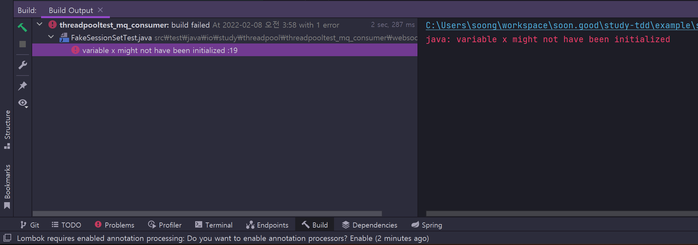

## 2) 자바의 데이터 타입, 변수 그리고 배열
## 참고도서 및 자료들
> - [백기선님 자바 스터디 영상](https://www.youtube.com/watch?v=xoHDRclHojM&list=PLfI752FpVCS96fSsQe2E3HzYTgdmbz6LU&index=3) (유료 멤버 가입 후 시청 가능)<br>
>   
>   - [2주차 스터디](https://github.com/whiteship/live-study/issues/2)
> - [자바 퍼즐러 - 조슈아 블로크, 닐 개프터](http://www.kyobobook.co.kr/product/detailViewKor.laf?ejkGb=KOR&mallGb=KOR&barcode=9788968481444&orderClick=LAG&Kc=)
>   - 7번째 퍼즐(변수 교환) : 
>     - 예전 c/c++ 시절부터 존재하던 비트 연산으로 변수를 교환하는 것에 대한 이야기
>     - 여기에 대해 저자들은 이렇게 말한다. `이렇게 하지 마세요. 더럽잖아요. `
>   - 54번째 퍼즐(Null과 Void)
>   - 85번째 퍼즐(게으른 초기화)
>   - 86번째 퍼즐(괄호의 함정)
> - [혼자공부하는 자바 - 신용권](http://www.kyobobook.co.kr/product/detailViewKor.laf?ejkGb=KOR&mallGb=KOR&barcode=9791162241875&orderClick=LAG&Kc=)
<br>

## 목표

자바의 프리미티브 타입, 변수 그리고 배열을 사용하는 방법을 요약.<br>

<br>

## 학습내용

- 프리미티브 타입 종류와 값의 범위 그리고 기본 값
- 프리미티브 타입과 레퍼런스 타입
- 리터럴
- 변수 선언 및 초기화하는 방법
  - 변수 선언
  - 변수 초기화

- 변수의 스코프와 라이프타임
- 타입 변환, 캐스팅 그리고 타입 프로모션
- 1차 및 2차 배열 선언하기
- 타입 추론, var

<br>

## 프리미티브 타입 종류와 값의 범위, 그리고 기본값

### 자바의 프리미티브(Primitive) 타입들

자바에서 기본으로 제공되는 타입들을 프리미티브(Primitive) 타입이라고 흔히 부른다.<br>

| 정수/실수/논리 | 타입                         |
| -------------- | ---------------------------- |
| 정수타입       | byte, char, short, int, long |
| 실수타입       | float, double                |
| 논리타입       | boolean                      |

<br>

### 프리미티브 타입의 범위

> TODO 
>
> 이거 재밌는 거긴 한데... 정리하는 거 은근짜증...java8 에서 지원하기 시작한 `unsigned int `정리.

#### 각 정수 타입의 범위

| 타입  | 크기(byte) | 크기(bit) | 범위              | 범위                                       |
| ----- | ---------- | --------- | ----------------- | ------------------------------------------ |
| byte  | 1byte      | 8bit      | -2^{7} ~ (2^7 -1) | -128 ~ 127                                 |
| short | 2byte      | 16bit     | -2^15 ~ (2^15 -1) | -32768 ~ 32767                             |
| char  | 2byte      | 16bit     | 0 ~ (2^16 - 1)    | 0 ~ 65535                                  |
| int   | 4byte      | 32bit     | -2^31 ~ (2^31-1)  | -2147483648 ~ 2147483647                   |
| long  | 8byte      | 64bit     | -2^63 ~ (2^63 -1) | -9223372036854775808 ~ 9223372036854775807 |

<br>

#### 각 실수 타입의 범위

| 타입   | 크기(byte) | 크기(bit) | 범위                               | 정밀도  |
| ------ | ---------- | --------- | ---------------------------------- | ------- |
| float  | 4byte      | 32bit     | (1.4 x 10^(-45)) ~ (3.4 x 10^38)   | 7자리   |
| double | 8byte      | 64bit     | (4.9 x 10^(-324) ~ (1.8 x 10^308)) | 15 자리 |

<br>

float 과 double 타입의 허용 범위는 그림 여기에 직접 그린 그림 또는 ppt 에 그린 그림 추가할 것


### 리터럴

#### 정수리터럴

#### 실수리터럴

#### 문자 리터럴

하나의 문자를 작은 따옴표로 감싼 것을 문자리터럴 이라고 부른다. 

**문자 리터럴은 유니코드(unicode)로 변환되어 저장** 된다.

유니코드는 세계 각국의 문자를 2byte로 매핑한 국제 표준 규약이다.

- 2byte = 2^16 = 2^10 x 2^6 = 1024 x 64 = 65536

자바의 `char` 은 2byte 크기로, 65536 가지의 문자들을 모두 저장할 수 있도록 지원된다. (언어에 따라 char 가 지원하는 범위는 다르다. 주의)<br>

작은 따옴표 '' 로 감싼 문자는 65536 까지의 숫자 하나와 문자가 매핑되는 것이기에 문자를 int 자료형에도 숫자로 저장해서 사용하는 것이 가능하다.<br>

ex)

```java
char a = 'A';
int numA = 'A';

System.out.println(a);		// A 
System.out.println(numA);		// 65
```

<br>

## 프리미티브 타입과 레퍼런스 타입

> TODO

<br>


## 변수 ( `variable` )

메모리의 특정 공간에 데이터를 저장하려고 할때 저장하려는 해당 주소에 대해 데이터의 타입과 함께 지정하는 이름. 즉, 소스 코드 내에서 메모리 주소를 가리키는 이름이다. 변수에는 `변하는 수` 또는 `변하는 값` 을 저장한다. 반대로 상수는 항상 변하지 않는 값 또는 수를 저장한다.<br>

<br>

### 변수 ( `variable` ) 선언

변수는 선언 시에 데이터의 타입과 함께 선언한다. 어떤 타입의 데이터를 저장할지를 명시함으로써, 메모리의 특정 주소로부터 어느 정도 크기의 데이터를 저장할지 유추할 수 있다.<br>

```java
int minSpeed;
double waitCostRatio;
```

또는 아래와 같이 한꺼번에 선언하는 것 역시 가능하다.

```java
int x,y,z;
```

<br>

### 변수이름 규칙

| 규칙                                                         | Example                                           |
| :----------------------------------------------------------- | ------------------------------------------------- |
| 첫번째 문자는 문자여야 한다. 숫자로 시작할 수 없다.<br>`$`, `_` 은 변수 명의 맨 앞에 오는 것이 가능하다. 이 외의 특수문자는 변수명에 사용할 수 없다. | int maxSpeed;<br>int $maxSpeed;<br>int _maxSpeed; |
| 변수명은 대소문자를 구별한다.                                | int maxSpeed;<br>int maxspeed;                    |
| 변수명의 길이에 제약은 없다.                                 |                                                   |
| 자바 예약어(키워드)는 사용할 수 없다.                        |                                                   |
| 첫 문자는 영어 소문자로 시작하고 다른 단어가 올경우 첫 문자를 대문자로 한다. <br>(자바언어의 일반적인 코딩 컨벤션은 카멜케이스를 따르는게 기본 규칙. 꼭 지켜야 되는 것은 아니다. 코딩 컨벤션) |                                                   |

<br>

### 자바의 예약어(keyword)

> 참고: 
>
> - [volatile](https://nesoy.github.io/articles/2018-06/Java-volatile)
> - var
>   - [https://catch-me-java.tistory.com/19](https://catch-me-java.tistory.com/19)

<br>

JAVA 내에 예약되어 있는 키워드 들이다. 변수명에 자바의 예약어를 사용하면 안된다.

|                |                                                              |
| -------------- | ------------------------------------------------------------ |
| primitive type | boolean, byte, char, short, int, long, float, double         |
| 접근제한자     | public, private, protected                                   |
| 클래스 관련    | class, abstract, interface, extends, implements, enum        |
| 객체 관련      | new, instanceof, this, super, null                           |
| 메소드 관련    | void, return                                                 |
| 제어문 관련    | if, else, switch, case, default, for, do, while, break, continue |
| 논리           | true, false                                                  |
| 예외처리       | try, catch, finally, throw, throws                           |
| etc            | package, import, sychronized, final, static, volatile, var   |


### 변수(variable) 초기화(initialization)

### 변수의 생성

Java 에서 변수는 선언 후에 초기화 하지 않으면 생성되지 않는다. 

`변수의 선언` : 변수를 선언하는 것은 변수를 어떤 타입으로 해서 사용할지 메모리의 특정 주소에 이름을 붙이는 과정이다. <br>

`변수 생성` : 변수를 생성하려면 선언한 변수에 값을 할당해야 한다. <br>

`변수의 초기화, 초기값` : 변수에 값이 최초로 저장될때 변수가 저장되는 것을 **변수의 초기화**라고 이야기 한다. 그리고 초기화 한 값을 **초기값**이라고 부른다.<br>

<br>

```java
@Test
public void 변수초기화_테스트(){
    int x;
    int y = 10;
    int sum = x + y; // 컴파일 에러 발생
    System.out.println(sum);
}
```

위 코드는 실행 전에 주석으로 표시한 곳에서 빨간 줄이 나타난다. 실행해보면 아래와 같은 에러문구가 나타난다. 



<br>

## 변수의 스코프, 라이프타임

자바에서 모든 변수는 중괄호 `{}` 블록 내에서 선언될 수 있고, 사용된다.<br>

`로컬변수` : 메소드 블록 `{}` 내에서 선언된 변수는 로컬변수(local variable) 이라고 부른다. 

`전역변수/멤버필드` : 클래스 내에 선언된 멤버필드를 전역변수 또는 멤버필드라고 부른다.

ex)

```java
public class HelloWorld{
    private String country = "KR";
    
    // ...
    
    public void printHello(){
        String msg = "안녕하세요 " + "(" + country + ")";
        System.out.println(msg);
    }
}
```

위의 예제에서 `country` 는 멤버필드/전역변수로 사용되었고, `msg` 는 로컬 변수로 사용되었다.<br>

<br>

### 스코프/라이프타임

각 변수는 자신이 속한 `{}` 블록 내에서만 사용가능하다.

외부 블록에서 내부 블록의 변수를 참조하는 것은 불가능하다.

내부 블록에서 외부 블록의 변수를 참조하는 것은 가능하다.(미리 선언되었기 때문에)

ex)

```java
public class Sample{
    private String country = "KR";
    
    public void printSomething(){ 	//-- (1) 블록 
        // 내부의 블록에 있는 sum 은 참조할 수 없다.
        String outerMsg = "안녕";
        String msg = "";
        if("KR".equals(country)){	//-- (2) 블록
            // 외부 블록에서 선언한 outerMsg, msg 를 참조하는 것이 가능하다.
            msg = outerMsg + ", 한국사람이군요.";
            msg = msg + "\n" + "잠깐만요. 1부터 10까지 덧셈좀 하고 올께요";
            
            int sum = 0;
            for(int i=1; i<=10; i++){
                sum+=i
            }
            msg = msg + "\n 합계 = " + sum;
        }
    }
}
```

이렇게 변수에 따라 자기 자신의 유효범위를 가지고 있는 것을 `스코프` 라고 함.<br>

<br>

## 타입 변환, 캐스팅 그리고 타입 프로모션

> TODO

## 1차 및 2차 배열 선언하기

> TODO

## 타입 추론, var

> TODO


