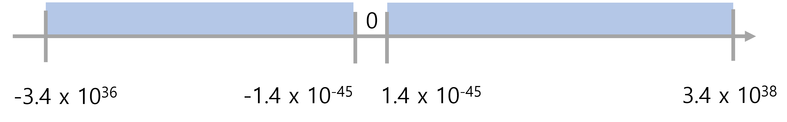
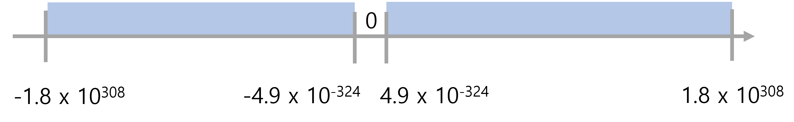
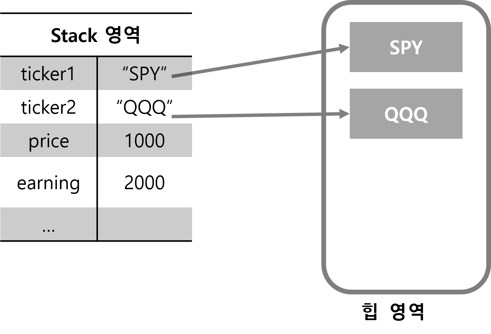
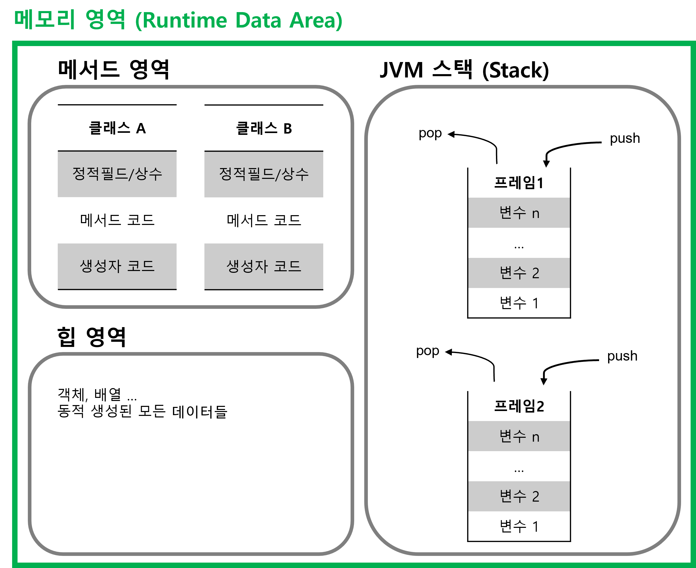
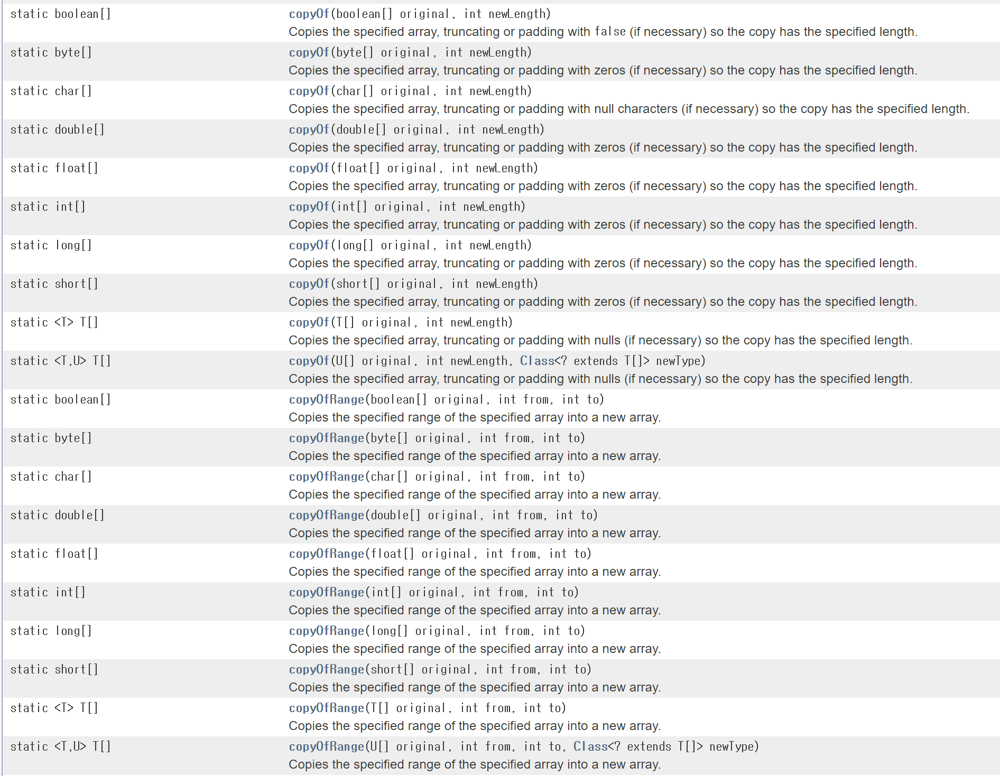

## 2) 자바의 데이터 타입, 변수 그리고 배열

## 참고도서 및 자료들
> - [백기선님 자바 스터디 영상](https://www.youtube.com/watch?v=xoHDRclHojM&list=PLfI752FpVCS96fSsQe2E3HzYTgdmbz6LU&index=3) (유료 멤버 가입 후 시청 가능)<br>
>
>   - [2주차 스터디](https://github.com/whiteship/live-study/issues/2)
> - [자바 퍼즐러 - 조슈아 블로크, 닐 개프터](http://www.kyobobook.co.kr/product/detailViewKor.laf?ejkGb=KOR&mallGb=KOR&barcode=9788968481444&orderClick=LAG&Kc=)
>   - 자바 언어 설계자가 전달하는 여러가지 주의 사항들을 언급하는 책이다.
>   - 7번째 퍼즐(변수 교환) : 
>     - 예전 c/c++ 시절부터 존재하던 비트 연산으로 변수를 교환하는 것에 대한 이야기
>     - 여기에 대해 저자들은 이렇게 말한다. `이렇게 하지 마세요. 더럽잖아요. `
>   - 54번째 퍼즐(Null과 Void)
>   - 85번째 퍼즐(게으른 초기화)
>   - 86번째 퍼즐(괄호의 함정)
> - [혼자공부하는 자바 - 신용권](http://www.kyobobook.co.kr/product/detailViewKor.laf?ejkGb=KOR&mallGb=KOR&barcode=9791162241875&orderClick=LAG&Kc=)
>   <br>

<br>

## 목표

자바의 프리미티브 타입, 변수 그리고 배열을 사용하는 방법을 요약.<br>

<br>

## 학습내용

- 프리미티브 타입 종류와 값의 범위 그리고 기본 값
- 프리미티브 타입과 레퍼런스 타입
- 리터럴
- 변수 선언 및 초기화하는 방법
  - 변수 선언
  - 변수 초기화
- 변수의 스코프와 라이프타임
- 타입 변환, 캐스팅 그리고 타입 프로모션
- 1차 및 2차 배열 선언하기
- 타입 추론, var
- 자바퍼즐러
  - 7번째 퍼즐(변수 교환) : 
    - 예전 c/c++ 시절부터 존재하던 비트 연산으로 변수를 교환하는 것에 대한 이야기
    - 여기에 대해 저자들은 이렇게 말한다. `이렇게 하지 마세요. 더럽잖아요. `
  - 54번째 퍼즐(Null과 Void)
  - 85번째 퍼즐(게으른 초기화)
    - 자동적인 클래스 초기화에 유의해야 한다. 변수의 초기화 로직은 지나치게 게으른 초기화를 하기보다는, 최대한 단순하게 작성하는 것이 낫다.
    - 문법적으로는 맞는 것 같아보여도, 실제 컴파일러의 클래스 초기화시 특정 블록의 초기화 시점은 조금 다를 수 있기 때문.
  - 86번째 퍼즐(괄호의 함정)
    - float 자료형과 double 자료형으로 자료형을 변환할 때는 정확도 손실에 주의하세요!
    - 이러한 손실은 매우 치명적이면서 찾기 힘든 버그를 유발합니다.
    - 관련 퍼즐 : 34번째 퍼즐, 혼합자료형 연산(5,8,21,31번째 퍼즐)
    - 프로그래밍 언어 설계자일 경우는 34번째 퍼즐에 유의하세요.
  - 88번째 퍼즐(원시타입)
    - 참고) java5에서 추가된 제너릭, 오토박싱, 가변길이 인자, for-each 반복문 
      - [http://java.sun.com/j2se/5.0/docs/guide/language](http://java.sun.com/j2se/5.0/docs/guide/language)
    - 자바  5 이상에서는 원시타입을 절대 사용하지 마세요.
    - 만약 기존 라이브러리가 제네릭을 사용하지 않아서 원시타입을 리턴한다면 강제로 자료형을 변환해서 파라미터라이즈드 타입으로 만들기를 바랍니다.

<br>

## 프리미티브 타입 종류와 값의 범위, 그리고 기본값

### 자바의 프리미티브(Primitive) 타입들

자바에서 기본으로 제공되는 타입들을 프리미티브(Primitive) 타입이라고 흔히 부른다.<br>

| 정수/실수/논리 | 타입                         |
| -------------- | ---------------------------- |
| 정수타입       | byte, char, short, int, long |
| 실수타입       | float, double                |
| 논리타입       | boolean                      |

<br>

### 프리미티브 타입의 범위

#### 각 정수 타입의 범위

| 타입  | 크기(byte) | 크기(bit) | 범위              | 범위                                       |
| ----- | ---------- | --------- | ----------------- | ------------------------------------------ |
| byte  | 1byte      | 8bit      | -2^{7} ~ (2^7 -1) | -128 ~ 127                                 |
| short | 2byte      | 16bit     | -2^15 ~ (2^15 -1) | -32768 ~ 32767                             |
| char  | 2byte      | 16bit     | 0 ~ (2^16 - 1)    | 0 ~ 65535                                  |
| int   | 4byte      | 32bit     | -2^31 ~ (2^31-1)  | -2147483648 ~ 2147483647                   |
| long  | 8byte      | 64bit     | -2^63 ~ (2^63 -1) | -9223372036854775808 ~ 9223372036854775807 |

<br>

#### 각 실수 타입의 범위

| 타입   | 크기(byte) | 크기(bit) | 범위                               | 정밀도  |
| ------ | ---------- | --------- | ---------------------------------- | ------- |
| float  | 4byte      | 32bit     | (1.4 x 10^(-45)) ~ (3.4 x 10^38)   | 7자리   |
| double | 8byte      | 64bit     | (4.9 x 10^(-324) ~ (1.8 x 10^308)) | 15 자리 |

<br>

**float 자료형의 허용범위**<br>

자세히 보면, 완벽하게 0에 가까워지지 않는다. 실세계의 수는 컴퓨터에서 표현이 불가능하다. 수학에서도 limit 이라는 연산자로 사용하고, 0에 가장 가까운 수는 수학에서는 없다. 다만, 컴퓨터가 사용하는 float 자료형에서는 0에 가장 가까운 수는 1.4 x 10^-45, -1.4 x 10^(-45) 이렇게 두개의 숫자다.



<br>

**double 자료형의 허용 범위**<br>

자세히 보면, 완벽하게 0에 가까워지지 않는다. 실세계의 수는 컴퓨터에서 표현이 불가능하다. 수학에서도 limit 이라는 연산자로 사용하고, 0에 가장 가까운 수는 수학에서는 없다. 다만, 컴퓨터가 사용하는 double 자료형에서는 0에 가장 가까운 수는 4.9 x 10^(-324), -4.9 x 10^(-324) 이렇게 두개의 숫자다.



<br>

### 리터럴

소스코드에서 프로그래머에 의해 직접 입력된 값을 `리터럴(literal)` 이라고 부른다. <br>

<br>

#### 진법 표현

**2진수**<br>

java 에서는 2진수 데이터를 리터럴로 표현할때 `0b` 또는 `0B` 로 시작되고, 숫자 0,1 로만 구성되게끔 표현한다.

```plain
0b1011 
// 1 x 2^3 + 0 x 2^2 + 1 x 2^1 + 1 x 2^0 == 11
```

<br>

**8진수**<br>

java 에서는 8진수 데이터를 리터럴로 표현할때 `0` 으로 시작되고, 숫자 `0~7` 로만 구성되게끔 표현한다.

```plain
013 
// 1 x 8^1 + 3 x 8^0
0206
// 2 x 8^2 + 0 x 8^1 + 6 x 8^0
```

<br>

**10진수**<br>

소수점이 없는 `0~9` 의 숫자로 구성된다.

```plain
365
1024
```

<br>

**16진수**<br>

java 에서는 8진수 데이터를 리터럴로 표현할때 `0` 으로 시작되고, 숫자 `0~7` 로만 구성되게끔 표현한다.

```plain
0xB3
// 11 x 16^1 + 3 x 16^0

0x2CFE
// 2 x 16^3 + 12x16^2 + 15x16^1 + 14x16^0
```

<br>

**예제**

```java
import org.junit.jupiter.api.Test;

public class HexOctDecimalBinaryTest {

    @Test
    public void 테스트_각_진법의_숫자를_int자료형에_저장해서_출력하기(){
        int n1 = 0b1111;    // 2진법
        int n2 = 0222;      // 8진법
        int n3 = 222;       // 10진접
        int n4 = 0x1FC;     // 16진법

        System.out.println("n1 = " + n1);
        System.out.println("n2 = " + n2);
        System.out.println("n3 = " + n3);
        System.out.println("n4 = " + n4);
    }
}
```

<br>

#### 정수리터럴

자바에서 정수리터럴, 또는 정수값을 저장할 수 있는 기본 자료형은 5가지가 존재한다. 그 종류는 `byte`, `short`, `char`, `int`, `long` 이 있다. 각 자료형의 범위는 위에서 정리해두었다.<br>

자바 컴파일러는 정수를 인식할 때 기본옵션으로 `int` 타입으로 간주한다.<br>

`long` 타입은 수치가 큰 데이터를 다루는 프로그램에서 주로 사용한다. 대표적으로 은행, 과학과 관련된 프로그램들이다.<br>

`int` 타입: 기본적으로 정수타입을 인식할때 컴파일러는 기본으로 `int` 타입으로 인식한다. 따라서 정수 데이터의 뒤에 접미사를 아무것도 붙이지 않으면 자동으로 `int` 타입으로 인식된다. 만약 `int` 타입의 허용 범위인 `-2147483648` ~ `2147483647` 의 범위를 초과하면 `long` 타입인 숫자임을 컴파일러에게 알려주기 위해 정수 리터럴 뒤에 소문자 `l` 또는 `L` 을 붙여서 표현한다. (일반적으로 소문자 `l` 은 숫자 1과 비슷해보여서 혼동할 우려가 있어서 대문자 `L` 이 흔히 쓰인다.)<br>

```java
long balance = 6000000000;// 컴파일 에러
long balance = 6000000000; 
```

<br>

`long` 타입 변수에 정수 리터럴을 저장할 때 반드시 `L` 을 붙여야 하는 것은 아니다. 정수 리터럴이 `int` 타입의 허용범위 이내이면 `L` 을 붙이지 않아도 된다.<br>

<br>

#### 실수리터럴

> `float`, `double` 은 실수를 근사치로 표현한다. 따라서 특정 경우에 따라서 계산이 부정확하게 나타나는 경우가 있다. 해당 내용에 대해 자세히 설명하고 있는 자료가 있다.
>
> - 자바퍼즐러 - 2번째 퍼즐, 변화를 위한 시간
> - Effective Java 3rd Edition - 아이템 60, 정확한 답이 필요하다면 float 와 double 은 피하라<br>
>
> <br>
>
> `TODO` <br>
>
> 위의 내용들은 정리가 완료된 문서도 있고, 아직 정리중인 문서도 있는데, 두 문서 모두 정리가 완료되면 여기에 해당 내용을 정리한 링크를 정리해둘 예정이다.<br>

<br>

소수점을 가지고 있는 실수 리터럴 또는 실수 값을 저자할 수 있는 자료형은 2가지가 있다. 그 종류는 float, double 이 있다. 각 자료형의 범위는 위에서 정리해두었다.<br>

소숫점이 있는 숫자리터럴

```plain
0.25
-3.14
```

<br>

소문자 `e` 또는 대문자 `E` 가 포함되어 있는 숫자 리터럴은 지수와 가수로 실수를 표현한 10진수 실수로 인식된다.<br>

```plain
5e2 => 5.0 x 10^2 => 500
0.12E-2 => 0.12 x 10^(-2) = 0.0012
```

<br>

**자바의 기본 인식 실수 리터럴**<br>

자바는 실수를 인식할때 기본 옵션으로 `double` 타입으로 읽어들인다. 즉, 실수리터럴을 그대로 `float` 타입 변수에 저장하면 컴파일 에러를 발생시킨다.

```java
float f = 3.14; // 컴파일 에러
double d = 3.14;
double d2 = 3.14e-2;
```

실수 타입을 `float` 타입으로 저장하려고 한다면 리터럴 뒤에 소문자 `f` 또는 대문자 `F` 를 붙여서 컴파일러가 `float` 타입임을 알수 있도록 해주어야 한다.<br>

```java
float f = 3.14; // 컴파일 에러
float ff = 3.14f;
float fff = 3E6F; 
```

<br>

**`float` 타입, `double` 타입이 허용하는 소숫점 이하 자리수**<br>

- `float` : 소숫점 이하 7자리까지 허용
- `double` : 소숫점 15자리까지 허용

`double` 타입은 `float` 타입보다 2배 정도 정밀독 높기 때문에 좀더 정확한 데이터 저장이 가능하다.<br>

<br>

#### 문자 리터럴

하나의 문자를 작은 따옴표로 감싼 것을 문자리터럴 이라고 부른다. 

**문자 리터럴은 유니코드(unicode)로 변환되어 저장** 된다.

유니코드는 세계 각국의 문자를 2byte로 매핑한 국제 표준 규약이다.

- 2byte = 2^16 = 2^10 x 2^6 = 1024 x 64 = 65536

자바의 `char` 은 2byte 크기로, 65536 가지의 문자들을 모두 저장할 수 있도록 지원된다. (언어에 따라 char 가 지원하는 범위는 다르다. 주의)<br>

작은 따옴표 '' 로 감싼 문자는 65536 까지의 숫자 하나와 문자가 매핑되는 것이기에 문자를 int 자료형에도 숫자로 저장해서 사용하는 것이 가능하다.<br>

ex)

```java
char a = 'A';
int numA = 'A';

System.out.println(a);		// A 
System.out.println(numA);		// 65
```

<br>

## 프리미티브 타입과 레퍼런스 타입

> 참고) [ITEM 61 - 박싱된 기본 타입보다는 기본 타입을 사용하라](https://github.com/soon-good/study-effective-java-3rd/blob/develop/ITEM-61-%EB%B0%95%EC%8B%B1%EB%90%9C-%EA%B8%B0%EB%B3%B8-%ED%83%80%EC%9E%85%EB%B3%B4%EB%8B%A4%EB%8A%94-%EA%B8%B0%EB%B3%B8%ED%83%80%EC%9E%85%EC%9D%84-%EC%82%AC%EC%9A%A9%ED%95%98%EB%9D%BC.md)<br>

**기본 타입**<br>

- `byte`, `char` , `short`, `long` , `float` , `double` , `boolean`
- 실제 값을 변수에 저장
- ex) int age = 25;

<br>

**참조타입**<br>

- 배열, 열거, 클래스, 인터페이스 변수
- 메모리의 번지수를 변수 안에 저장
- 메모리의 주소를 통해 객체를 **참조(Reference)** 한다는 뜻에서 유래해 **참조 타입**이라고 이름 지어짐
- ex) String ticker1 = "SPY";

<br>

기본 타입과 참조 타입은 저장되는 메모리 영역이 서로 다르다. 기본타입은 `stack` 영역에 저장되고, 참조 타입 변수는 `stack` 영역에 위치하고, 참조타입이 가리키는 실제 메모리 상의 데이터는 `heap` 영역에 있는 데이터다. 각 타입이 저장되는 영역을 그림으로 그려보면 아래와 같다.<br>



<br>

## 메모리 사용 영역



<br>

**메모리 영역**<br>

- JVM 이 시작할 때 생성된다. 모든 스레드가 공유하는 영역이다.<br>
- 각 클래스 별 정적 필드, 상수, 메서드 코드, 생성자 코드 등을 분류해서 가지고 있는다.<br>
- 이러한 정적필드, 상수, 메서드 코드, 생성자 코드는 클래스 로더로 읽어들인다.<br>

<br>

**힙 영역**<br>

- 객체, 배열이 생성되는 영역
- JVM 스택 영역의 변수를 통해 힙 영역에 생성한 객체,배열의 주소를 참조한다.
- 만약 힙 영역의 해당 영역에 값이 없다면 의미 없는 객채로 간주해 JVM 의 가비지 컬렉터로 자동으로 제거된다.
- 개발자는 객체를 제거하기 위해 별도의 코드를 작성할 필요가 없다.

<br>

**JVM 스택 영역**<br>

- 메소드를 호출할 때마다 프레임(frame)을 추가(push)하고, 메서드가 종료되면 해당 프레임을 제거(pop)하는 역할을 한다.
- 프레임 내부에는 로컬 변수 스택이 있는데, 기본 타입변수와 참조 타입변수가 push/pop 된다.
- 스택영역에 변수가 생성되는 시점은 초기화가 될때, 즉, 최초로 변수에 값이 저장될 때다.
- 변수는 선언된 블록 안에서만 스택에 존재하고, 블록을 벗어나면 스택에서 제거된다.

<br>

예제) Stack 영역<br>

```java
char ticker = "SPY"; 			// 1)

if(ticker = "SPY"){				// 2)
    int price = 1000;
    double earning = 2000;
}

boolean summerTimeFlag = true;	// 3)
```

위의 `1)` , `2)` , `3)` 으로 표시된 부분에서의 스택의 변화를 그림으로 표현하면 아래와 같다.<br>

`2)` : if 블록으로 진입할 때 stack 에 블록내의 변수가 stack 에 push 된다.<br>

`3)` : if 블록에서 나올때 stack 에서 `price`, `earning` 은 pop 된다. 그리고 `summerTimeFlag` 는 새롭게 진입했다.<br>


<br>

예제) 힙영역에 배열을 선언했을때<br>

```java
int [] earnings = {1000, 2000, 3000};
```

<br>


<br>


## 변수 ( `variable` )

메모리의 특정 공간에 데이터를 저장하려고 할때 저장하려는 해당 주소에 대해 데이터의 타입과 함께 지정하는 이름. 즉, 소스 코드 내에서 메모리 주소를 가리키는 이름이다. 변수에는 `변하는 수` 또는 `변하는 값` 을 저장한다. 반대로 상수는 항상 변하지 않는 값 또는 수를 저장한다.<br>

<br>

### 변수 ( `variable` ) 선언

변수는 선언 시에 데이터의 타입과 함께 선언한다. 어떤 타입의 데이터를 저장할지를 명시함으로써, 메모리의 특정 주소로부터 어느 정도 크기의 데이터를 저장할지 유추할 수 있다.<br>

```java
int minSpeed;
double waitCostRatio;
```

또는 아래와 같이 한꺼번에 선언하는 것 역시 가능하다.

```java
int x,y,z;
```

<br>

### 변수이름 규칙

| 규칙                                                         | Example                                           |
| :----------------------------------------------------------- | ------------------------------------------------- |
| 첫번째 문자는 문자여야 한다. 숫자로 시작할 수 없다.<br>`$`, `_` 은 변수 명의 맨 앞에 오는 것이 가능하다. <br>이 외의 특수문자는 변수명에 사용할 수 없다. | int maxSpeed;<br>int $maxSpeed;<br>int _maxSpeed; |
| 변수명은 대소문자를 구별한다.                                | int maxSpeed;<br>int maxspeed;                    |
| 변수명의 길이에 제약은 없다.                                 |                                                   |
| 자바 예약어(키워드)는 사용할 수 없다.                        |                                                   |
| 첫 문자는 영어 소문자로 시작하고 다른 단어가 올경우 <br>첫 문자를 대문자로 한다. <br>(자바언어의 일반적인 코딩 컨벤션은 카멜케이스를 <br>따르는게 기본 규칙. 꼭 지켜야 되는 것은 아니다. 코딩 컨벤션) |                                                   |

<br>

### 자바의 예약어(keyword)

> 참고: 
>
> - [volatile](https://nesoy.github.io/articles/2018-06/Java-volatile)
> - var
>   - [https://catch-me-java.tistory.com/19](https://catch-me-java.tistory.com/19)

<br>

JAVA 내에 예약되어 있는 키워드 들이다. 변수명에 자바의 예약어를 사용하면 안된다.

|                |                                                              |
| -------------- | ------------------------------------------------------------ |
| primitive type | boolean, byte, char, short, int, long, float, double         |
| 접근제한자     | public, private, protected                                   |
| 클래스 관련    | class, abstract, interface, extends, implements, enum        |
| 객체 관련      | new, instanceof, this, super, null                           |
| 메소드 관련    | void, return                                                 |
| 제어문 관련    | if, else, switch, case, default, for, do, while, break, continue |
| 논리           | true, false                                                  |
| 예외처리       | try, catch, finally, throw, throws                           |
| etc            | package, import, sychronized, final, static, volatile, var   |


### 변수(variable) 초기화(initialization)

### 변수의 생성

Java 에서 변수는 선언 후에 초기화 하지 않으면 생성되지 않는다. 

`변수의 선언` : 변수를 선언하는 것은 변수를 어떤 타입으로 해서 사용할지 메모리의 특정 주소에 이름을 붙이는 과정이다. <br>

`변수 생성` : 변수를 생성하려면 선언한 변수에 값을 할당해야 한다. <br>

`변수의 초기화, 초기값` : 변수에 값이 최초로 저장될때 변수가 저장되는 것을 **변수의 초기화**라고 이야기 한다. 그리고 초기화 한 값을 **초기값**이라고 부른다.<br>

<br>

```java
@Test
public void 변수초기화_테스트(){
    int x;
    int y = 10;
    int sum = x + y; // 컴파일 에러 발생
    System.out.println(sum);
}
```

위 코드는 실행 전에 주석으로 표시한 곳에서 빨간 줄이 나타난다. 실행해보면 아래와 같은 에러문구가 나타난다. 


<br>

## 변수의 스코프, 라이프타임

자바에서 모든 변수는 중괄호 `{}` 블록 내에서 선언될 수 있고, 사용된다.<br>

`로컬변수` : 메소드 블록 `{}` 내에서 선언된 변수는 로컬변수(local variable) 이라고 부른다. 

`전역변수/멤버필드` : 클래스 내에 선언된 멤버필드를 전역변수 또는 멤버필드라고 부른다.

ex)

```java
public class HelloWorld{
    private String country = "KR";
    
    // ...
    
    public void printHello(){
        String msg = "안녕하세요 " + "(" + country + ")";
        System.out.println(msg);
    }
}
```

위의 예제에서 `country` 는 멤버필드/전역변수로 사용되었고, `msg` 는 로컬 변수로 사용되었다.<br>

<br>

### 스코프/라이프타임

각 변수는 자신이 속한 `{}` 블록 내에서만 사용가능하다.

외부 블록에서 내부 블록의 변수를 참조하는 것은 불가능하다.

내부 블록에서 외부 블록의 변수를 참조하는 것은 가능하다.(미리 선언되었기 때문에)

ex)

```java
public class Sample{
    private String country = "KR";
    
    public void printSomething(){ 	//-- (1) 블록 
        // 내부의 블록에 있는 sum 은 참조할 수 없다.
        String outerMsg = "안녕";
        String msg = "";
        if("KR".equals(country)){	//-- (2) 블록
            // 외부 블록에서 선언한 outerMsg, msg 를 참조하는 것이 가능하다.
            msg = outerMsg + ", 한국사람이군요.";
            msg = msg + "\n" + "잠깐만요. 1부터 10까지 덧셈좀 하고 올께요";
            
            int sum = 0;
            for(int i=1; i<=10; i++){
                sum+=i
            }
            msg = msg + "\n 합계 = " + sum;
        }
    }
}
```

이렇게 변수에 따라 자기 자신의 유효범위를 가지고 있는 것을 `스코프` 라고 함.<br>

<br>

## 타입 변환, 캐스팅 그리고 타입 프로모션

**프로모션(promotion), 자동타입변환**<br>

- 자동으로 타입 변환이 일어나는 것을 의미
- 값의 허용 범위가 작은 타입이 값의 허용범위가 큰 타입으로 저장되는 것

<br>

ex)

```java
byte b = 1;
int i = b;
```

<br>

**캐스팅(casting), 강제타입변환**<br>

- 큰 자료형을 작은 자료형에 강제로 대입하는 것을 의미

- 값의 허용 범위가 큰 타입을 값의 허용 범위가 작은 타입에 강제로 나눠서 저장하는 것
- 강제 타입변환(casting) 은 괄호연산자 `()` 을 사용한다.

<br>

ex)

```java
int i = 15;
byte b = (byte) i;
```

<br>

## 정수연산에서의 자동 타입변환

> 기본으로 자동타입 변환되는 것은 `int` 타입이고, 더 큰 자료형인 `long` 과 같은 자료형이 피연산자로 구성되면, `long` 으로 자동타입변환되게 된다.<br>
>
> 단, 정수 리터럴만을 피연산자로 사용할 경우 자동 타입변환은 발생하지 않는다.<br>

<br>

정수 타입의 변수가 산술 연산식에서 피 연산자로 사용되면 `int` 타입보다 작은 `byte`, `short`, `char` 타입의 변수는 `int` 타입으로 자동타입변환되어 연산을 수행한다.<br>

기본 옵션은 `int` 타입으로 변환되는 것이지만, 피연산자들 사이에 `int` 보다 큰 타입인 `long` 타입의 정수가 있을 때는 `long` 타입으로 자동 타입 변환되어 연산이 수행된다.<br>

단, 정수 리터럴 간의 연산에서는 피연산자가 변수가 아니기에, `int` 타입으로 변환되지 않는다.<br>

ex)

```java
@Test
public void byte에_byte간의_덧셈을_하면_컴파일에러를_낸다(){
    byte a = 1;
    byte b = 2;
    //        byte c = a + b; // 컴파일 에러
    int c = a + b;
}
```

<br>

위의 덧셈은 `a` 와 `b` 가 `int` 타입으로 변환되어 연산된다. 따라서 `byte` 타입의 변수에 `a`, `b` 의 덧셈을 저장하려 하면 컴파일에러를 낸다. 이때 나타나는 에러 문구는 이렇다.

```plain
java: incompatible types: possible lossy conversion from int to byte
```

<br>

정수연산에 사용되는 변수는 특별한 이유가 없다면 아래 예제처럼 `int` 타입으로 선언하여 사용하면, 타입 변환을 줄여주게 된다. 자동 타입 변환이 줄어들면 미세하게 나마 실행 성능이 향상되게 된다.<br>

```java
@Test
public void int와_int간의_덧셈연산(){
    int x = 10;
    int y = 20;
    int result = x + y;
}
```

<br>

정수 리터럴간의 연산을 할 때에는 정수 변수가 사용되지 않았으면, `int` 타입으로 자동 타입변환이 발생하지 않는다.

```java
@Test
public void 정수리터럴간의_연산_자동타입변환되지_않는다(){
    byte result = 10 + 20;
}
```

<br>

더 큰 정수 타입인 `long` 타입의 변수가 피연산자로 쓰일 경우, 더 큰 정수 타입인  `long` 타입으로 자동 타입변환된다.

```java
@Test
public void 정수리터럴간의_연산_더_큰_타입인_long타입이_피연산자로_쓰일경우(){
    int a = 1;
    int b = 2;
    long c = 3L;

    long sum = a + b + c;

    assertThat(a + b + c).isEqualTo(sum);
}
```

<br>

## 실수 연산에서의 자동 타입 변환

> 기본으로 자동타입 변환되는 것은 `int` 타입이고, 더 큰 자료형인 `long` 과 같은 자료형이 피연산자로 구성되면, `long` 으로 자동타입변환되게 된다.<br>
>
> 단, 정수 리터럴만을 피연산자로 사용할 경우 자동 타입변환은 발생하지 않는다.<br>

<br>

실수 타입은 정수 타입과는 조금 원칙이 다르다.<br>

<br>

**같은 타입의 실수 변수간의 산술연산일 경우**<br>

같은 타입의 실수 변수간의 산술 연산이라면, 해당 타입으로 연산된다. <br>

**피연산자 중 하나가 `double` 타입일 경우**<br>

하지만, 서로 다른 실수 변수 간의 산술이고, 그 중 하나의 피연산자가 `double` 타입일 경우 반대편 피연산자 역시 `double` 타입으로 자동현변환 되어 연산이 수행되어 연산결과 역시 `double` 타입으로 변환된다.<br>

```java
@Test
public void 피연산자_중_하나가_double_타입일경우(){
    // 3.14f    : float 타입
    // 1.2      : double 타입
    double result = 3.14f * 1.2;
    System.out.println(result);
}
```

<br>

**`int` 타입으로 연산되도록 강제해야 하는 경우**<br>

- 만약 `int` 타입으로 변환해서 연산해야 할 경우 `int` 타입으로 강제 타입변환 후에 연산을 수행한다.

```java
@Test
public void int타입으로_강제타입변환해야_할_경우(){
    int intVal = 10;
    double doubleVal = 3.14;
    int result = intVal * (int)doubleVal;
    System.out.println(result);
}
```

출력결과

```plain
30
```

<br>

**실수 리터럴 연산을 수행할 경우**<br>

`f`, `F` 등을 명시하지 않은 실수 리터럴은 자바에서 기본적으로 `double` 타입으로 인식한다. 이런 이유로 실수 리터럴 간의 연산 결과는 `double` 타입에 저장해야 한다.

```java
@Test
public void 실수리터럴간의_연산은_double에_저장하는것이_기본옵션(){
    double result = 3.14 * 10;
    System.out.println(result);
}
```

출력결과

```plain
31.400000000000002
```

<br>

**실수 리터럴 간의 연산은 `float` 타입에 저장하면 안된다.**<br>

```java
@Test
public void 실수리터럴간의_연산을_float에_저장할_경우_컴파일에러다(){
    float result = 3.14 * 10; // 컴파일 에러
}
```

출력결과

```plain
java: incompatible types: possible lossy conversion from double to float
```

<br>

**실수 리터럴 간의 연산을 `float` 에 저장하고 싶다면, 각 리터럴을 `float` 로 지정해준다.**<br>

```java
@Test
public void 실수리터럴간의_연산을_float에_저장하고_싶다면_각_리터럴을_float로_지정해준다(){
    float result = 3.14f * 10f;
    System.out.println(result);
}
```

출력결과

```plain
31.400002
```

<br>

출력결과를 보면 의도하지 않은 끝자리 수인 0.000002 가 포함된 것을 확인 가능하다. 이렇게 되는 것은 `double`, `flaot` 로 산술 연산을 할 경우 오차가 있다. 여기에 대해서는 [정확한 답이 필요하다면 `float` 와 `double` 은 피하라](https://github.com/soon-good/study-effective-java-3rd/blob/develop/ITEM-60-%EC%A0%95%ED%99%95%ED%95%9C-%EB%8B%B5%EC%9D%B4-%ED%95%84%EC%9A%94%ED%95%98%EB%8B%A4%EB%A9%B4-float%EC%99%80-double%EC%9D%80-%ED%94%BC%ED%95%98%EB%9D%BC.md) 에 정리해두었다.<br>

<br>

**정수형과 정수형간의 나눗셈의 결과는 소숫점이 짤려서 소숫점을 버린 정수형으로 저장된다.**<br>

예를 들어 정수형 1을 정수 2로 나누면 사람의 입장에서는 실수형 0.5 를 연상하게 되지만, 컴퓨터 입장에서는 정수형으로 저장하려고 하기에 0으로 저장된다.

```java
@Test
public void 정수와_정수간의_나눗셈은_실수로_저장되지않고_소숫점은_버려진다(){
    int first = 1;
    int second = 2;
    int result = first / second;

    assertThat(result).isEqualTo(0);
}
```

<br>

정수형과 정수형간의 나눗셈을 실수 타입으로 저장할 때 사용할 수 있는 방식은 아래의 3가지 방식이 있다.<br>

```java
@Test
public void 정수와_정수간의_나눗셈을_실수로_저장하는_방법_1(){
    int first = 1;
    int second = 2;
    double result = (double) first / second;

    assertThat(result).isEqualTo(0.5);
}

@Test
public void 정수와_정수간의_나눗셈을_실수로_저장하는_방법_2(){
    int first = 1;
    int second = 2;
    double result = first / (double) second;

    assertThat(result).isEqualTo(0.5);
}

@Test
public void 정수와_정수간의_나눗셈을_실수로_저장하는_방법_3(){
    int first = 1;
    int second = 2;
    double result = (double) first / (double) second;

    assertThat(result).isEqualTo(0.5);
}
```

<br>

## + 연산시 문자열 자동 타입변환

자바의 `+` 연산자는 두가지 기능을 가지고 있다.

- `+` 연산에 대한 피연산자가 모두 숫자일 경우는 산술연산을 수행한다.
- `+` 연산에 대한 피연산자 중 하나가 문자열이 포함되어 있을 경우는 문자열로 자동변환되고, 문자열 결합 연산을 수행한다.

<br>

이 부분은 예제를 정리할까 했는데, 굳이 예제까지 정리할 필요는 없을 것 같다. 하지만, 주의점에 대해서는 참고자료들을 언급하고 넘어가는 게 나을 것 같다.

<br>

**주의) 문자열 연결(`+`) 은 느리니, 가급적 `StringBuilder` 사용을 고려하자.**<br>

문자열 결합 연산시, 비교적 긴 문자열을 결합해야 하는 경우 가급적, `String` 의 `+` 연산 보다는, `StringBuilder` 를 이용해 결합연산을 해야 한다. 이와 관련해서는 Effective Java 3/E 의 ITEM-63 문자열 연결은 느리니 주의하라 에서 언급하고 있다. 해당 문서는 현재 예제와 함께 정리중이다.<br>

<br>

## 문자열을 기본타입으로 강제 타입 변환

문자열을 기본타입으로 변환하는 가벼운 예제를 먼저 살펴보면 아래와 같다.

```java
String strPi = "3.14";
Double pi = Double.parseDouble(strPi);
```

이렇게 각 숫자 연산에 대한 박싱된 기본 타입인 `Double`, `Integer` , `Long`, `Byte`, `Float` , `Boolean` , `Short` 은 문자열을 기본 타입으로 변환해주는 기능을 제공한다.<br>

조금은 흔하지 경우인 문자열을 `byte` 로 바꾸는 경우도 예제로 살펴보면 아래와 같다.

```java
Sting str = "10";
byte value = Byte.parseByte(str);
```

<br>

**예외) 만약 문자열이 숫자가 아닌 특수 문자, 한글 등을 포함하고 있으면 , 숫자타입으로 변환시도시 숫자형식 예외(`NumberFormatException`)가 발생한다.**

```java
String str = "1a";
int value = Integer.parseInt(str);
```

<br>

**참고) 기본타입을 문자열로 변환할 때는 `String.valueOf` 를 사용한다.**<br>

```java
double pi = 3.14D;
String str = String.valueOf(val);
```

<br>

## 1차 및 2차 배열 선언하기

### 1차원 배열

1차원 배열을 선언하는 방식은 두가지가 있다. 두 방식의 차이점은 컴파일타임에 배열의 사이즈를 확보할지, 런타임에 배열의 사이즈를 확보할지와 연관되어 있다.<br>

**첫 번째 방법 - 컴파일 타임에 사이즈를 확보**<br>

먼저 첫 번째 방법은 아래와 같다.

```java
String [] names = {"C++", "Java", "C"};
```

위와 같이 선언하면, 컴파일 타임에 배열의 사이즈를 결정짓게 된다.<br>

**두 번째 방법 - new 연산자 활용, 런타임에 사이즈를 확보**<br>

살펴볼 예제는 아래의 두가지다.

- 배열변수를 먼저 선언해두고, 필요할 때에 초기화하는 방법
- 배열변수를 런타임에 초기화하기

먼저 첫번째 예제를 보자.

**배열변수를 먼저 선언해두고, 필요할 때에 초기화하는 방법**<br>

```java
String [] names = null;
names = new String[]{"C++", "Java", "C"};
```

이렇게 배열 변수를 먼저 선언해두고 필요할 때에 초기화 하는 방법은, 아래와 같이 컴파일 타임에 사이즈를 확보하듯이 선언하면 컴파일에러를 내니 주의하자.

```java
String [] names = null;
names = {"C++", "Java", "C"}; // 컴파일 에러
```

<br>

예를 들어서 함수의 인자로 바로 넣어주려고 할때에는 아래와 같이 사용하는 것으로 응용할 수 있다.

```java
int avg(int [] scores){...}

int result1 = avg(new int {100, 99, 98});
int result2 = avg({100, 99, 98});
```

<br>

**배열 변수를 런타임에 초기화하기**<br>

`new` 연산자를 사용해 초기화하는 방식이다.<br>

예를 들면 아래와 같은 방식이다.<br>

```java
int [] scores = new int [1000];
String [] names = new String [1000];
```

<br>

### 배열 생성후 기본으로 초기화되는 초기값

배열 생성 후 아무 작업도 하지 않았다면, 각 타입별로 배열 내에서 기본으로 세팅되어 초기화 되는 초깃값은 다르다. 아래에 각 초깃값을 정리해두었다.<br>

|                | 타입                                   | 초기값                |
| -------------- | -------------------------------------- | --------------------- |
| 기본타입(정수) | byte[], char[], short[], int[], long[] | 0, '\u0000', 0, 0, 0L |
| 기본타입(실수) | float[] , double []                    | 0.0F<br />0.0         |
| 기본타입(논리) | boolean[]                              | false                 |
| 참조타입       | 구체클래스[]                           | null                  |
| 참조타입       | 인터페이스[]                           | null                  |

<br>

### 다차원 배열

예를 들면 아래와 같은 코드가 있다고 해보자.

```java
int [][] scores = new int [2][3];
```

위의 코드에서 배열 `scores`  는 `length` 가 3 인 배열을 두개 가지는 2차원 배열이다.<br>

- `scores[0]` 은 `length` 가 3 인 배열을 가지는 배열이다.<br>

- `scores[1]` 은 `length` 가 3인 배열을 가지는 배열이다.<br>

위와 같이 `new` 연산자를 이용한 선언 방식 외에도 컴파일 타임에 선언과 동시에 초기화하는 방식 역시 가능하다.<br>

```java
int [][] scores = {{99,98}, {100},{99}};
```

<br>

**`NxM` 형태의 배열**<br>

`NxN` 형태의 배열이 아닌 각각의 사이즈가 다른 `NxM` 형태의 배열은 아래와 같이 선언한다.<br>

```java
int [][] scores = new int[2][];
scores[0] = new int[2]; // scores[0]은 사이즈가 2인 배열을 참조한다.
scores[1] = new int[3]; // scores[1]은 사이즈가 3인 배열을 참조한다.
```

**`TODO` :: 그림을 나중에 추가할 예정.**<br>

이렇게 `NxM` 형태의 배열을 사용할 때 주의할 점은 `ArrayIndexOutOfBoundsException` 을 발생할 가능성이 있다는 점이다.<br>

<br>

### 객체를 참조하는 배열

기본 타입의 배열들은 각 항목에 직접 값을 가지고 있는다. 하지만, 참조 타입(클래스, 인터페이스) 배열은 각 항목에 객체의 번지를 가지고 있다. 각 항목이 참조변수다.<br>

예를 들어 `String` 은 클래스다. 따라서 `String []` 배열은 각 항목에 문자열이 아니라 `String` 객체의 번지를 가지고 있다. 즉, `String []` 배열은 `String` 객체를 참조하게 된다.

```java
String [] strArray = new String[3];
strArray[0] = "C++";
strArray[1] = "Java";
strArray[2] = "C";
```

 <br>

**`TODO` :: 그림을 나중에 추가할 예정.**<br>

<br>

### Java의 배열 관련 라이브러리

java 에서는 배열의 정렬, 검색, 처리 등을 담당하는 `java.utils.Arrays` 클래스를 제공하고 있다. 이 `java.utils.Arrays` 클래스를 이용하면 배열의 복사, 문자열 변환, 정렬, 검색 등의 기능을 손쉽게 사용가능하다.<br>

<br>

### 배열 복사, 배열의 사이즈 변경하기

배열은 한번 생성하면 크기를 변경할 수 없다. 크기를 변경하려고 할 경우는 더 큰 배열을 선언하고 그 배열로 원본 배열의 값들을 하나씩 복사해주어 새로운 배열을 만드는 것으로 배열의 사이즈를 변경할 수 있다.<br>

<br>

배열의 각 값을 복사라려면 `for` 문을 사용하거나 `System.arrayCopy()` 메서드, `Arrays.copyOf()` 메서드를 사용한다.<br>

- `System.arrayCopy()` : 자바 5.0 까지 자주 사용되던 방식
- `Arrays.copyOf()` : 자바 6.0 부터 지원되던 방식

예제)

```java
int [] array = {1,1,2,3,5,9,13};

int [] newArray1 = new int [array.length + 3];

// 1) 자바 5.0 까지의 배열 복사방식
System.arrayCopy(array, 0, newArray1, 0, array.length);

// 2) 자바 6.0 이후의 배열 복사방식
int [] newArray2 = Arrays.copyOf(array, array.length +3);

newArray1[7] = 21;
newArray1[8] = 34;
newArray1[9] = 55;
newArray1[10] = 89; // ArrayIndexOutOfException
```

<br>

`Arrays.copyOf()` 메서드는 굉장히 다양한 버전의 메서드들로 오버로딩 되어 있다. 아래는 [JAVA API 문서](https://docs.oracle.com/javase/7/docs/api/java/util/Arrays.html)의 일부를 캡처한 그림이다.



<br>

### 가변길이 인자

가변길이 인자를 가지는 메서드는 아래와 같은 모양이다.

```java
void log(String msg, String... args){
    System.out.println(msg);
    System.out.println("파라미터");
    for(String arg : args){
        System.out.println(args);
    }
}
```

가변 길이 인자를 가지는 메서드를 호출하는 코드는 아래와 같다.

```java
log("ADD", "username", "홍길동", "country", "조선");
```

가변 길이 인자의 메서드 호출은 컴파일 시에 아래와 같이 변환된다.

```java
log("ADD", new String[]{"username", "홍길동", "country", "조선"});
```

<br>

## 타입 추론, var

> TODO<br>

<br>

## 참고

### 문자열, String 의 기본적인 성격

자바의 `String` 는 `char` 의 배열을 유지하고 있는다. `String` 은 문자열의 정보를 내부에서 `char` 배열로 유지하면서 여러 문자를 모아서 처리한다.<br>

이와 관련된 문서는 [Oracle JAVA 7 - String](https://docs.oracle.com/javase/7/docs/api/java/lang/String.html) 에서 정리해주고 있다.<br>

관련 내용은 내일 이후로 정리 예정 .... 윽...<br>

`TODO` :: 정리 <br>

<br>

## Effective Java 3rd Edition

### ITEM 60 - 정확한 값이 필요하면 float,double 은 피하라

[정확한 답이 필요하다면 `float` 와 `double` 은 피하라](https://github.com/soon-good/study-effective-java-3rd/blob/develop/ITEM-60-%EC%A0%95%ED%99%95%ED%95%9C-%EB%8B%B5%EC%9D%B4-%ED%95%84%EC%9A%94%ED%95%98%EB%8B%A4%EB%A9%B4-float%EC%99%80-double%EC%9D%80-%ED%94%BC%ED%95%98%EB%9D%BC.md)

<br>

### ITEM 61 - 박싱된 기본 타입보다는 기본 타입을 사용하라.

이펙티브 자바의 해당 아이템은 로컬 pc 내에 정리해두기는 했는데, 빠른 시일 내에 이곳에 링크를 추가해둘 예정이다.

<br>

## 자바 퍼즐러

- 2번째 퍼즐(변화를 위한 시간)
- 7번째 퍼즐(변수 교환) : 
  - 예전 c/c++ 시절부터 존재하던 비트 연산으로 변수를 교환하는 것에 대한 이야기
  - 여기에 대해 저자들은 이렇게 말한다. `이렇게 하지 마세요. 더럽잖아요. `
- 54번째 퍼즐(Null과 Void)
- 85번째 퍼즐(게으른 초기화)
- 86번째 퍼즐(괄호의 함정)
- 88번째 퍼즐(원시타입)<br>

<br>

### 7 번째 퍼즐 (변수교환)

<br>

### 54번째 퍼즐(Null과 Void)

<br>

### 85번째 퍼즐(게으른 초기화)

애플리케이션 코드를 작성하다보면, 애플리케이션의 환경설정이 모두 로드 된 후에 비지니스 로직의 메타 정보들을 로딩시켜서 초기화해야 하는 경우가 있다. 이런 로직을 항상 스레드로 작성하는 것은 아니지만, 불가피하게도 스레드로 작성해야 경우, 시점을 잘 맞춰줘야 한다. <br>

이렇게 클래스 초기화 시에 오래 걸릴 것 같은 로직을 스레드로 실행할 수도 있는데, 이때 백그라운드 스레드의 종료를 기다리는 방식으로 작성하게 되는 경우가 있다. 이렇게 클래스를 초기화 할 때 백그라운드 스레드가 종료되기를 기다리는 로직이 있는 것은 조건 변수가 동기화 되지 않아서 교착상태를 일으킬 가능성이 있다.<br>

`85번째 퍼즐 (게으른 초기화)` 에서는 이런 경우에 자주 나타나는 실수를 언급해주고 있다.<br>

여기에 대한 기술적인 해결책보다 더 근본적인 해결책은 이렇다. **클래스 초기화 과정**은 **되도록 단순하게 작성**해야 한다. 자동적인 클래스 초기화(=코더 입장은 컴파일러가 알아서 하겠지 하는 방식의 초기화)는 매우 어려운 프로그래밍 언어 설계문제다. 자바는 잘 해결하고 있지만, 그래도 엄청 복잡한 경우에 대해서는 보증되지는 않았다.<br>

<br>

#### 게으른 초기화가 발생하는 케이스

아래 코드는 결국 코드가 실행되더라도 교착상태에 이르러 종료되지 않는 상태가 된다. 그 이유는 `static { ... }` 내에서 초기화 후 시작하는 `t.sart` 때문이다. static 멤버필드로 선언과 동시에 선언했다면 별달리 이런 일이 없었겠지만 `static {...}` 과 같은 코드 블록 안에서 초기화를 따로 해주어서, `static {...} ` 의 초기화 작업은 재귀요청을 하는데, 이 재귀 요청은 메인 스레드가 아닌 백그라운드 스레드로 실행된다. 따라서 메인 스레드와 백그라운드 스레드간 값의 차이가 시점에 따라 생길수 있다.<br>

> 스레드의 생성은 코드 상으로 보면 단순히 객체 생성 같지만, JVM은 프로그래머의 눈치를 보면서 OS에게 스레드를 빌려온다. 그 과정에서 프로그래머가 느끼지 못하지만, JVM에게 있어서는 충분히 큰 폴링 시간을 가질수도 있다는 걸 유의해야 할 것 같다.<br>

<br>

```java
public class Lazy{
    private static boolean initialized = false;
    
    static{
        Thread t = new Thread(new Runnable (){
            public void run(){
                initialized = true;
            }
        });
        
        t.start();
        
        try{
            t.join();
        }
        catch(InterruptedException e){
            throw new AssertionError(e);
        }
    }
    
    public static void main(String [] args){
        System.out.println(initialized);
    }
}
```

<br>

위 코드의 초기화 과정을 요약해보면 이렇다.<br>

(클래스가 아직 초기화 되지 않은 경우를 가정)<br>

- 메인 스레드가 `Lazy.main()` 메서드를 호출할 때에는 `Lazy` 클래스가 초기화 되어 있는지 확인한다.
- 클래스가 아직 초기화되어 있지 않은 경우, 스레드는 `Lazy` 클래스가 **아직 초기화 전이라는 것을 기록** 후 초기화를 시작
  - `initalized = false` 로 설정 후 `initialized = true` 로 바꾸는 백그라운드 스레드를 실행
- 이 때 백그라운드 스레드는 자신의 `run()` 메서드를 실행한다.
  - 백그라운드 스레드는 `Lazy.initialized = true` 로 변경하기 전에 `Lazy` 클래스가 초기화 되었는지 확인한다.
  - 위의 코드 상으로는 클래스가 다른 클래스에 의해 초기화되고 있는 상태다.
  - 이렇게 되면 백그라운드 스레드는 메인 스레드가 작동하고 있는 `Lazy` 클래스가 초기화 될 때까지 기다린다.
- 메인 스레드는 백그라운드 스레드가 끝나기를 기다린다.
- 이렇게 서로가 서로를 기다리게 되어 교착상태가 발생하고 프로그램이 멈추게 된다.

<br>

#### 해결책

1 ) 클래스 초기화 전에는 어떠한 스레드도 시작하지 않도록 코드를 단순화

- **클래스 초기화 과정은 최대한 단순하게** 만드는 것이 좋다.
- 두개의 스레드를 사용하는 것이 하나의 스레드를 사용하는 것보다 못할 때도 있다.

2 ) 백그라운드 스레드를 기다리기 전에 메인 스레드에서 초기화를 끝내도록 수정

<br>

##### 코드

위의 두가지 방식 중에서 2 ) 의 방식을 조금은 억지 스럽게 고친 코드는 아래와 같다.

- 멤버 필드에 스레드의 선언과 동시에 스레드 인스턴스가 초기화되도록 해두었다.
- 메인스레드는 백그라운드 스레드의 초기화를 기다린다. (`t.join();`)

```java
public class Lazy{
    private static boolean initialized = false;
    private static Thread t = new Thread(new Runnable(){
        public void run(){
            initialized = true;
        }
    });
    
    static{
        t.start();
    }
    
    public static void main(String [] args){
        try{
            t.join();
        }
        catch(InterruptedException e){
            throw new AssertionError(e);
        }
        System.out.println(initialized);
    }
}
```

<br>

교착 상태를 제거할 수는 있지만, 좋은 방법은 아니다. 메인스레드는 백그라운드 스레드를 기다리지만, 다른 스레드는 기다려주지 않는다. 즉, 다른 스레드는 `initialized == false` 인 시점에 접근할 가능성이 있다.<br>

<br>

### 86번째 퍼즐(괄호의 함정)

> 이번 내용은 그리 어렵지 않은 내용이다. 정리할 정도로 중요한 내용일까? 하는 생각에 정리할까? 말까? 했는데, `이왕 공부하는거 여기다 때려넣어서 정리해보자. ` 하는 매우 단순하고 실천하는 마음으로 정리를 하기로 마음먹었다.<br>

<br>

- float 자료형과 double 자료형으로 자료형을 변환할 때는 정확도 손실에 주의하세요!
- 이러한 손실은 매우 치명적이면서 찾기 힘든 버그를 유발합니다.
- 관련 퍼즐 : 34번째 퍼즐, 혼합자료형 연산(5,8,21,31번째 퍼즐)
- 프로그래밍 언어 설계자일 경우는 34번째 퍼즐에 유의하세요.

<br>

일반적으로 10진수 값에 대해 음수연산을 할때 피연산자에  `-` 부호를 붙여서 음수로 변환한다.<br>

int 형의 음수의 최솟값의 절댓값은 `2147483648` 이다. 그런데 `2147483648` 을 - 부호없이 사용하면 에러를 낸다.<br>

long 형의 음수의 최솟값의 절댓값은 `9223372036854775808L` 이다. 그런데 `9223372036854775808L` 을 - 부호 없이 사용하면 에러를 낸다.<br>

이유는 각 자료형의 허용되는 음수의 갯수가 양수보다 한개 더 많고, 양수가 표현할 수 있는 숫자가 하나 더 적다. 이것과 관련된 개념인데, 이걸 말로 설명을 정리하는게 정말 어렵다는 것을 느꼈다. 그래서 예제로 해당 내용을 정리해봤다.<br>

먼저 정상적으로 동작하는 예제를 보자.

```java
public class BracketTest {

    @Test
    public void 일반적인경우의_음수연산자와_괄호연산_혼합__정상적이다(){
        int i = 23;
        int j = -(23);

        System.out.println("23 = " + i);
        System.out.println("-(23) = " + j);
    }
    
    // ...
    
}
```

23은 십진수 23이다. 그리고 23은 int 자료형의 최댓값은 아니다. 이것을 출력하면 아래와 같은 결과값이 나온다.

```plain
23 = 23
-(23) = -23
```

<br>

이제 컴파일 타임에 에러가 나는 경우를 보자.

```java
public class BracketTest {

    // ...

    @Test
    public void 자료형의_최대값에_음수연산자와_괄호연산_혼합__비정상이다(){
//        int i_bracket_neg = -(2147483648);  // 컴파일 에러
        int i_neg = -2147483648;            // 에러가 아니다.

//        long l_bracket_neg = -(9223372036854775808L);   // 컴파일 에러
        long l_neg = -9223372036854775808L;             // 에러가 아니다.
    }
}
```

위 코드에서 아래의 코드들은 컴파일 에러다.

- `int i_neg = -(2147483648);` // 컴파일 에러 
  - int 타입의 양수의 가장 큰 값은 `2147483647`  이다.
  - int 타입의 음수의 가장 작은 값은 `-2147483648` 이다.
  - 숫자 `2147483648` 를 사용하기 위해서는 `-` 가 붙어야만 사용가능하다. `-` 없이 단독으로 사용하는 것은 불가능하다.
  - 위의 코드에서는 `-(숫자)` 안에 들어간 숫자는 - 연산자 없이 쓰인 `2147483648` 이므로 에러를 낸다.
- `long l_bracket_neg = -(9223372036854775808L);`  // 컴파일에러 
  - long 타입 역시 long 타입의 음수에서의 가장 작은 값은 `-9223372036854775808L` 이다.
  - 하지만 양수에서 가장 큰 값은 `9223372036854775807L` 이다.
  - `9223372036854775808L` 이라는 숫자는 -부호 없이 단독으로 쓰일 수 없다. 따라서 이 코드 역시 컴파일 에러를 낸다.<br>

<br>

### 87번째 퍼즐 (긴장된 관계) - 기본자료형 확장변환의 단점

- float 자료형과 double 자료형으로 자료형을 변환할 때는 정확도 손실에 주의하세요!
- 이러한 손실은 매우 치명적이면서 찾기 힘든 버그를 유발합니다.
- 관련 퍼즐 : 34번째 퍼즐, 혼합자료형 연산 (5,8,21,31번째 퍼즐)
- 프로그래밍 언어 설계자일 경우는 34번째 퍼즐에 유의하세요.

`기본자료형의 확장`은 **하나의 자료형을 큰 자료형에 대입/저장하는 것**을 의미한다. 그런데, 기본자료형의 확장 변환이 일어날 경우 숫자 손실이 발생할 수 있다. 예를 들면 int,long 타입 변수를 float 변수에대입하는 경우, long타입을 double 타입으로 변환하는 경우가 있다. 즉, **이렇게 작은 자료형의 변수를 큰 범위의 자료형에 대입하는 경우 숫자 손실이 발생할 가능성이 있다.** 물론, 모든 경우에 손실이 발생하는 것은 아니다. 각 자료형의 최댓값을 더 큰 타입에 저장할 때 손실이 발생한다.<br>

먼저 예제를 살펴보자.<br>

```java
public class ToBiggerTypeDataTest {   
    @Test
    public void 테스트_더_큰_타입으로의_자료형변환_transitivity_위배(){
        long a      = Long.MAX_VALUE;
        double b    = (double) Long.MAX_VALUE;
        long c      = Long.MAX_VALUE-1;

        System.out.println("a == b ? " + (a == b));
        System.out.println("b == c ? " + (b == c));
        System.out.println("a == c ? " + (a == c));
    }
}
```

위의 코드의 출력결과는 아래와 같다.<br>

```plain
a == b ? true
b == c ? true
a == c ? false
```

<br>

이렇게 숫자 손실이 발생하는 것으로 인해 동치성을 지키기 어려워지게 된다. 즉, 다른 타입간의 equals 연산을 하게 될 경우 동치성이 깨지게 된다. 동치성이라는 것은 effective java - ITEM 10 에서 언급하는 개념이고, 논리적인 값의 동일함을 보장하는 연산을 의미한다. 

- 반사성(reflexivity)
  - ex) A = A
  - null 아아닌 모든 x 에 대해 x.equals(x) 는 true 다.
- 대칭성(symmetry)
  - ex) A=B이면 B=A 가 보장되어야 한다.
  - null 이 아닌 모든 x,y에 대해 x.equals(y) 이면 y.equals(x)는 true 다.
- 추이성, 이행성(transitivity)
  - A=B이고 B=C 이면, A=C 임이 보장되어야 한다.
  - null 아닌 모든 x,y,z 에 대해 x.equls(y) 는 true 이고 y.equals(z) 도 true 이면 x.equals(z) 도 true다.
- 일관성(consistency)
  - null 이 아닌 모든 x,y 에 대해 x.equals(y) 를 반복해서 호출하면 항상 true 를 내거나 false 를 내야 한다.
  - 한번 true 로 결정한 조건에 대해서는 계속 true를 false 로 결정된 조건에 대해서는 false를 리턴해야 한다.
- null-아님

<br>

위의 경우에서는 추이성/위행성, 즉, transitivity 가 지켜지지 않고 있다.

- `a == b` : true
- `b == c` : true
- `a == c` : false 

이런 이유로 equals 연산내에서 기본자료형의 확장이 일어날 경우 찾기 힘든 버그를 유발할 수 있다. 또는 equals와 유사한 연산을 equals 메서드로 구현하지 않고 하드 코딩으로 사용할 경우 역시 에러를 낼 수 있다.<br>

<br>

### 88 번째 퍼즐 (원시타입)

- 참고) java5에서 추가된 제너릭, 오토박싱, 가변길이 인자, for-each 반복문 
  - [http://java.sun.com/j2se/5.0/docs/guide/language](http://java.sun.com/j2se/5.0/docs/guide/language)
- 자바  5 이상에서는 원시타입을 절대 사용하지 마세요.
- 만약 기존 라이브러리가 제네릭을 사용하지 않아서 원시타입을 리턴한다면 강제로 자료형을 변환해서 파라미터라이즈드 타입으로 만들기를 바랍니다.

<br>

