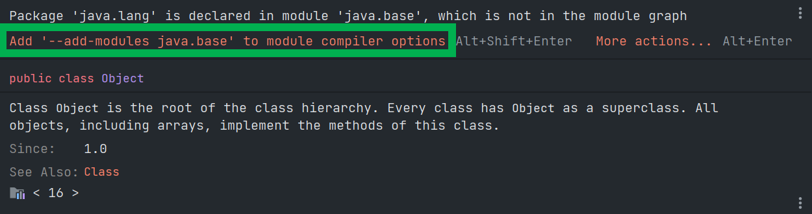
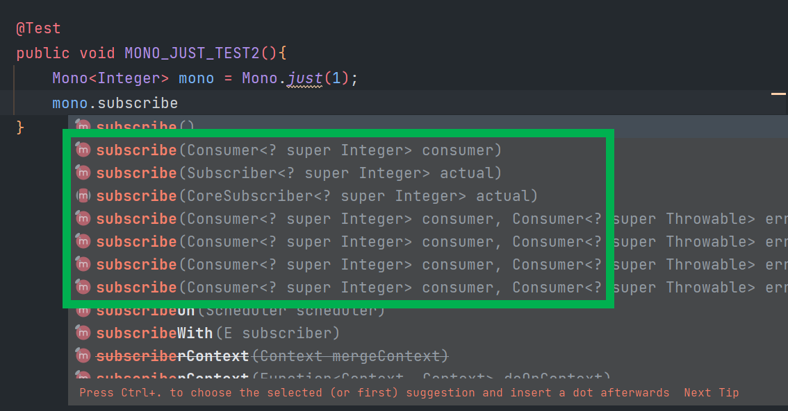
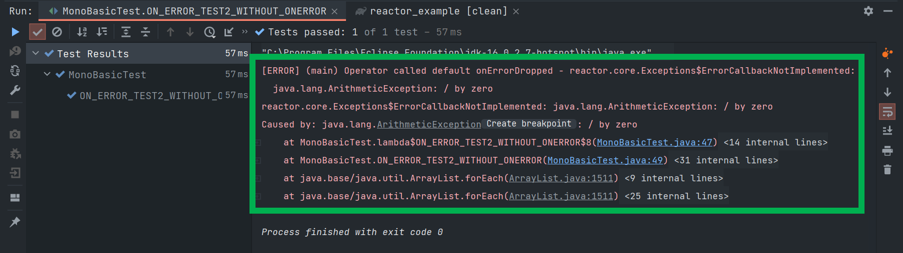
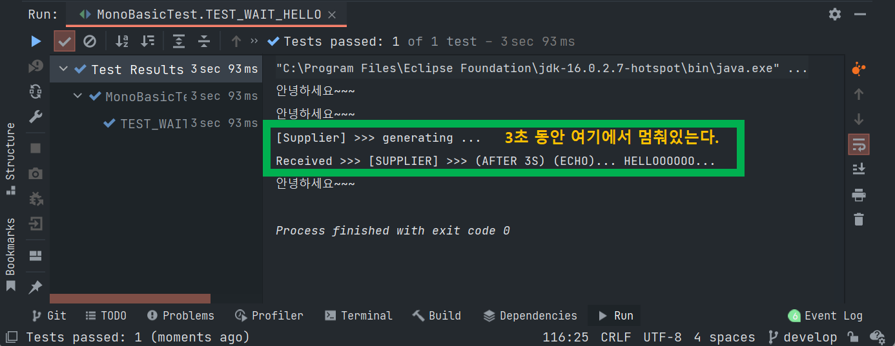
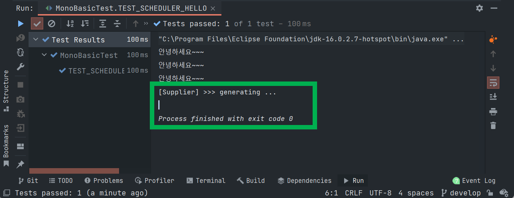
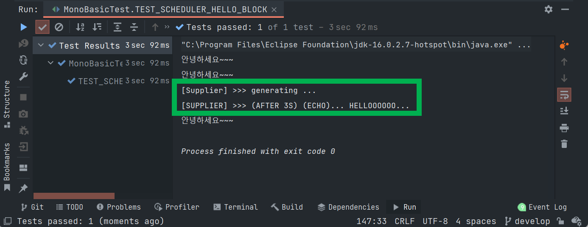
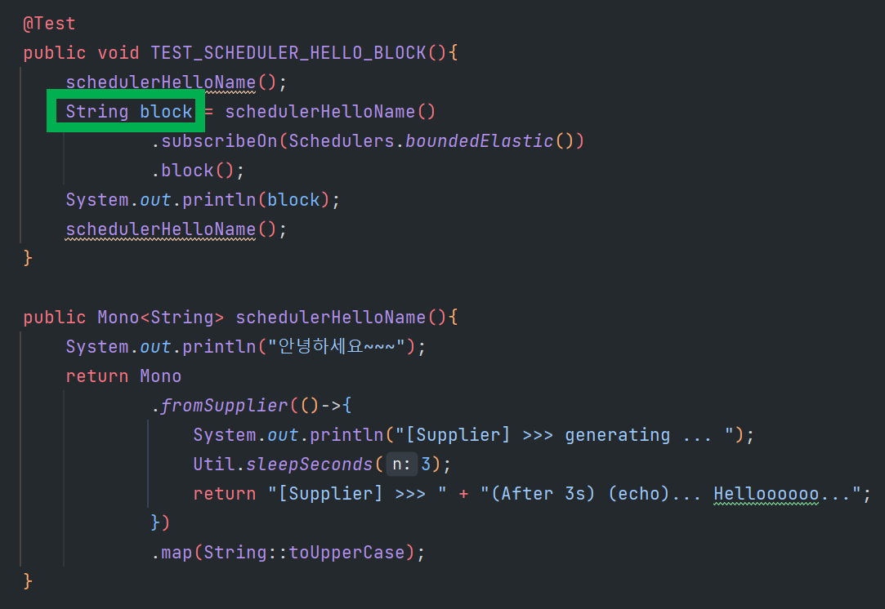

# 리액티브 프로그래밍 시작하기 (1) - Flux, Mono


# 환경세팅

gradle 프로젝트 생성. 의존성은 아래와 같이 추가<br>

<br>

```groovy
plugins{
    id 'java'
    id 'eclipse'
}

group 'io.study'
version '1.0-SNAPSHOT'
sourceCompatibility = 11

repositories {
    mavenCentral()
}

dependencies {
    // reactor
    implementation 'io.projectreactor:reactor-core:3.4.19'
    implementation 'org.projectlombok:lombok:1.18.24'
    implementation 'com.github.javafaker:javafaker:1.0.2'

    // junit-jupiter
    testImplementation 'org.junit.jupiter:junit-jupiter-api:5.7.2'
    // reactor
    testImplementation 'io.projectreactor:reactor-test:3.4.19'
    testRuntimeOnly 'org.junit.jupiter:junit-jupiter-engine:5.7.2'
}

test {
    useJUnitPlatform()
}
```

<br>

실행시 아래와 같은 에러가 발생할 수 있는데, Add '--add-modules java.base' to module compiler options 버튼을 클릭해서, 컴파일러 옵션을 추가해주자. (intellij 에서만 발생하는 이슈인 듯 해보인다.)<br>



<br>

# Mono 기초

## Mono.just

**예제**<br>

Mono.just 를 단순히 선언한다고 해서 바로 선언할 수 있는 것은 아니다. Mono 를 선언했다는 것은 하나의 데이터의 흐름을 만들어놓은 것이다. (java 의 Stream 과 유사한 개념.)

```java
@Test
public void MONO_JUST_TEST(){
    Mono<Integer> one = Mono.just(1);
    System.out.println(one);
}
```

**출력결과**<br>

```plain
MonoJust
```

<br>

## Mono.just 로 생성된 데이터의 흐름을 subscribe 하기

**예제**<br>

특이한점은 Mono, Flux 는 Stream 과는 다르게, 한번 소모한 것을 재사용할 수 있다. 

>  참고로, 컬렉션과 Stream은 다른 개념이다. Stream 은 컬렉션으로부터 생성할 수 있는 데이터의 흐름이다. 보통은 함수의 입출력으로는 Stream을 반환하거나, 인자값으로 받지 않도록 권장하는 편이다. (참고: Effective Java)

```java
@Test
public void MONO_JUST_TEST2(){
    Mono<Integer> mono = Mono.just(1);
    mono.subscribe(i->System.out.println(i));
    // 또는 아래와 같이 간결하게 메서드 레퍼런스로도 가능
    mono.subscribe(System.out::println);
}
```

<br>

**출력결과**

```plain
1
1
```

<br>

Mono.just 의 인자값을 잠시 살펴보면 아래와 같은 것들이 있다. 



<br>

## Mono.subscribe

subscribe 메서드를 사용할 때 보통 아래 3가지의 인자값들을 기본으로 하는 subscribe 메서드를 주로 사용하는 편이다.

- onNext
  - `Consumer<T>` 
- onError 와 같은 역할을 하는 각각의 Consumer 객체를 전달하는 편이다.
  - `Consumer<Throwable>`
- onComplete
  - `Runnable` 

<br>

**예제**<br>

```java
@Test
public void MONO_JUST_TEST3(){
    Mono<Integer> mono = Mono.just(2);

    mono.subscribe(
        number -> System.out.println(number),
        throwable -> System.out.println(throwable.getMessage()),
        () -> System.out.println("Complete!!")
    );
}
```

<br>

**출력결과**<br>

```plain
2
Complete!!
```

<br>

## onError

일부러 에러가 나게끔 하고, 에러가 날 경우의 출력결과를 살펴보기 위해 아래의 코드를 살펴보자.

```java
@Test
public void ON_ERROR_TEST1(){
    Mono<Integer> hello = Mono.just("hello")
        .map(String::length)
        .map(i -> i / 0);

    hello.subscribe(
        number -> System.out.println(number),
        throwable -> System.out.println(throwable.getMessage()),
        () -> System.out.println("Complete!!")
    );
}
```

<br>

출력결과는 아래와 같이 에러에 대한 메시지를 출력하게 된다.

```plain
/ by zero
```

<br>

이번에는 아래와 같이 `onError` 없이 일반 메서드만 호출하도록 해보자. 이렇게 하는 이유는 onError 시의 에러처리를 지정해주는 것이 왜 좋은지를 직접 확인하기 위해서다.<br>

```java
@Test
public void ON_ERROR_TEST2_WITHOUT_ONERROR(){
    Mono<Integer> hello = Mono.just("hello")
        .map(String::length)
        .map(i -> i / 0);

    hello.subscribe(
        number -> System.out.println(number)
    );
}
```

<br>

출력결과는 아래와 같에 예외가 발생한다.



<br>

## Emitting Empty

Mono는 Optional.empty() 와 비슷한 역할을 하는 데이터를 내보낼 수 있다. 아주 편리하게 쓰이겠다 싶었다.

```java
@Test
public void EMITTING_EMPTY(){
    emptyData(1).subscribe(
        Util.onNext(),
        Util.onError(),
        Util.onComplete()
    );
}

public static Mono<String> emptyData(int userId){
    return Mono.empty();
}
```

출력결과

```plain
Completed
```

<br>

## Emitting Error

```java
@Test
public void EMMITTING_ERROR(){
    errorData(1).subscribe(
        Util.onNext(),
        Util.onError(),
        Util.onComplete()
    );
}

public static Mono<String> errorData(int userId){
    return Mono.error(new Throwable("테스트를 위해 예외를 발생시켰어요. "));
}
```

출력결과

```plain
Error >>> 테스트를 위해 예외를 발생시켰어요.
```

<br>

## fromSupplier

일단, Supplier 관련 내용은 아니지만, 먼저 아래 코드를 실행해보자.

```java
@Test
public void SOME_EXECUTING_CONTEXT_TEST(){
    Mono<String> mono = Mono.just(helloMessage());
}

public String helloMessage(){
    System.out.println("안뇽하세요~~~");
    return "반갑습니다~~~";
}
```

subscribe() 메서드를 통해 아직 데이터를 구독을 하지 않았음에도 아래와 같이 출력결과가 나타난다.

```plain
안뇽하세요~~~
```

helloMessage() 를 통해 리턴되는 값은 아직 리턴되지 않은 상태이지만, Mono.just로 데이터를 받을 때는 System.out.println 구문이 실행되었다.

<br>

subscribe() 로 구독을 할 때에만 실행되게끔 하고 싶다면, fromSupplier() 를 사용해야 한다.

이제는 아래와 같이 해보자.

```java
@Test
public void FROM_SUPPLIER_TEST(){
    Mono<String> mono = Mono.fromSupplier(() -> helloMessage());
}

public String helloMessage(){
    System.out.println("안뇽하세요~~~");
    return "반갑습니다~~~";
}
```

<br>

결과를 보면 아무일도 일어나지 않는다.<br>

즉, Supplier 를 통해 만들어낸 Mono 는 그냥 하나의 실행 문맥일 뿐 실행이 즉시 되지 않음을 알 수 있다.<br>

이번에는 아래와 같이 subscribe() 메서드를 작성해보자.<br>

```java
@Test
public void FROM_SUPPLIER_TEST2(){
    Mono.fromSupplier(() -> helloMessage())
        .subscribe(Util.onNext());
}

public String helloMessage(){
    System.out.println("안뇽하세요~~~");
    return "반갑습니다~~~";
}
```

<br>

## fromCallable

callable 역시 Mono 에 등록해서 사용하는 것이 가능하다. 자세한 사용법은 아래의 예제를 보자.

```java
@Test
public void FROM_CALLABLE_TEST(){
    Callable<String> helloCallable = () -> helloMessage();
    Mono.fromCallable(helloCallable)
        .subscribe(Util.onNext());
}

public String helloMessage(){
    System.out.println("안뇽하세요~~~");
    return "반갑습니다~~~";
}
```

<br>

**출력결과**<br>

```plain
안뇽하세요~~~
Received >>> 반갑습니다~~~
```

<br>

## blocking 처럼 동작하는 코드

Mono 의 fromSupplier 로 데이터의 흐름을 풀어놓는 코드다. 프로그램의 흐름을 풀어놓은 듯한 느낌이지만 실제로는 `Util.sleepSeconds()` 에서 blocking 된다. <br>

reactor 는 기본적으로 실제 발생하는 모든 로직들이 실행되는 곳은 main thread 이다. 메인 스레드는 프로그램이 실행될 때 current thread로 간주된다. 그리고 아래 코드에서 Thread.sleep(n) 코드는 메인스레드(current thread) 에서 실행되기에 현재 스레드를 3초간 블록되게 되는 것이다.<br>

<br>

```java
@Test
public void TEST_WAIT_HELLO(){
    waitHelloName();
    waitHelloName().subscribe(Util.onNext());
    waitHelloName();
}

public Mono<String> waitHelloName(){
    System.out.println("안녕하세요~~~");
    return Mono
        .fromSupplier(()->{
            System.out.println("[Supplier] >>> generating ... ");
            Util.sleepSeconds(3);
            return "[Supplier] >>> " + "(After 3s) (echo)... Helloooooo...";
        })
        .map(String::toUpperCase);
}
```

<br>

실행결과를 캡쳐해보면 아래와 같다.<br>



<br>

이번에는 아래의 코드를 보자. 메인 스레드 대신 Scheduler 위에서 동작하게끔 해줬다. 즉, Scheduler 가 점유하는 스레드 위에서 sleep 을 실행되게끔 했다.<br>

```java
@Test
public void TEST_SCHEDULER_HELLO(){
    schedulerHelloName();
    schedulerHelloName()
        .subscribeOn(Schedulers.boundedElastic())
        .subscribe(Util.onNext());
    schedulerHelloName();
}

public Mono<String> schedulerHelloName(){
    System.out.println("안녕하세요~~~");
    return Mono
        .fromSupplier(()->{
            System.out.println("[Supplier] >>> generating ... ");
            Util.sleepSeconds(3);
            return "[Supplier] >>> " + "(After 3s) (echo)... Helloooooo...";
        })
        .map(String::toUpperCase);
}
```

<br>

fromSupplier 의 스레드가 종료되기 전에 메인스레드가 실행을 종료하기에 아래와 같이 fromSupplier 에 작성한 로직이 모두 실행되지 않고 메인 스레드의 코드를 모두 실행한후 메인 스레드를 종료시킨다.<br>



<br>

main 스레드에서 실행시킬 코드를 모두 완료시킨 후에 Scheduler 코드도 모두 마무리 될 때까지 기다리고 싶다면? 아래의 코드를 보자.

```java
@Test
public void TEST_SCHEDULER_HELLO_BLOCK(){
    schedulerHelloName();
    String block = schedulerHelloName()
        .subscribeOn(Schedulers.boundedElastic())
        .block();
    System.out.println(block);
    schedulerHelloName();
}

public Mono<String> schedulerHelloName(){
    System.out.println("안녕하세요~~~");
    return Mono
        .fromSupplier(()->{
            System.out.println("[Supplier] >>> generating ... ");
            Util.sleepSeconds(3);
            return "[Supplier] >>> " + "(After 3s) (echo)... Helloooooo...";
        })
        .map(String::toUpperCase);
}
```

`subscribe()` 로 마무리하던 로직을 `block()` 코드를 호출하도록 변경해줬다.<br>



<br>

Scheduler 스레드가 모두 실행될 때 까지 기다렸다가 실행되는 것을 확인 가능하다.<br>

여기서 주의점이 있다.<br>

> String block = ...; 

과 같이 리턴값을 받아줘야 한다. 마치 CompletableFuture.supplyAsync() 의 실행결과를 future.get(); 으로 받아오는 로직을 작성하지 않으면 CompletableFuture 의 스레드 로직은 다른 스레드에서 실행되고 있고, 메인스레드에서는 별개로 동작하는 것과 비슷한 흐름이다.<br>



<br>

## fromFuture

<br>

## fromRunnable

<br>


# Util 클래스

```java
package util;

import java.util.function.Consumer;

public class Util {
    public static Consumer<Object> onNext(){
        return obj -> System.out.println("Received >>> " + obj);
    }
    
    public static Consumer<Throwable> onError(){
        return error -> System.out.println("Error >>> " + error.getMessage());
    }
    
    public static Runnable onComplete(){
        return () -> System.out.println("Completed");
    }
}
```

<br>

# Faker 클래스 테스트

Faker 클래스는 가짜 데이터를 만드는 용도로 사용한다. 예를 들면 아래와 같은 방식으로 사용하는 편이다.

```java
@Test
public void FAKER_TEST(){
    Faker instance = Faker.instance();
    IntStream.range(1, 11)
        .forEach(i -> System.out.println(i + ". " + instance.name().fullName()));
}
```

<br>

출력결과

```plain
1. Matthew Grant
2. Mr. Allen Thiel
3. Linette Stracke PhD
4. Randy Ankunding Sr.
5. Sarah Mohr
6. Reid Keeling
7. Rod Mann
8. Ricky Kuvalis
9. Alton Friesen
10. Melodee Koepp
```

<br>

<br>

<br>

<br>

<br>

<br>

<br>

<br>

<br>

<br>

<br>
