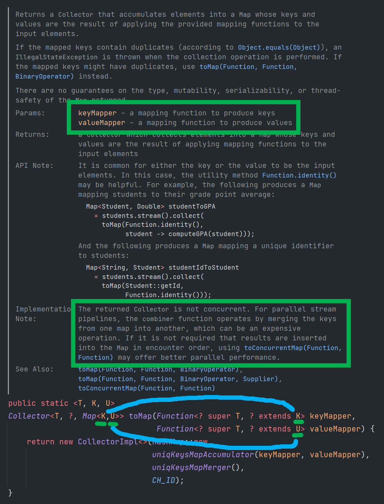
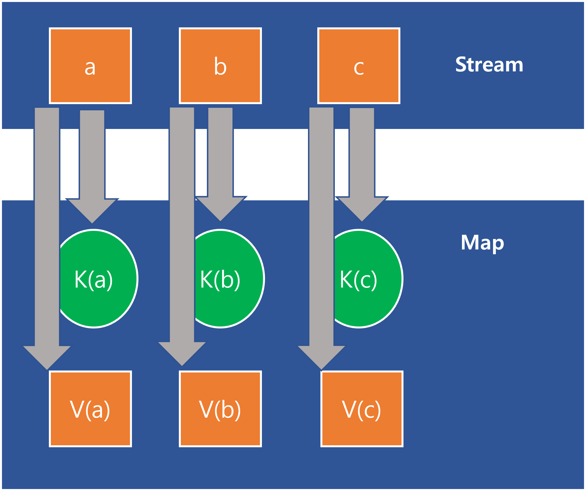

# Collectors.toMap

오늘 살펴보는 toMap 메서드는 Collectors 클래스의 메서드이다.<br>

Collector 클래스의 toMap() 메서드는 어떤 스트림을 key, value를 가진 Map 컬렉션으로 변환하고자 할 때 사용한다.<br>

toMap 이 생성해내는 객체는 Collector 객체이다. 그리고 이 Collector 객체는 Stream 클래스의 collect 메서드가 받아서 먹은후 알맞은 자료형으로 collect 해준다.<br>

toMap 이 Collector 객체를 생성할 때 이용되는 구체클래스는 CollectorImpl 클래스인데, 이 CollectorImpl 클래스는 Collectors 클래스 내의 inner static 클래스이다.<br>

<br>

# toMap

toMap 은 Stream 내부의 데이터를 map 으로 변환해주는 collector이다.

```java
public static <T, K, U> Collector<T, ?, Map<K,U>> toMap(
	Function<? super T, ? extends K> keyMapper,
	Function<? super T, ? extends U> valueMapper
)
```

- keyMapper
  - 데이터를 map의 key 로 변환해주는 역할을 수행
  - K라는 약자에서 알 수 있듯이 `KEY` 를 의미하는 약자다.
- ValueMapper
  - 데이터를 map의 Value로 변환해주는 역할을 수행

<br>

return 되는 collector는 concurrent 하지 않다는 주석을 자세히 보자. 만약 concurrent 한 Map으로 리턴하고 싶다면 `toConcurrentMap(Function, Function)` 을 사용해야 한다.



<br>

아래 그림에서 KeyMapper 는 K(a), K(b), K(c) 이다. 그리고 ValueMapper 는 V(a), V(b), V(c) 이다.



<br>

# 예제

Employee 클래스, JobType enum 은 이 문서의 최 하단부에 코드를 정리해두었다.<br>

<br>

## 문자열의 리스트를 각각을 문자열의 길이가 얼마인지 Map 으로 저장

단순한 리스트같은 모습을 띄는 스트림의 각 요소에 대해 key,value 의 형식을 가지는 리턴을 가지도록 해보는 예제다.

```java
@Test
public void TEST_COLLECTORS_TO_MAP_1(){
    Map<String, String> map1 = Stream.of("Apple", "Banana", "Cherry")
            .collect(Collectors.toMap(x -> x, x -> "문자열의 길이 = " + x.length()));

    System.out.println("map1 = " + map1);

    // x->x 는 Function.identity() 로 바꿔서 쓸수 있다.
    Map<String, String> map2 = Stream.of("Apple", "Banana", "Cherry")
            .collect(Collectors.toMap(x -> x, x -> "문자열의 길이 = " + x.length()));

    System.out.println("map2 = " + map2);
}
```

<br>

출력결과

```plain
map1 = {Apple=문자열의 길이 = 5, Cherry=문자열의 길이 = 6, Banana=문자열의 길이 = 6}
map2 = {Apple=문자열의 길이 = 5, Cherry=문자열의 길이 = 6, Banana=문자열의 길이 = 6}
```

<br>

## Employee 객체의 리스트(List\<Employee\>)를 받아서, Map\<id, Employee\> 로 변환

Employee 객체의 리스트를 받아서 Map\<String, Employee\> 로 변환하는데, 이때 Map의 키는 Employee 객체의 id 이다. (Employee 클래스에 대한 코드는 제일 아래에 정리해두었다.)

```java
@Test
public void TEST_COLLECTORS_TO_MAP_2(){
    Map<String, Employee> employeeMap1 = sampleEmployeeList().stream()
            .collect(Collectors.toMap(v -> v.getId(), v -> v));

    System.out.println("employeeMap1 = " + employeeMap1);

    Map<String, Employee> employeeMap2 = sampleEmployeeList().stream()
            .collect(Collectors.toMap(Employee::getId, Function.identity()));

    System.out.println("employeeMap2 = " + employeeMap2);
}
```

<br>

출력결과

```plain
employeeMap1 = {228a6a6c-21b6-485f-80a9-0c5776946b81=CollectorsToMapTest.Employee(id=228a6a6c-21b6-485f-80a9-0c5776946b81, name=고든, salary=600000000, jobType=DEVELOPER), 672c32a0-52ae-4550-ad8b-12a29f4f0509=CollectorsToMapTest.Employee(id=672c32a0-52ae-4550-ad8b-12a29f4f0509, name=주드, salary=500001, jobType=DEVELOPER), bc5e5136-c410-4b94-86b8-13876c3bee8c=CollectorsToMapTest.Employee(id=bc5e5136-c410-4b94-86b8-13876c3bee8c, name=케인, salary=500000, jobType=MANAGER), 4b049930-f24e-4bfe-8ffe-319cdaf67dbd=CollectorsToMapTest.Employee(id=4b049930-f24e-4bfe-8ffe-319cdaf67dbd, name=웨인, salary=500001, jobType=MARKETER)}
employeeMap2 = {d606594f-e2d6-4899-9555-86b1ef908f12=CollectorsToMapTest.Employee(id=d606594f-e2d6-4899-9555-86b1ef908f12, name=고든, salary=600000000, jobType=DEVELOPER), f1924bf3-f0ce-4e74-8668-0ca67731cb43=CollectorsToMapTest.Employee(id=f1924bf3-f0ce-4e74-8668-0ca67731cb43, name=주드, salary=500001, jobType=DEVELOPER), 46507746-78b1-4e29-a7da-56ae0d4b4787=CollectorsToMapTest.Employee(id=46507746-78b1-4e29-a7da-56ae0d4b4787, name=케인, salary=500000, jobType=MANAGER), d4ad61ba-e8a2-4eb2-b13f-6ece8a425da6=CollectorsToMapTest.Employee(id=d4ad61ba-e8a2-4eb2-b13f-6ece8a425da6, name=웨인, salary=500001, jobType=MARKETER)}
```

<br>

## List\<Employee\> 를 Map\<String, JobType\> 으로 변환

각 ID 에 대한 JobType 을 가지는 Map 을 생성

```java
@Test
public void TEST_COLLECTORS_TO_MAP_3(){
    Map<String, JobType> idJobTypeMap1 = sampleEmployeeList()
            .stream().collect(Collectors.toMap(v-> v.getId(), v-> v.getJobType()));

    System.out.println("idJobTypeMap1 = " + idJobTypeMap1);

    Map<String, JobType> idJobTypeMap2 = sampleEmployeeList()
            .stream().collect(Collectors.toMap(Employee::getId, Employee::getJobType));

    System.out.println("idJobTypeMap2 = " + idJobTypeMap2);
}
```

<br>

출력결과

```plain
idJobTypeMap1 = {2010e3b9-3f70-4205-9215-fa7d5d82339c=MARKETER, 432a981d-5686-4568-80f1-888fd0214fe9=DEVELOPER, 7a7c860d-c5db-4f42-bf85-98790495c148=DEVELOPER, a884d845-ff43-4a6e-bd0e-f03e83eaed45=MANAGER}
idJobTypeMap2 = {c50476c8-b23a-4760-90d6-bef2eb26ffe2=DEVELOPER, e2d188b1-4acd-4fbf-bb1f-cae7847a4472=MANAGER, 07bc0ce6-a80a-4e2f-af4e-589813db0f5c=MARKETER, bce47208-5e5d-4a0f-8631-0d1b74528892=DEVELOPER}
```

<br>

## JobType, Employee 클래스, sampleEmployeeList() 메서드

```java
enum JobType{
    DEVELOPER, MANAGER, MARKETER
}

@Getter
@ToString
class Employee{
    private String id;
    private String name;
    private BigDecimal salary;
    private JobType jobType;

    public Employee(String id, String name, BigDecimal salary, JobType jobType){
        this.id = id;
        this.name = name;
        this.salary = salary;
        this.jobType = jobType;
    }
}

public List<Employee> sampleEmployeeList(){
    return Arrays.asList(
        new Employee(UUID.randomUUID().toString(), "고든", BigDecimal.valueOf(600000000), JobType.DEVELOPER),
        new Employee(UUID.randomUUID().toString(), "케인", BigDecimal.valueOf(500000), JobType.MANAGER),
        new Employee(UUID.randomUUID().toString(), "웨인", BigDecimal.valueOf(500001), JobType.MARKETER),
        new Employee(UUID.randomUUID().toString(), "주드", BigDecimal.valueOf(500001), JobType.DEVELOPER)
    );
}
```


