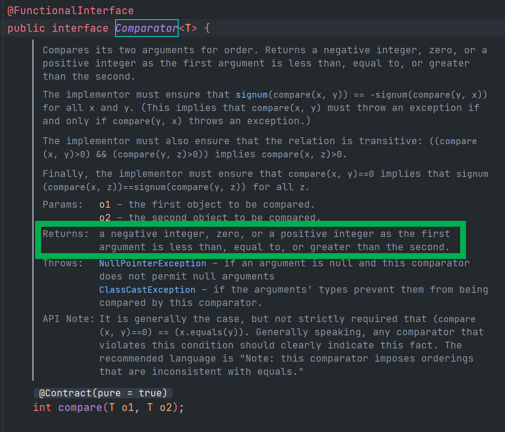

# Comparator

Comparator 의 원형은 아래와 같다.

```java
@FunctionalInterface
public interface Comparator<T>{
	int compare(T o1, T o2);
}
```

<br>

조금 한국식으로 명확해보면 이렇다.

- o1 이 o2 보다 작으면 : 음수를 리턴 (o1-o2)
- o1 이 o2 와 같으면 : 0을 리턴 (o1-o2)
- o1 이 o2 보다 크면 : 양수를 리턴 (o1-o2)

<br>

IntelliJ 에서 Type Search 를 통해 찾은 Comparator 클래스의 내부 주석은 아래와 같다.

중요해보이는 부분을 초록색 테두리로 강조해두었다.

- 첫번째 argument 가 두번째 argument 보다 더 작으면 negative integer 를 return
- 첫번째 argument 가 두번째 argument 와 같으면 zero 를 return
- 첫번째 argument 가 두번째 argument 보다 더 크면 positive integer 를 return

> 영어 어순상 뒤에 as로 뒤에 맞춰져 있고, than the second 라는 문구가 중복되되는 것을 줄여서 쓴것이 보인다. 라이브러리의 영어 주석을 읽는 것에 익숙해지려면 이런 문구에서 사용하는 as절 같은 것도 익숙해져야 할 것 같아서 캡처를 올려두었다…ㅋㅋ…



<br>

예제를 만들긴 했는데, 설명을 쓰기가 귀찮아졌다. 나중에 정리할까 생각중이다...

```java
@Test
public void TEST_COMPARATORS(){
    List<StockEarningValuation> earningValuations = Arrays.asList(
            newEarningData("TSLA", new BigDecimal("95.10"), new BigDecimal("44.26")),
            newEarningData("TSM", new BigDecimal("21.53"), new BigDecimal("14.81")),
            newEarningData("LULU", new BigDecimal("40.11"), new BigDecimal("27.19")),
            newEarningData("FB", new BigDecimal("14.44"), new BigDecimal("13.64"))
    );

    Consumer<List<StockEarningValuation>> sysoutConsumer =
            l-> l.forEach(System.out::println);

    System.out.println("PER SORT RESULT >> ");
    Comparator<StockEarningValuation> perComparator = (p1, p2) -> p1.getPer().subtract(p2.getPer()).intValue();
    Collections.sort(earningValuations, perComparator);
    sysoutConsumer.accept(earningValuations);
    System.out.println();

    System.out.println("Foward PER SORT RESULT >> ");
    Comparator<StockEarningValuation> forwardPerComparator = (p1, p2) -> p1.getForwardPer().subtract(p2.getForwardPer()).intValue();
    Collections.sort(earningValuations, forwardPerComparator);
    sysoutConsumer.accept(earningValuations);
    System.out.println();

    System.out.println("Ticker SORT RESULT >> ");
    Comparator<StockEarningValuation> tickerComparator = (p1, p2) -> p1.getTicker().compareTo(p2.getTicker());
    Collections.sort(earningValuations, tickerComparator);
    sysoutConsumer.accept(earningValuations);
    System.out.println();
}

public StockEarningValuation newEarningData(String ticker, BigDecimal per, BigDecimal forwardPer){
    return StockEarningValuation.builder()
            .ticker(ticker)
            .per(per)
            .forwardPer(forwardPer)
            .build();
}
```

