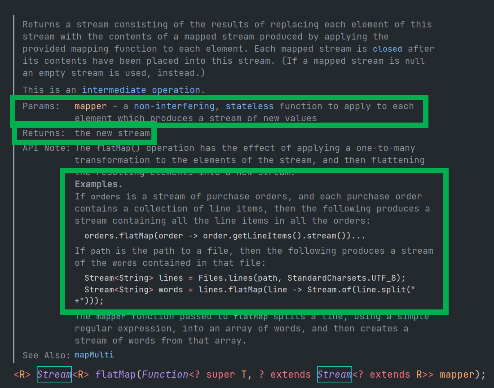

# FlatMap

flatMap 메서드의 원형은 아래와 같다.<br>

자세히 살펴보면, R로 사용되는 뒤의 타입은 `? extends Stream<? extends R>` 으로 명시되어 있다.<br>

조금 간결하게 요약해보면, 결국 R 타입의 Stream 이 **R**eturn 타입임을 알수 있다.<br>

<br>

```java
<R> Stream<R> flatMap(Function<? super T, ? extends Stream<? extends R>> mapper);
```

<br>

아래는 API의 명세다.<br>

<br>



<br>

# 예제1)

과거 4개분기 Eps도 모두 평가해서 높은 순으로 Eps 를 정렬하는 문제

급하게 예제를 만드느라, 전송객체가 꽤 지저분하다.

<br>

**테스트코드 - EpsTest.java**

예제의 내용은 이렇다. `MSFT`, `LULU`, `TSM` 종목의 최근 4개 분기 EpsList들을 각각 들고와서 하나의 스트림으로 합친 뒤에 Eps가 가장 큰 순서대로 정렬(역순정렬)한다. 그리고 그 중에서 가장 큰 3개를 추려내는 예제다.<br>

```java
package io.study.lang.javastudy2022ty1.functional_study.supplier_consumer;

import io.study.lang.javastudy2022ty1.functional_study.supplier_consumer.pojo.Eps;
import io.study.lang.javastudy2022ty1.functional_study.supplier_consumer.pojo.PeriodType;
import org.junit.jupiter.api.Test;

import java.math.BigDecimal;
import java.util.Arrays;
import java.util.Comparator;
import java.util.List;
import java.util.stream.Collectors;

public class EpsTest {

    public Eps newEps(PeriodType periodType, String time, String ticker, BigDecimal eps){
        return Eps.builder()
                .ticker(ticker)
                .periodType(periodType)
                .time(time)
                .eps(eps)
                .build();
    }

    @Test
    public void TEST_EARNING(){
        List<Eps> msftEpsHistory = Arrays.asList(
                newEps(PeriodType.QUARTERLY, "2022/1Q", "MSFT", BigDecimal.valueOf(2.22)),
                newEps(PeriodType.QUARTERLY, "2021/4Q", "MSFT", BigDecimal.valueOf(2.48)),
                newEps(PeriodType.QUARTERLY, "2021/3Q", "MSFT", BigDecimal.valueOf(2.27)),
                newEps(PeriodType.QUARTERLY, "2021/2Q", "MSFT", BigDecimal.valueOf(2.17))
        );

        Eps msft = Eps.builder()
                .ticker("MSFT")
                .eps(msftEpsHistory.get(0).getEps())
                .epsHistory(msftEpsHistory)
                .build();

        List<Eps> tsmEpsHistory = Arrays.asList(
                newEps(PeriodType.QUARTERLY, "2022/1Q", "TSM", BigDecimal.valueOf(1.39)),
                newEps(PeriodType.QUARTERLY, "2021/4Q", "TSM", BigDecimal.valueOf(1.15)),
                newEps(PeriodType.QUARTERLY, "2021/3Q", "TSM", BigDecimal.valueOf(1.08)),
                newEps(PeriodType.QUARTERLY, "2021/2Q", "TSM", BigDecimal.valueOf(0.93))
        );

        Eps tsm = Eps.builder()
                .ticker("TSM")
                .eps(tsmEpsHistory.get(0).getEps())
                .epsHistory(tsmEpsHistory)
                .build();

        List<Eps> luluEpsHistory = Arrays.asList(
                newEps(PeriodType.QUARTERLY, "2022/1Q", "LULU", BigDecimal.valueOf(1.48)),
                newEps(PeriodType.QUARTERLY, "2021/4Q", "LULU", BigDecimal.valueOf(3.37)),
                newEps(PeriodType.QUARTERLY, "2021/3Q", "LULU", BigDecimal.valueOf(1.62)),
                newEps(PeriodType.QUARTERLY, "2021/2Q", "LULU", BigDecimal.valueOf(1.65))
        );

        Eps lulu = Eps.builder()
                .ticker("LULU")
                .eps(luluEpsHistory.get(0).getEps())
                .epsHistory(luluEpsHistory)
                .build();

        Comparator<Eps> epsComparator = (left, right) -> left.getEps().compareTo(right.getEps());

        List<Eps> allEpsData = Arrays.asList(msft, tsm, lulu)
                .stream()
                .flatMap(eps -> eps.getEpsHistory().stream())
                .sorted(epsComparator.reversed())
                .limit(3)
                .collect(Collectors.toList());

        System.out.println(allEpsData);
    }
}
```

<br>

출력결과<br>

```plain
[Eps(periodType=QUARTERLY, time=2021/4Q, ticker=LULU, eps=3.37, epsHistory=null), Eps(periodType=QUARTERLY, time=2021/4Q, ticker=MSFT, eps=2.48, epsHistory=null), Eps(periodType=QUARTERLY, time=2021/3Q, ticker=MSFT, eps=2.27, epsHistory=null)]
```

<br>

## 예제 2)

예제를 한 3\~4개 정도는 추가해둘예정이다.