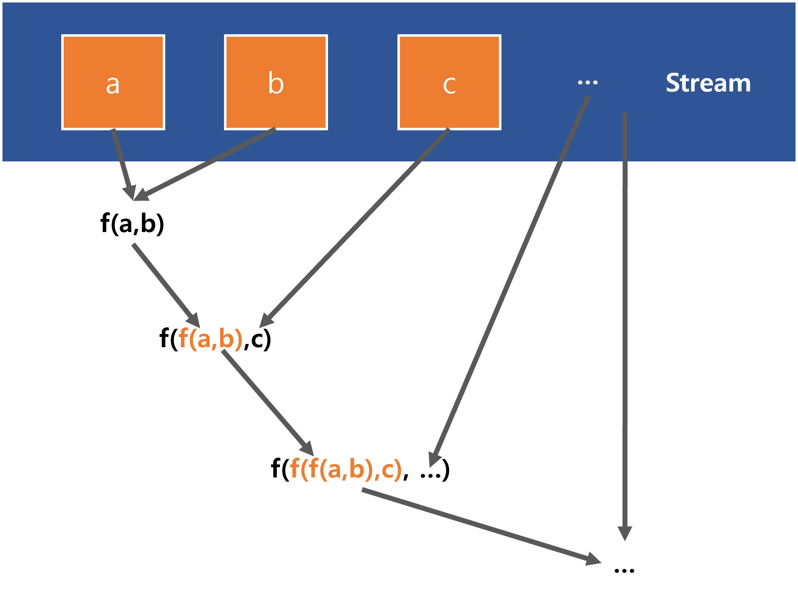

# Reduce

# Overview

- Stream 안의 각각의 데이터에 데이터가 하나만 남을 때 까지 계속해서 주어진 함수를 계속해서 적용하고 최종적인 결과를 리턴<br>
- 병렬컴퓨팅에서 자주 이야기하는 맵리듀스의 리듀스가 바로 이 리듀스를 의미.
- 여러 컴퓨터에서 매핑작업을 하고 그 결과를 리듀서를 통해서 하나의 결과물로 합쳐주는 것.
- Stream 에서 기본으로 제공하는 min, max 함수는 reduce 함수를 직접 구현해서 적용가능하다.



<br>

# BinaryOperator

input 2개와 하나의 리턴값을 갖는 BiFunction 에서 input 타입 T와 output타입 R이 같은 타입일 때

이 경우, BinaryOperator 로 해당 로직을 대체할 수 있다.<br>

<br>

# Stream::reduce()

Stream 클래스에서 reduce 기능으로 제공하는 reduce() 메서드는 아래와 같이 3가지가 있다.


<br>

## 1) reduce (BinaryOperator\<T\> accumulator)

BinaryOperator 타입인 accumulator 를 인자값으로 받는다.<br>

Stream 내의 모든 요소에 대해 accumulator 연산을 수행한다.<br>

Stream 이 비어있을수도 있기에 Optional 을 반환한다.<br>

```java
@Test
public void TEST1_1번_리듀스_메서드_합구하기(){
    int result = Stream.of(100, 200, 300, 400, 500)
            .reduce((x,y)-> x + y)
            .get();

    assertThat(result).isEqualTo(1500);
    System.out.println(result);
}
```

<br>

Stream 클래스에서 제공하는 기본 메서드인 min, max 메서드 역시도 reduce() 메서드로 구현 가능하다.

```java
@Test
public void TEST1_1번_리듀스_메서드_최대값구하기(){
    int result = Stream.of(100, 200, 300, 400, 500)
        .reduce((x,y) -> x > y ? x : y);
    assertThat(result).isEqualTo(500);
}
```

<br>

## 2) reduce (T identity, BinaryOperator\<T\> accumulator)

기본값 `T identity` 를 받아서 accumulator 연산을 수행<br>

스트림이 비어있을 경우에는 T identity 를 리턴한다.<br>

스트림이 비어있지 않을 경우는 스트림의 모든 요소를 T identity 부터 시작해서 accumulator 연산을 수행한다.<br>

<br>

```java
@Test
public void TEST2_2번_리듀스_메서드_모든요소의_합구하기(){
    int result = Stream.of(100, 200, 300, 400, 500)
        .reduce(0, (x,y) -> x+y);
    
    assertThat(result).isEqualTo(1500);
}
```

<br>

## 3) reduce (T identity, BiFunction \<U, ? super T, U\> accumulator, BinaryOperator \<U\> combiner)

- 사실 나는 이 메서드가 제일 어렵다.
- 이 3) 번 리듀스 함수는 map 함수와 reduce 함수를 조합해서 같은 역할을 하도록 구현하는 것이 가능하다. 따라서 비교적 복잡하고, 커스터마이징이 쉽지 않은 3) 번 리듀스 보다는 2)번 리듀스를 자주 사용한다.

<br>

**첫번째 인자값**<br>

`2)`와 마찬가지로 초기값은 T identity로 받는다.<br>

<br>

**두번째 인자값**<br>

accumulator 는 1),2)와는 다르게 인자값을 두개 받는다.

- 초깃값의 타입 T와, U타입의 인자값을 받아서 U타입으로 변환하는 accumulator 이다.
- 이렇게 말로 적어봐야 코드 한번 보는게 더 빠르다.

U타입끼리 합치는 combiner 는 병렬작업시에 필요하다.

<br>

**세번째 인자값 = reduce 연산 객체 (BinaryOperator)**<br>

두번째 인자값에 정의한 연산을 reducing 할 람다를 전달해준다. BinaryOperator 가 보통이다.<br>

<br>

```java
@Test
public void TEST3_3번_리듀스_메서드_모든요소의_합구하기(){
    int result = Stream.of("100", "200", "300", "400", "500")
            .reduce(0, (x,str)-> x + Integer.parseInt(str), (x,y)->x+y);

    assertThat(result).isEqualTo(1500);
}
```

어찌 어찌 예제를 만들기는 했는데, 쉽지 않았다. 그리고 이 예제는 분명 다시 까먹을 거다 ㅋㅋ. 그냥 map과 reduce를 잘 활용해서 쓰게되지 않을까 싶다. 어차피 map,reduce 조합과 이 `3)` 번 리듀스는 같은 의미, 같은 기능을 한다.<br>

<br>

# 예제

이번에도 역시 Eps 관련 예제다. 꽤 재미없는 예제이긴 하지만, flatMap 도 연습해볼 겸 정리했다.<br>

예제 여러개를 테스트 코드 하나에 모두 모아놨는데, 일주일내로 다시 와서 깔끔하게 다시 정리할 예정이다. 지금은 너무 바빠서…<br>

<br>

```java
@Test
public void TEST_SAMPLE(){
    List<Eps> msftEpsHistory = Arrays.asList(
            newEps(PeriodType.QUARTERLY, "2022/1Q", "MSFT", BigDecimal.valueOf(2.22)),
            newEps(PeriodType.QUARTERLY, "2021/4Q", "MSFT", BigDecimal.valueOf(2.48)),
            newEps(PeriodType.QUARTERLY, "2021/3Q", "MSFT", BigDecimal.valueOf(2.27)),
            newEps(PeriodType.QUARTERLY, "2021/2Q", "MSFT", BigDecimal.valueOf(2.17))
    );

    Eps msft = Eps.builder()
            .ticker("MSFT")
            .eps(msftEpsHistory.get(0).getEps())
            .epsHistory(msftEpsHistory)
            .build();

    List<Eps> tsmEpsHistory = Arrays.asList(
            newEps(PeriodType.QUARTERLY, "2022/1Q", "TSM", BigDecimal.valueOf(1.39)),
            newEps(PeriodType.QUARTERLY, "2021/4Q", "TSM", BigDecimal.valueOf(1.15)),
            newEps(PeriodType.QUARTERLY, "2021/3Q", "TSM", BigDecimal.valueOf(1.08)),
            newEps(PeriodType.QUARTERLY, "2021/2Q", "TSM", BigDecimal.valueOf(0.93))
    );

    Eps tsm = Eps.builder()
            .ticker("TSM")
            .eps(tsmEpsHistory.get(0).getEps())
            .epsHistory(tsmEpsHistory)
            .build();

    List<Eps> luluEpsHistory = Arrays.asList(
            newEps(PeriodType.QUARTERLY, "2022/1Q", "LULU", BigDecimal.valueOf(1.48)),
            newEps(PeriodType.QUARTERLY, "2021/4Q", "LULU", BigDecimal.valueOf(3.37)),
            newEps(PeriodType.QUARTERLY, "2021/3Q", "LULU", BigDecimal.valueOf(1.62)),
            newEps(PeriodType.QUARTERLY, "2021/2Q", "LULU", BigDecimal.valueOf(1.65))
    );

    Eps lulu = Eps.builder()
            .ticker("LULU")
            .eps(luluEpsHistory.get(0).getEps())
            .epsHistory(luluEpsHistory)
            .build();

    List<Eps> list = Arrays.asList(msft, tsm, lulu);

    BigDecimal epsTotal = list.stream()
            .flatMap(eps -> eps.getEpsHistory().stream())
            .map(eps -> eps.getEps())
            .reduce(BigDecimal.ZERO, (x, y) -> x.add(y));

    System.out.println("epsTotal = " + epsTotal);

    BigDecimal epsMax = list.stream()
            .flatMap(eps -> eps.getEpsHistory().stream())
            .map(eps->eps.getEps())
            .reduce(BigDecimal.ZERO, (x,y) -> x.compareTo(y) > 0 ? x : y);

    System.out.println("epsMax = " + epsMax);

    Optional<Eps> epsMax2 = list.stream()
            .flatMap(eps -> eps.getEpsHistory().stream())
            .reduce((eps1, eps2) -> eps1.getEps().compareTo(eps2.getEps()) > 0 ? eps1 : eps2);

    System.out.println("epsMax2 = " + epsMax2.get());
}
```

<br>

출력결과

```plain
epsTotal = 21.81
epsMax = 3.37
epsMax2 = Eps(periodType=QUARTERLY, time=2021/4Q, ticker=LULU, eps=3.37, epsHistory=null)
```

