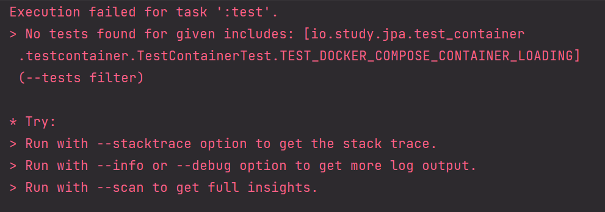

# No tests found for given includes: 

분명히 테스트 코드를 추가하고 테스트코드를 run 했는데 아래와 같은 에러가 출현

 

테스트코드가 없어서 생기는 에러였다. 

몇분 지난 후에 다시 테스트 코드를 실행하니 해결됐다. 인텔리제이 에러인듯하다. 무슨현상이지? 이상함...

 

만약 이런 경우가 또 생기면 구글링하지 말고, 3분 정도 기다렸다가 다시 run 버튼을 실행시키자. 프로젝트 새로 개설 후에 테스트 클래스를 새로 만든 직후에 생긴 에러라 아마도 인텔리제이 에러가 아닌가 싶은 생각이 들었다. 

 
