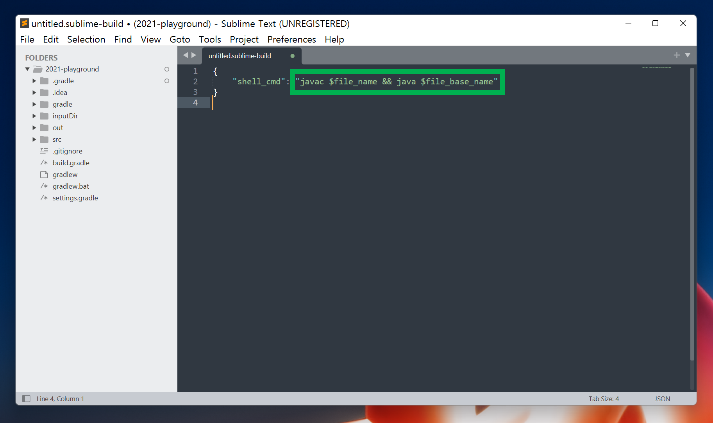
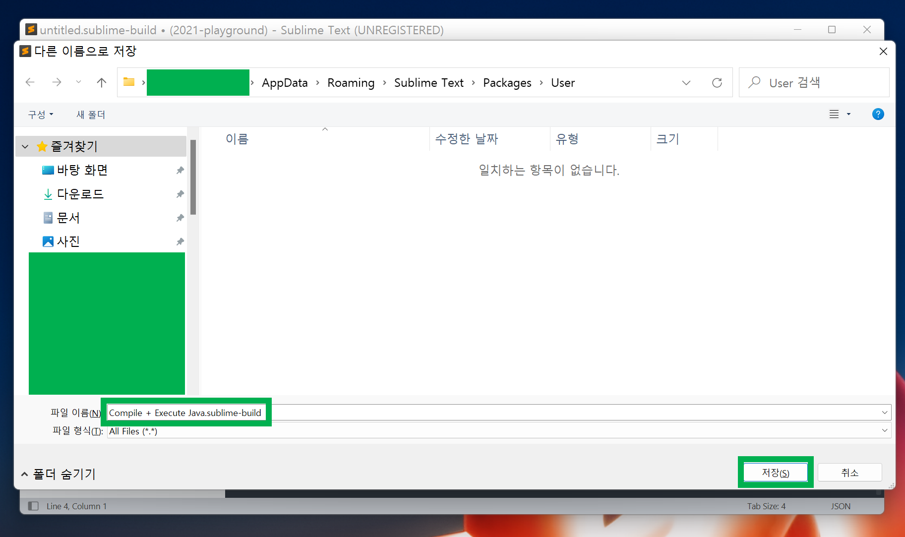
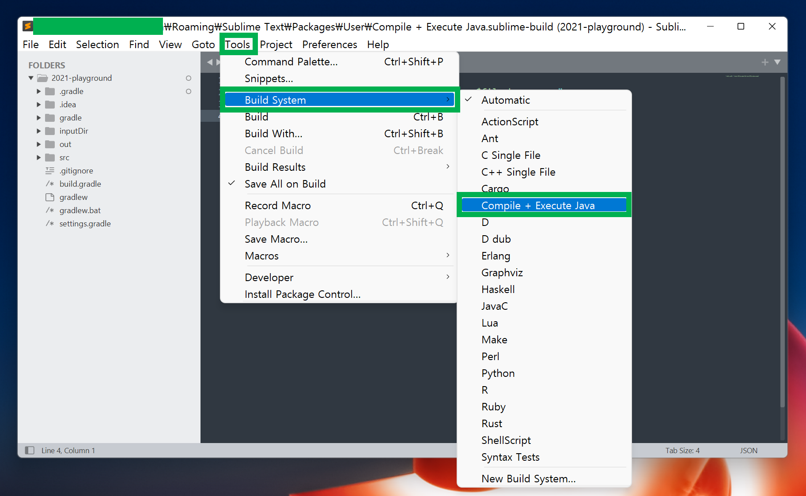
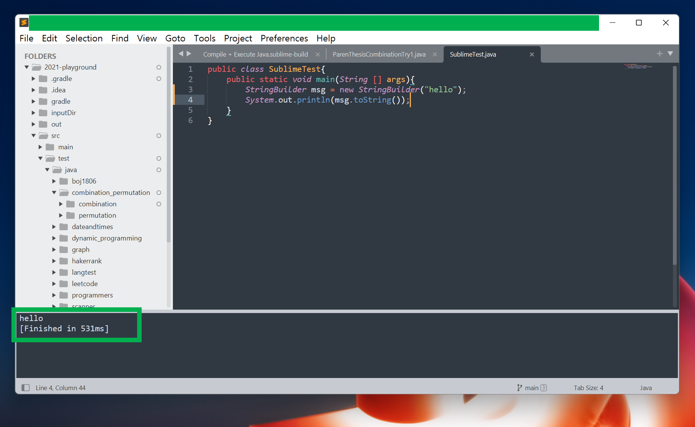

# Sublime Text Java build 세팅

코딩테스트를 준비하면서 intellij 를 자주 쓰다보니, 코딩 테스트 플랫폼의 에디터에 익숙해지질 않는다. 가급적 코드 추천이 없는 플레인(Plain) 한 에디터를 써야 했는데, 그 중 가장 단순해보이는게 서브라임텍스트였다. 그래서 오늘은 귀찮지만 Sublime Text 에서 자바 프로그램을 Execute 할때 빠르게 단축키로 하는 실행하는 방법을 정리하기로 했다.<br>

<br>

# 세팅

>  Tools → Build System → New Build System


<br>

> 아래와 같이 shell_cmd를 입력해준다.



<br>

코드는 아래와 같다.

```json
{
	"shell_cmd": "javac $file_name -encoding UTF8 && java $file_base_name"
}
```

<br>

>  Ctrl + S 키를 눌러서 저장을 하면 아래와 같은 창이 나타난다.
>
> 내 경우는 아래와 같이 빌드 Cmd 이름을 `Compile + Execute Java.sublime-build` 라고 지어주었다.
>
> 빌드파일 이름은 확장자만  `.sublime-build` 이면 이름을 뭘로 지정하든 상관이 없다.
>
> 저장 버튼을 누르고 나오자.



<br>

> Tools → Build System → Compile + Execute Java 를 클릭해줘서 현재 프로젝트에서는 기본 빌드 cmd 를 Compile + Execute Java 가 되도록 지정해준다.



<br>

> Java 프로그램을 작성하고 Ctrl + B 버튼을 눌러서 실행하면 아래와 같이 hello 라는 문구가 정상적으로 출력된다.



<br>

# DFS 또는 순열 돌릴때 무한재귀에 빠질 경우

## MS-WINDOWS

아무리 정확하게 한다고 해도 실수할 때가 있다. 이럴때는 당황하지 말고 터미널에서 아래의 명령어를 수행하자.

```bash
# JAVA 프로그램 검색
tasklist | findstr java
java.exe                     17236 Console                    1     32,508 K

# taskkill 
taskkill /pid 17236 /f
```

<br>

## 리눅스 / Mac

리눅스/Mac 에서는 아래와 같이...

```bash
ps -ef | grep java

kill -9 [프로세스번호]
```

<br>


