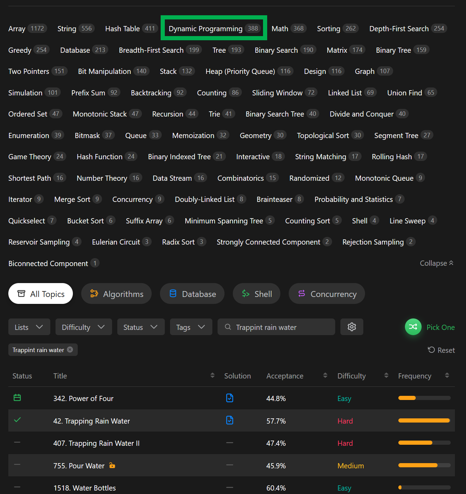
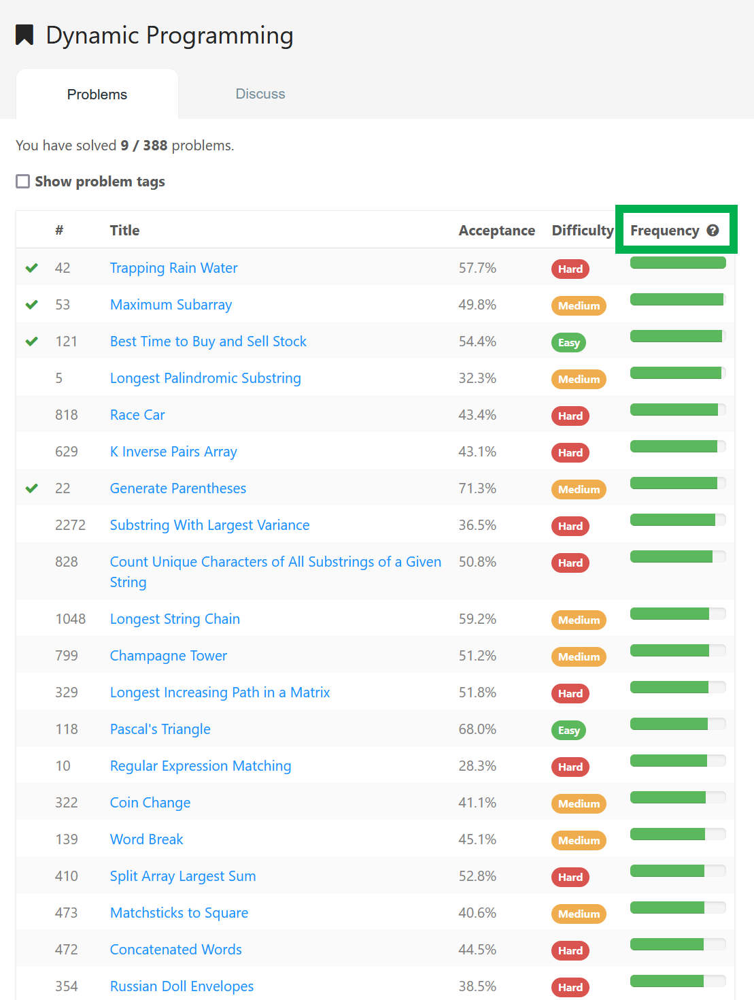
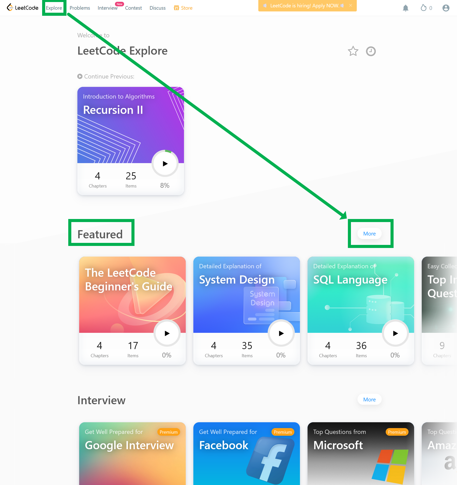
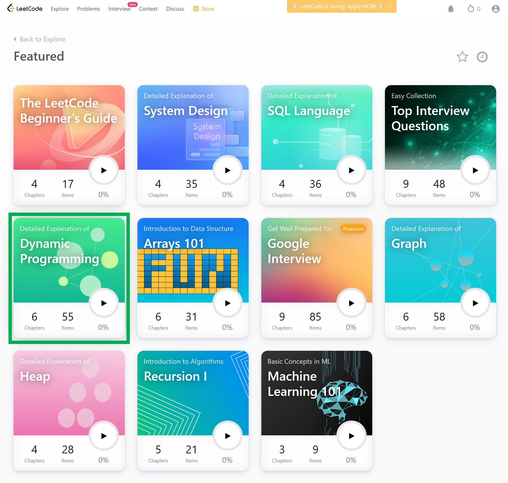
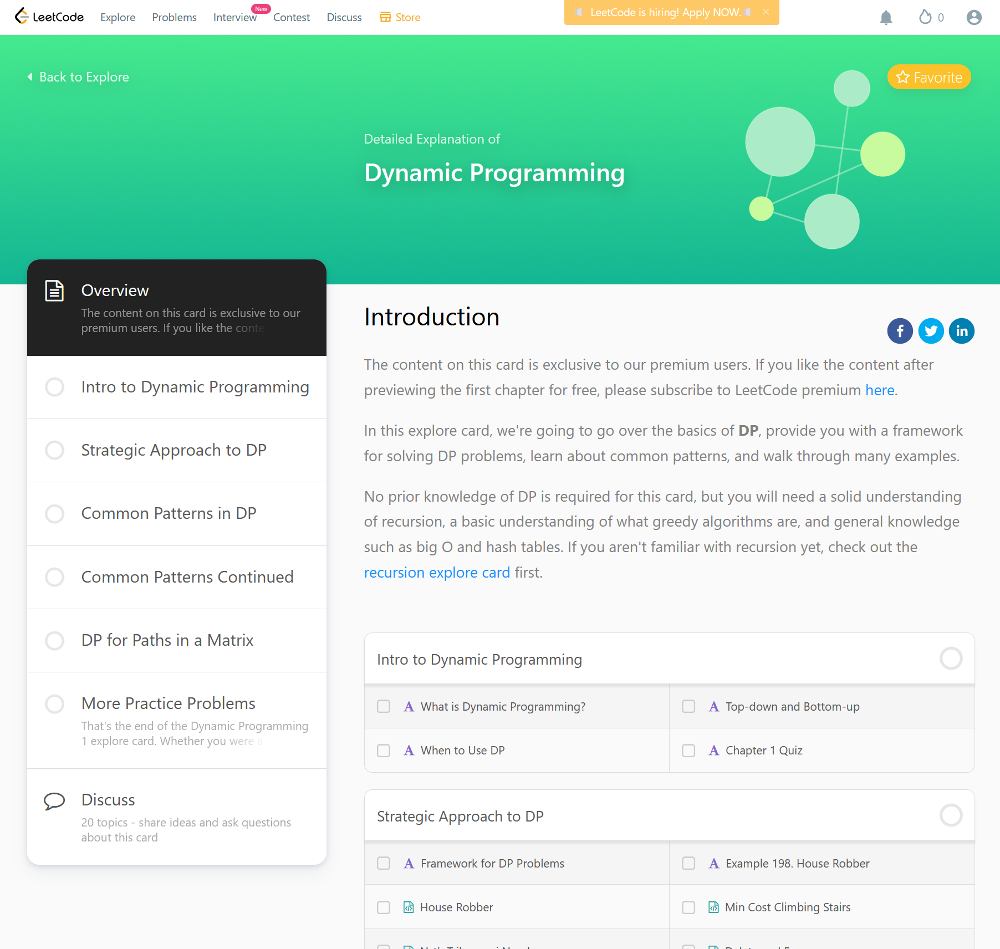

# LeetCode 정주행시 참고하면 좋은 자료들

# Youtube 풀이

youtube : [Nick White - LeetCode Solutions](https://www.youtube.com/playlist?list=PLU_sdQYzUj2keVENTP0a5rdykRSgg9Wp-)  

뭐부터 공부해야할지 모르는 초짜일때 여기에 있는 문제리스트로 공부했었다. 지금은 Dynamic Programming, 비트 연산, Stack 개념의 빈출문제를 풀어보느라 잠시 접어두었다. 

엑셀에 문제리스트 적어두고, 풀이 몇번했는지 체크해서 반복하고, 취약문제들을 체크해뒀었다. 

 

# 주제별 문제리스트

태그중에 하나를 클릭하자. 예를 들어 `Dynamic Programming` 을 공부하고 싶다면 아래 초록 영역을 선택하면 된다

 

저 위의 Dynamic Programming 링크를 새탭에서 열면 아래와 같은 화면이 나타난다. 

[Dynamic Programming](https://leetcode.com/tag/dynamic-programming/) 

빈출도 순으로 정렬할 수 있다. 

 

 

자, 이제 공부를 시작하자...ㅋㅋ 

코딩테스트를 공부하면서 생긴 버릇은 문제가 안풀려서 스트레스 받을 때 유튜브에 올라온 애완견/애완묘 동영상을 보게 된다는 거였다. 

스트레스가 이상하게 풀리더라...;;; 

 

# Explore

내 경우는 Dynamic Programming 이 항상 공부의 뒷전으로 미뤄뒀었다. 그러다가 이번에 된통 당했다ㅋㅋ... 

지금까지 한번도 Dynamic Programming을 코테에서 겪어본적이 없었다가 크게 혼났다. 

그래서 뭔가 유형을 정리해놓은게 없을까 하고 찾다보니 Explore라는 기능을 알게됐다. 

 

**리트코드 페이지에서 `Explore` 버튼 클릭 -> `More` 버튼 클릭** 

 

원하는 주제를 선택한다. 

보통 시험에 잘 출제되는건 Arrays 이지 않나 싶다. 부분수열문제나 정렬을 하고 시작할지 말지 고민하게 만드는 약올리는 문제라든가 이런문제들은 대부분 Arrays 문제다. 

**원하는 유형 선택**

- 아래 경우는 Dynamic Programming 을 선택했다.

 

이제는 문제를 풀면 된다. ㅋ

