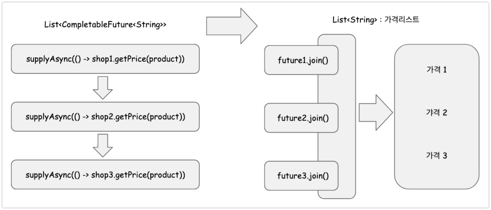

# 16.3 논블로킹 코드 만들기

여러 개의 상점이 있는데, 이 가게마다의 물건에 대한 가격을 출력하는 예제를 살펴본다. <br>

문제의 제한사항은 아래와 같다.<br>

- 상점은 모두 5개이다.<br>
- 가격을 구하는 데에 걸리는 시간은 1초가 걸린다. 이 메서드의 이름은 `getPrice(String product)` 이다.<br>

<br>

문제를 푸는 과정은 아래의 세가지 단계로 발전시켜나간다.<br>

- 첫 번째 예제 : 동기방식으로 작동하는 예제<br>
  - 이 방식은 각 상점에서 물건의 가격을 구해질때까지 기다리면서 가격을 구하는 방식이다.<br>
  - 5개의 상점의 가격을 getPrice로 순차적으로 구하면 5초가 걸린다.<br>
- 두 번째 예제 : 병렬 스트림으로 findPrice()를 여러 코어에서 각각 수행하도록 풀어보기<br>
  - 첫 번째 예제를 5개의 CPU 코어에서 각각 getPrice()를 실행하도록 수정해서 풀어본다.<br>
  - 이 방식은 CPU 코어의 갯수가 충분하다면 최소 1초에 5개 상점의 모든 가격을 계산할 수 있게 된다.<br>
  - 약간은 하드웨어의 성능에 전적으로 의존해야 한다는 단점이 있기는 하다.<br>
- 세 번째 예제 : findPrice() 메서드를 비동기방식으로 변경하기<br>
  - 다섯 개의 상점에 대한 가격을 각각 findPrice() 로 순차적으로 구해야 하는데, 이 때의 findPrice() 메서드를 비동기적으로 실행하도록 하는 방식이다.<br>

<br>

## 목차

- [참고자료](#참고자료)<br>
- [예제 초기 상태](#예제-초기-상태)<br>
- [첫 번째 예제 : 동기방식으로 작동하는 예제](#첫-번째-예제---동기방식으로-작동하는-예제)<br>
- [두 번째 예제 : 병렬 스트림으로 findPrice()를 각각 수행하도록 풀어보기](#두-번째-예제---병렬-스트림으로-findPrice-를-각각-수행하도록-풀어보기)<br>
- [세 번째 예제 : findPrice() 메서드를 비동기방식으로 변경하기](#세-번째-예제---findPrice----메서드를-비동기방식으로-변경하기)<br>
  - [1.CompletableFuture 를 활용한 스레드 인스턴스 생성](#1-CompletableFuture-를-활용한-스레드-인스턴스-생성)<br>
  - [2. join 하기](#2--join-하기)<br>
- [Parallel Stream 의 문제점 - 공유된 thread pool 사용](#parallel-stream-의-문제점---공유된-thread-pool-사용)<br>
- [ForkJoinPool](#ForkJoinPool)<br>
- [Custom Executor 로 성능 개선해보기](#custom-executor-로-성능-개선해보기)<br>

<br>

## 참고자료

- [모던 자바 인 액션](http://www.yes24.com/Product/Goods/77125987)<br>
- [티몬의 개발이야기 - Java 8 Parallel Stream, 성능장애를 조심하세요!](https://m.blog.naver.com/PostView.nhn?blogId=tmondev&logNo=220945933678&proxyReferer=https:%2F%2Fwww.google.com%2F)<br>
- [사바라다는 차곡차곡 - java8 병렬 Stream](https://sabarada.tistory.com/102)<br>
- [parallelStream 남용으로 인한 장애 경험기](https://multifrontgarden.tistory.com/254)<br>

<br>

## 예제 초기 상태

예제의 초기 상태는 아래의 코드와 같다.<br>

```java
package io.study.modernjavainaction.ch16;

import java.util.*;
import java.util.stream.Collectors;
import org.junit.jupiter.api.Test;

public class FutureTest2 {
	class Shop{
		String productName;
		String name;

		public Shop(String name){
			this.name = name;
		}

		public double getPrice(String product){
			return calculatePrice(product);
		}

		public double calculatePrice(String product){
			delay();
			Random random = new Random();
			return random.nextDouble() + product.charAt(0) + product.charAt(1);
		}

		public void delay(){
			try{
				Thread.sleep(1000L);
			}
			catch (InterruptedException e){
				throw new RuntimeException(e);
			}
		}

		public String getName() {
			return name;
		}
	}

	List<Shop> shops = Arrays.asList(
							new Shop("BastPrice"),
							new Shop("LetsSaveBig"),
							new Shop("MyFavoriteShop"),
							new Shop("BuyItAll"),
    					new Shop("Superman"));
	
	public List<String> findPrices(String product){
		return shops.stream()
			.map(shop -> {
				return String.format("%s price is %.2f", shop.getName(), shop.getPrice(product)); })
			.collect(Collectors.toList());
	}
  
	@Test
	void 테스트1_동기식으로_모든_상점의_가격을_단순하게_나열해서_풀어내기(){
		long start = System.nanoTime();
		List<String> prices = findPrices("내 핸드폰이에요~!!");
		prices.forEach(System.out::println);

		long duration = (System.nanoTime() - start) / 1000000;

		System.out.println();
		System.out.println("[시간측정] Done in " + duration + " msecs");
	}
}
```

<br>

## 첫 번째 예제 : 동기방식으로 작동하는 예제

다섯 개의 상점들 모두의 데이터에 대해서 각각에 대해 findPrice()를 호출하는 예제이다. 이 경우 다섯 번을 delay()를 수행하기 때문에 5초 남짓의 시간이 소요되게 된다.<br>

위의 예제 초기상태에서 동기식으로 모든 상점의 가격을 나열해서 풀어내는 코드는 아래와 같다.<br>

```java
public class FutureTest2 {
	// ...
	@Test
	void 테스트1_동기식으로_모든_상점의_가격을_단순하게_나열해서_풀어내기(){
		long start = System.nanoTime();
		List<String> prices = findPrices("내 핸드폰이에요~!!");
		prices.forEach(System.out::println);

		long duration = (System.nanoTime() - start) / 1000000;

		System.out.println();
		System.out.println("[시간측정] Done in " + duration + " msecs");
	}
}
```

<br>

출력결과는 아래와 같다.<br>

```plain
BastPrice price is 45268.48
LetsSaveBig price is 45268.67
MyFavoriteShop price is 45268.65
BuyItAll price is 45268.71
Superman price is 45268.42

[시간측정] Done in 5019 msecs
```

<br>

## 두 번째 예제 : 병렬 스트림으로 findPrice()를 각각 수행하도록 풀어보기

위의 `첫 번째 예제` 에서는 한번의 수행에 1초가 걸리는 findPrice() 를 모두 순차적으로 하나의 CPU에서 처리했다. <br>

이번에는 5개 상점의 가격을 구하는 findPrice()를 5개의 코어에서 각각 수행되도록 하는 코드를 살펴보자.<br>

개인적인 생각이지만, parallelStream() 을 사용하는 것은 애플리케이션이 동작하는 운영/개발환경에 CPU의 코어 수가 몇개가 있는지, 운영체제는 멀티코어를 지원하는지에 따라 수행시간이 달라지게 된다. 즉, 하드웨어의 성능에 의존적인 코드이다.<br>

<br>

```java
public class FutureTest2 {
	// ...
	public List<String> findPricesByParallel(String product){
		return shops.parallelStream()
			.map(shop -> String.format("%s price is %.2f", shop.getName(), shop.getPrice(product)))
			.collect(Collectors.toList());
	}

	@Test
	void 테스트2_동기식으로_구하는_5개_상점의_가격을_각각의_CPU에_분산시켜서_처리해보기(){
		long start = System.nanoTime();
		List<String> prices = findPricesByParallel("내 핸드폰이에요~!!");
		prices.forEach(System.out::println);

		long duration = (System.nanoTime() - start) / 1000000;

		System.out.println();
		System.out.println("[시간측정] Done in " + duration + " msecs");
	}
}
```

<br>

**출력결과**<br>

```plain
BastPrice price is 45268.57
LetsSaveBig price is 45268.04
MyFavoriteShop price is 45268.69
BuyItAll price is 45268.57
Superman price is 45268.45

[시간측정] Done in 1011 msecs
```

<br>

책을 자세히 보다보면 병렬 스트림 코드에 대해서 16.3.3 에서 아래와 같이 언급하고 있다.<br>

> 병렬 스트림 버전의 코드는 정확히 네 개의 상점에 하나의 스레드를 할당해서 네 개의 작업을 병렬로 수행하면서 검색시간을 최소화 할 수 있었다. 만약 검색해야 할 다섯번째 상점이 추가되었다면 어떻게 될까? <br>
>
> 병렬 스트림 버전에서는 네개의 상점을 검색하느라 네 개의 모든 스레드 (일반적으로 스레드 풀에서 제공하는 스레드 수는 4개)가 사용된 상황이므로 다섯번째 상점을 처리하는 데 추가로 1초 이상 소요된다. 즉, 네 개의 스레드 중 누군가가 작업을 완료해야 다섯 번째 질의를 수행할 수 있다.


## 세 번째 예제 : findPrice() 메서드를 비동기방식으로 변경하기

두 번째 예제에서는 병렬스트림을 통해 연산을 수행했었다. 이번 예제 역시 병렬화 하는 연산이다. 두번째 예제와는 방법은 조금 다르다. 이번 예제에서는 Future 인스턴스의 리스트를 풀어놓아서, 이것을 비동기적으로 처리한다.<br> <br>

이번 예제에서는 크게 아래의 첫 번째, 두 번째에 해당하는 동작을 수행한다.<br>

- 첫번째<br>
  - CompletableFuture 인스턴스들의 컬렉션을 만들어서 내부의 연산을 만들어낸다. <br>
- 두번째<br>
  - 그리고 각 Future가 완료되기 전(CompletableFuture::join)까지 다른 동작을 수행할 수 있도록 비동기적인 병렬 스트림을 만들어 낸다. <br>

<br>

> **참고**<br>뒤에서 정리하겠지만, `CompletableFuture` 인스턴스에 스레드 풀의 크기를 잘 조절한 커스텀 Executor를 잘 조합해서 사용하면, 9개의 상점을 검색(9초 예상작업)하더라도 1022 밀리 초에 수행할 수 있게 된다.<br>

<br>

```java
public class FutureTest2 {
	// ...
	public List<String> findPricesByCompletableFuture(String product){
		List<CompletableFuture<String>> priceFutures =
			shops.stream()
				.map(shop -> {
					return CompletableFuture.supplyAsync(() -> {
						return shop.getName() + "price is " + shop.getPrice(product);
					});
				})
				.collect(Collectors.toList());

		return priceFutures.stream()
				.map(CompletableFuture::join)
				.collect(Collectors.toList());
	}

	@Test
	void 테스트3_비동기식으로_5개_상점의_가격을_구해보기(){
		long start = System.nanoTime();
		List<String> prices = findPricesByCompletableFuture("내 핸드폰이에요~!!");
		prices.forEach(System.out::println);

		long duration = (System.nanoTime() - start) / 1000000;

		System.out.println();
		System.out.println("[시간측정] Done in " + duration + " msecs");
	}
}
```

<br>

위의 예제에서는 아래의 두 작업을 각각 별도의 스트림 파이프라인으로 처리하고 있다.

- CompletableFuture 인스턴스 들의 컬렉션인 리스트를 생성하는 작업

- 이것을 각각의 join하는 동작
  - 각 CompletableFuture\<String\> 이 미래의 특정 시점에 완료되기를 기다리는 CompletableFuture::join 으로 기다리고 있는 동작이다.
  - 기다리는 동안 프로그램 내의 다른 로직들을 처리할 수 있다. 별도의 스레드 흐름이기 때문이다.

위의 두 작업을 각각 별도의 스트림 파이프라인으로 처리하고 있다.<br>

<br>

**출력결과**<br>

```plain
LetsSaveBigprice is 45268.43519950093
MyFavoriteShopprice is 45268.97668750236
BuyItAllprice is 45268.23714452512
Supermanprice is 45268.85521446332

[시간측정] Done in 1028 msecs
```

<br>

### 1.CompletableFuture 를 활용한 스레드 인스턴스 생성

일단 상점 5개 각각에 대한  CompletableFuture\<String\> 을 생성해서 이것을 List 에 담아두는 로직을 먼저 정리해보면 아래와 같다.<br>

```java
List<CompletableFuture<String>> priceFutures =
  shops.stream()
  .map(shop -> {
    // CompletableFuture.supplyAsync : CompletableFuture 로 각각의 가격을 비동기적으로 계산한다.
    return CompletableFuture.supplyAsync(() -> {
      return shop.getName() + "price is " + shop.getPrice(product);
    });
  })
  .collect(Collectors.toList());
```

<br>

위의 구문을 요약해보면 아래와 같다.<br>

- Future 인스턴스가 처리하게 될 구문들을 Supplier 람다 식으로 작성한다. 그리고 이 람다식을 supplyAsync 내에 전달해준다.<br>
- 이렇게 하면, CompletableFuture 에서는 내부적으로 Executor 등을 활용해서 전달받은 Supplier 람다를 실행시킨다.<br>

<br>

처음 위의 supplyAsync() 구문을 접하면 뭔가 약간 "**객체만 생성했는데 실행이 되는거라고?**"하는 의문이 생길 수 있다. ExecutorService 사용 로직 등등 반복되는 구문들을 supplyAsync() 메서드 내에 공통화하고 추상화했기 때문이다.<br>

위에서 사용한 supplyAsync()를 사용해 스레드를 생성하는 구문을 풀어서 써보면 아래와 같은 의미의 구문이 된다.(나는 이 방식이 더 마음에 들기는 하다ㅋㅋ) <br>

<br>

```java
public Future<Double> getPriceAsync(String product){
  CompletableFuture<Double> futurePrice = new CompletableFuture<>();
  new Thread(()->{
    try{
      double price = calculatePrice(product);
      futurePrice.complete(price);
    }
    catch(Exception ex){
      futurePrice.completeExceptionally(ex);
    }
  }).start();
  return futurePrice;
}
```

<br>

### 2. join 하기

join을 사용하는 것은 미래에 future 스레드 인스턴스의 처리가 종료되기를 기대되는 시점에 `future.get()` 구문을 사용하는 것과 같은 의미를 가진다. `future.get()` 이 사용된 구문은 새로운 스레드 인스턴스를 생성해서 미래의 특정시점에 해당 스레드의 처리가 완료되기를 기다리는 것을 의미한다.<br>

위에서 살펴봤던 아래의 예제를 다시한번 살펴보자.<br>

```java
public List<String> findPricesByCompletableFuture(String product){
  List<CompletableFuture<String>> priceFutures =
    shops.stream()
    .map(shop -> {
      // CompletableFuture.supplyAsync : CompletableFuture 로 각각의 가격을 비동기적으로 계산한다.
      return CompletableFuture.supplyAsync(() -> {
        return shop.getName() + "price is " + shop.getPrice(product);
      });
    })
    .collect(Collectors.toList());

  return priceFutures.stream()
    // CompletableFuture::join : 모든 비동기 동작이 끝나길 기다린다.
    .map(CompletableFuture::join)
    .collect(Collectors.toList());
}
```

<br>

위의 예제는 하나의 스트림에서 몰아서 처리하지 않고 두개의 스트림 파이프라인으로 처리하고 있다.

- CompletableFuture 인스턴스 기반의 스레드를 생성하는 스트림
- CompletableFuture 인스턴스의 실행을 기다리는 스트림

<br>

만약 이 두개의 연산을 하나의 스트림으로 처리했을 경우 5개의 상점을 순차적으로 처리하게 되기때문에 스레드 하나를 실행하고 기다리는 것을 순차적으로 실행하게 되어 5초가 걸린다. 하지만 예제에서는 여러개의 스트림에 나누었다. 스레드를 생성해 스레드를 풀어놓는 동작과 기다리는 스트림을 분리해두었다. 이런 이유로 성능이 어느 정도 개선되어 1025ms 에 처리할 수 있게 된다.<br>

정리해보면 아래와 같은 그림처럼 연산을 수행하고 있다.



왼쪽에서는 CompletableFuture 인스턴스를 리스트로 모았다.

오른쪽에서는 다른 작업과는 독립적으로 가격을 출력하는 작업(1초)을 수행하고 있다.

<br>

## Parallel Stream 의 문제점 - 공유된 thread pool 사용

Java Stream API 내에서 사용 중인 parallelStream()은 공유된 스레드 풀을 사용하게 되어 가끔 장애를 일으키는 경우도 많다. 해당 내용은 [parallelStream 남용으로 인한 장애 경험기](https://multifrontgarden.tistory.com/254) 를 읽어보자. 이 외에도 읽어볼 내용들은 아래와 같다.

- [티몬의 개발이야기 - Java 8 Parallel Stream, 성능장애를 조심하세요!](https://m.blog.naver.com/PostView.nhn?blogId=tmondev&logNo=220945933678&proxyReferer=https:%2F%2Fwww.google.com%2F)<br>
- [사바라다는 차곡차곡 - java8 병렬 Stream](https://sabarada.tistory.com/102)<br>
- [parallelStream 남용으로 인한 장애 경험기](https://multifrontgarden.tistory.com/254)<br>

<br>

**ParallelStream 의 공유스레드풀**<br>

parallelStream 은 내부적으로 스레드 풀을 만들어서 작업을 병렬화해준다. 그런데, parallelStream()을 사용할 때 해당 구문마다 독자적인 스레드 풀이 존재하는 것이 아니다. 별도로 Executor를 넘기거나, 커스텀한 로직을 작성하지 않으면 애플리케이션 전역적으로 하나의 스레드 풀을 모든 parallelStream()이 사용된 로직들이 공유하게 된다.<br>

[모던 자바 인 액션](http://www.yes24.com/Product/Goods/77125987) 의 저자가 명학하게 이 부분을 설명하지 않은것 같은 기분도 조금 있다. 해당 부분을 찾아봐야 할 것 같기는하다.<br>

<br>

[티몬의 개발이야기 - Java 8 Parallel Stream, 성능장애를 조심하세요!](https://m.blog.naver.com/PostView.nhn?blogId=tmondev&logNo=220945933678&proxyReferer=https:%2F%2Fwww.google.com%2F) 에서 개발자 분께서 직접 실행을 해본 결과를 정리해주셨다. 내용을 요약해보면 이렇다. parallelStream()은 런타임 전역적으로 같은 스레드풀을 공유하는 `commonForkJoinPool`을 사용한다. 이런 이유로 병렬 스트림을 직접 구현하여 사용할 경우 ForkJoinPool을 사용하는 코드를 직접 만들어서 사용하는 것을 권장하고 있다. (자세한 내용은 [티몬의 개발이야기 - Java 8 Parallel Stream, 성능장애를 조심하세요!](https://m.blog.naver.com/PostView.nhn?blogId=tmondev&logNo=220945933678&proxyReferer=https:%2F%2Fwww.google.com%2F) 을 참고.)<br>

<br>

TODO!!! 직접 테스트해본 결과를 추가하자!!!<br>

## ForkJoinPool

<br>

## Custom Executor 로 성능 개선해보기

[Java Concurrency in Practice](http://jcip.net.s3-website-us-east-1.amazonaws.com/) 에서는 스레드 풀의 크기를 어느 정도로 조절해야 효율적인지를 설명하고 있다고 하면서, Brian Goetz 가 제시한 약간은 주관적인 CPU 활용비율 공식을 설명하고 있다. 자세한 내용은 더 읽어봐야 이해가 될 것 같다.<br>

!TODO 정리 필요<br>

<br>


