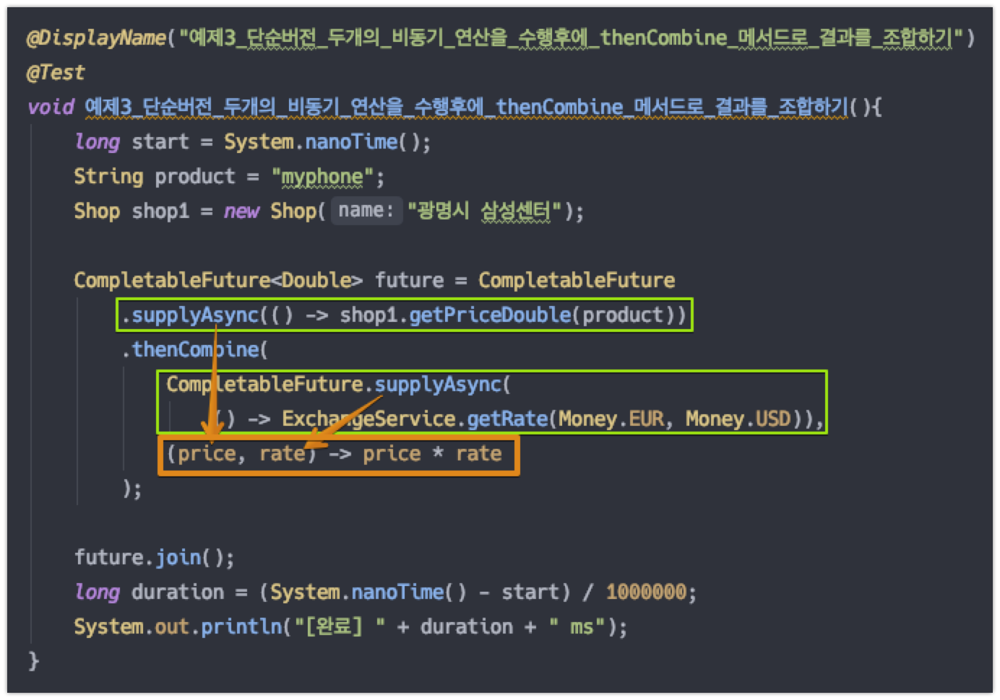
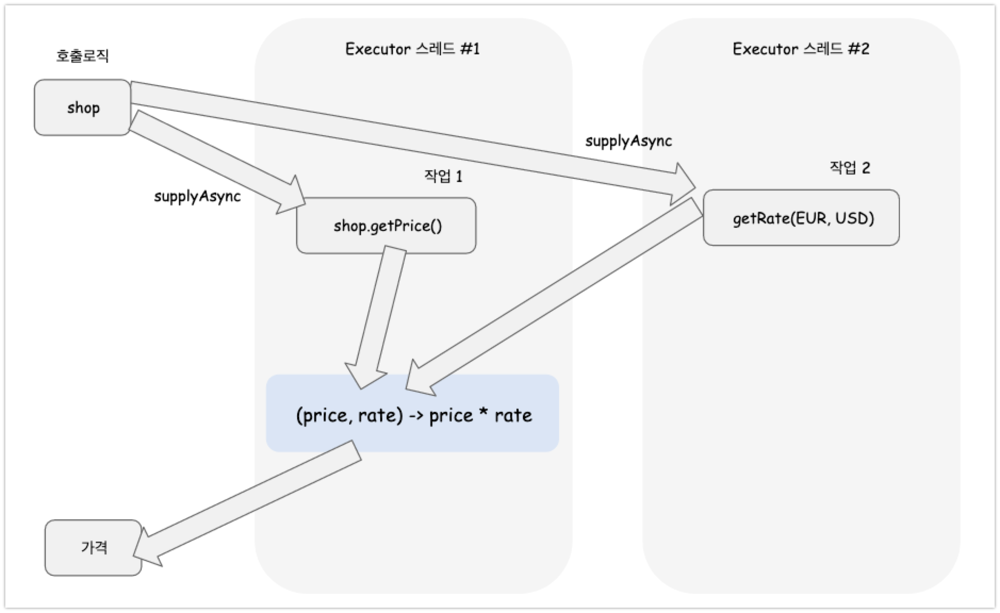

# 16.4-16.5 비동기 작업 파이프라인 만들기

예제 소스에 대한 설명은 16.4-예제코드-정리.md 에 정리해두었다.<br>

<br>

얼렁 얼렁 16.5 까지 일단 리스트업 모두 끝내고, 깔끔하게 요약 시작할 예정!!<br>

<br>

## 목차

- [참고자료](#참고자료)<br>
- [Overview](#overview)<br>
- [문제의 코드](#문제의-코드)<br>
  - [출력결과](#출력결과)<br>
- [커스텀 Executor 생성하기](#커스텀-executor-생성하기)<br>
- [두 가지 비동기 연산을 thenCompose 로 비동기 파이프라인으로 만들어 처리해보기](#두-가지-비동기-연산을-thencompose-로-비동기-파이프라인으로-만들어-처리해보기)<br>
  - [call-flow](#call-flow)<br>
  - [테스트코드 - thenCompose 를 이용한 비동기파이프라인](#테스트코드---thenCompose-를-이용한-비동기-파이프라인)<br>
  - [1) supplyAsync(Supplier, Executor)](#1--supplyasync(supplier--Executor-))<br>
  - [2) thenApply(Funciton)](#2--thenapply-funciton-)<br>
  - [3) thenCompose(Function)](#3--thencompose-function-)<br>

<br>

## 참고자료

- [모던 자바 인 액션](http://www.yes24.com/Product/Goods/77125987)<br>
- [docs.oracle.com/javase - CompletableFuture](https://docs.oracle.com/javase/8/docs/api/java/util/concurrent/CompletableFuture.html)
- [devidea.tistory.com/34 - CompletableFuture 정리](https://devidea.tistory.com/34)<br>

<br>

## Overview

어떤 내용을 배우게 될지 정리하지 않고, 무작정 독자가 따라서 읽게끔 하는 것은 조금은 불친절한게 아닐까하는 생각이 들었다. [모던 자바 인 액션](http://www.yes24.com/Product/Goods/77125987) 책이 실제로 그렇다. 일단 이번 챕터를 정리하기 전에 어떤 메서드들을 다루게 되는지 등을 먼저 문서 초입에 요약을 잘 해놓아야 할 것 같다.<br>

<br>(정리 필요!!!)

- `CompletableFuture::supplyAsync(Supplier<U> supplier)` <br>
  - Returns a new CompletableFuture that is asynchronously completed by a task running in the [`ForkJoinPool.commonPool()`](https://docs.oracle.com/javase/8/docs/api/java/util/concurrent/ForkJoinPool.html#commonPool--) with the value obtained by calling the given Supplier.
- `CompletableFuture::supplyAsync(Supplier<U> supplier, Executor executor)` <br>
  - Returns a new CompletableFuture that is asynchronously completed by a task running in the given executor with the value obtained by calling the given Supplier.
- `CompletableFuture::thenApply` <br>
  - `thenApply(Function \<? super T, ? extends U\> fn)` <br>
  - Returns a new CompletionStage that, when this stage completes normally, is executed with this stage's result as the argument to the supplied function.
- `CompletableFuture::thenCompose` <br>
  - `thenCompose(Function\<? super T, extends CompletionStage\<U\>\> fn)` <br>
  - Returns a new CompletionStage that, when this stage completes normally, is executed with this stage as the argument to the supplied function.
- `CompletableFuture::thenCombine` <br>
  - `thenCombine(CompletionStage\<? etends U\> other, BiFunction\<? super T, ? super U, ? extends V\> fn)` <br>
  - Returns a new CompletionStage that, when this and the other given stage both complete normally, is executed with the two results as arguments to the supplied function.
- `orTimeout` , `completeOnTimeout` <br>
  - 타임아웃 효과적으로 사용하기<br>

<br>

## 문제의 코드

가게 5개에 대해서 "myphone" 이라는 물건의 가격과 할인율을 조회한다. 이 때 조회하는 함수들은 아래와 같다.<br>

- 처리속도가 1초인 getPrice(String product)<br>
- 처리속도가 1초인 applyDiscount(Quote qoute)<br>

<br>

기대되는 수행시간은 10000ms, 즉, 10초 가량이다.

```java
package io.study.modernjavainaction.ch16;

import io.study.modernjavainaction.ch16.discount.Discount;
import io.study.modernjavainaction.ch16.discount.Quote;
import io.study.modernjavainaction.ch16.shop.Shop;
import java.util.*;
import java.util.stream.Collectors;
import org.junit.jupiter.api.DisplayName;
import org.junit.jupiter.api.Test;

public class AsyncPipelineTest_16_4 {

	List<Shop> shops = Arrays.asList(
		new Shop("광명시 삼성센터"),
		new Shop("강남구 삼성센터"),
		new Shop("분당구 삼성센터"),
		new Shop("안양시 삼성센터"),
		new Shop("수원시 삼성센터")
	);

	public List<String> findPrices(String product){
		return shops.stream()
			.map(shop -> shop.getPrice(product))
			.map(Quote::parse)
			.map(Discount::applyDiscount)
			.collect(Collectors.toList());
	}

	@DisplayName("문제예제1_동기식으로_값_조회와_할인율계산을_한꺼번에_수행하기")
	@Test
	void 문제예제1_동기식으로_값_조회와_할인율계산을_한꺼번에_수행하기(){
		long start = System.nanoTime();
		List<String> results = findPrices("myphone");
		long duration = (System.nanoTime() - start) / 1000000;
		System.out.println("[완료] " + duration + " ms");
	}
}
```

<br>

실제로 최종적으로 수행되는 시간은 10초(10000ms)가 소요되게 된다.<br>

### 출력결과

```plain
[완료] 10064 ms
```

<br>

## 커스텀 Executor 생성하기

[모던 자바 인 액션](http://www.yes24.com/Product/Goods/77125987) 에서 제공하는 Executor 는 스레드 풀 등의 크기 등에 대해 크게 의미를 부여해 만들어진 Executor는 아니지만, 책에서 직접 사용한 커스텀 Executor 를 사용해봤다.<br>

```java
private final Executor executor =
  Executors.newFixedThreadPool(Math.min(shops.size(), 100), new ThreadFactory(){
    public Thread newThread(Runnable r){
      Thread t = new Thread(r);
      t.setDaemon(true);
      return t;
    }
  });
```

<br>

스레드 풀의 개념에 대해서는 16.3 에서 따로 정리할 예정이다.<br>

<br>

## 두 가지 비동기 연산을 thenCompose 로 비동기 파이프라인으로 만들어 처리해보기

[모던 자바 인 액션](http://www.yes24.com/Product/Goods/77125987) 에서는 이 부분을 16.4.3 에서 3 페이지 가량에 걸처 설명하고 있다. 이 내용을 더 줄여서 요약할 수 있을지는 아직 자신이 없지만 정리를 시작해보려 한다.<br>

<br>

### call-flow

구글 독스의 파워포인트에서 그려본 그림이다. 잘 그리지는 못했다. 그림실력이 좋지 않다. 전체적인 call-flow 는 아래와 같다.<br>


<br>

### 테스트코드 - thenCompose 를 이용한 비동기 파이프라인

```java
package io.study.modernjavainaction.ch16;

public class AsyncPipelineTest_16_4 {

	List<Shop> shops = Arrays.asList(
		new Shop("광명시 삼성센터"),
		new Shop("강남구 삼성센터"),
		new Shop("분당구 삼성센터"),
		new Shop("안양시 삼성센터"),
		new Shop("수원시 삼성센터")
	);

	private final Executor executor =
		Executors.newFixedThreadPool(Math.min(shops.size(), 100), new ThreadFactory(){
			public Thread newThread(Runnable r){
				Thread t = new Thread(r);
				t.setDaemon(true);
				return t;
			}
		});
  
	@DisplayName("예제2_두가지_비동기_연산을_thenCompose()_메서드를_이용해_파이프라인으로_만들어서_처리해보기")
	@Test
	void 예제2_두가지_비동기_연산을_thenCompose_메서드를_이용해_파이프라인으로_만들어서_처리해보기(){
		long start = System.nanoTime();
		String product = "myphone";

		List<CompletableFuture<String>> priceStrFutures = shops.stream()
			.map(shop -> CompletableFuture.supplyAsync(() -> shop.getPrice(product), executor))
			.map(future -> future.thenApply(Quote::parse))
			.map(future -> future.thenCompose(
				quote -> CompletableFuture.supplyAsync(
					() -> Discount.applyDiscount(quote), executor)
			))
			.collect(Collectors.toList());

		priceStrFutures.stream()
			.map(CompletableFuture::join)
			.collect(Collectors.toList());

		long duration = (System.nanoTime() - start) / 1000000;
		System.out.println("[완료] " + duration + " ms");
	}
}
```

<br>

출력결과

```plain
[완료] 2056 ms
```

 순차적으로 모두 처리할 경우 10초가 걸려야 하는데, 2초 만에 처리가 완료되었다. 아래에서부터는 위의 코드를 설명하면서 CompletableFuture에서 제공하는 API에 대해서도 정리해볼 예정이다.<br>

<br>

### 1) supplyAsync(Supplier, Executor)

> Executor 객체로 Supplier 람다를 실행시켜 CompletableFuture 태스크를 비동기적으로 완료시킨다.<br>

<br>

CompletableFuture의 `supplyAsync` 는 이전에서 살펴봤었었다. `supplyAsync`  의 역할을 간단하게 요약해보면 아래와 같다.<br>

- supplyAsync의 역할은 아래의 두가지이다.
  - `CompletableFuture` 인스턴스를 생성하는 팩토리 메서드 역할<br>
  - 파라미터로 Supplier 람다를 받아서 스레드가 어떤 역할을 할지 기술한다.<br>
  - Executor 인스턴스를 전달하는 오버로딩된 메서드 역시 존재하는데, 이런 메서드의 경우는 전달받은 Executor 객체로 비동기적으로 CompletableFuture 태스크를 완료시킨다.<br>
- supplyAsync는 CompletableFuture 클래스 내에서 아래의 두가지 형태의 메서드 들로 오버로딩되어 있다. <br>
  - `supplyAsync (Supplier <U> supplier)` <br>
  - `supplyAsync (Supplier <U> supplier, Executor executor)` <br>
    - `supplyAsync (Supplier <U> supplier, Executor executor)`  의 경우 직접 커스터마이징한 Executor 를 인자로 전달해서 지정할 수 있다.<br>

<br>

위에서 사용한 예제에서 supplyAsync 를 통해 completableFuture 인스턴스를 생성하는 부분은 아래와 같다.<br>


<br>

아래의 두개의 태스크를 supplyAsync를 통해 CompletableFuture 인스턴스로 생성했다.<br>

- 가격 조회 (shop.getPrice(String product)) <br>
- 할인율 조회 (Discount.applyDiscount(quote)) <br>

<br>

이 작업들은 2초내에 수행된다. 그리고 이 CompletableFuture 인스턴스는 shops의 갯수인 5개가 생성된다.<br>

<br>

### 2) thenApply(Function)

> 참고) [docs.oracle.com/.../CompletableFuture/thenApply](https://docs.oracle.com/javase/8/docs/api/java/util/concurrent/CompletableFuture.html#thenApply-java.util.function.Function-)<br>
>
> Returns a new CompletionStage that, when this stage completes normally, is executed with this stage's result as the argument to the supplied function.<br>
>
> (CompletionStage 는 CompletableFuture 클래스가 구현하는 인터페이스명이다.)<br>
>
> 원서에는 위와 같이 적혀있고, 한글로 번역해보니 뜻이 너무 이상했다. 단순히 번역을 받아적기보다는 되도록이면 실용적으로 예제 기반으로 정리하는 것이 맞을 것 같다는 생각이 들었다. (사람이 아닌 기계가 말하는 것 같은 느낌...)<br>

<br>

일단, 책에 나온 예제에서 thenApply 구문이 적용된 부분을 보자.


thenApply 메서드는 CompletableFuture가 끝날 때 까지 블록하지 않는다. 이점에 주의해야 한다.<br>

약간은 야매같은 요약이지만, thenApply는 CompletableFuture\<T\> 를 CompletableFuture\<A'\> 로 바꿔주는 역할을 한다. (제너릭 타입을 바꾸는 역할, 변환하는 역할)<br>

<br>

어떻게든 thenApply 메서드의 기능을 요약해서 설명하려 했는데, 쉽지 않았다. 그래서 그냥 위의 예제를 요약하는 것으로 설명을 대체하는 것이 나을 것 같다.<br>

- 먼저 CompletableFuture.supplyAsync() 를 통해 CompletableFuture\<String\> 타입의 인스턴스를 생성하고 있다. <br>
  - 가격을 문자열로 반환하는 가격 조회 작업인 `getPrice(string)` 을 supplyAsync로 비동기 작업으로 처리되도록 비동기 스레드를 생성했다.<br>
- `CompletableFuture<String> -> CompletableFuture<Quote>` <br>
  - 이 인스턴스는 두 번째 map 에서 thenApply 하고 있다. Quote 클래스의 parse 는 `parse(String price) : Quote` 와 같은 형식을 지니고 있다.<br>
  - thenApply 내의 인자는 Function \<T, R\> 객체인데, 위 예제에서는 T(Type)=String, R(Return)=Quote 로 지정했기 때문에 thenApply 함수 내부구현에서는 R(Return) 에 해당하는 Quote 타입으로 변환된 CompletableFuture\<Quote\> 로 변환된다.<br>
  - 참고) Quote 클래스의 parse 함수는 가격을 문자열로 받아 Quote 인스턴스를 반환한다. ([소스 참고](https://github.com/soongujung/modern-java-in-action/blob/develop/example/src/test/java/io/study/modernjavainaction/ch16/discount/Quote.java)) <br>

<br>

### 3) thenCompose(Function)

일단, thenCompose는 두 개의 비동기 연산을 파이프라인으로 만들 때에 사용한다. 첫번째 연산의 결과를 두번째 연산으로 전달한다.<br>

thenCompose 내에 인자로 전달되는 Function\<T, R\> 은 

- `T(Type)` 으로 첫번째 CompletableFuture를 받는다. 
- 그리고 반환되는 값인 `R(Return)`로는 두번째 CompletableFuture를 반환한다. 

두번째 CompletableFuture 는 첫번째 CompletableFuture 의 결과를 계산의 입력으로 사용한다.<br>

이때 shops 를 stream 으로 순회하면서 여러 상점에서 thenCompose를 통해 Quote 를 얻어내는 동안, 미래의 특정 시점에 Future::join 이 호출되기 전까지 다른 동작을 수행할 수 있다.<br>(다른 UI 동작, 계산동작 등등 여러가지... 양치하면서 스마트폰 보고 이런 느낌? 양치가 끝나는 시점이 Future::join 이 호출되는 시점이다. 모든 shops 스트림에 대한 CompletableFuture 내에서 처리중인 연산이 끝나는 시점.)<br>

<br>

아래는 oracle 공식문서의 내용을 번역해봤다.<br>

> 참고) [docs.oracle.com/.../CompletableFutur/thenCompose](https://docs.oracle.com/javase/8/docs/api/java/util/concurrent/CompletableFuture.html#thenCompose-java.util.function.Function-)<br>
>
> Description copied from interface: `CompletionStage`<br>
>
> Returns a new CompletionStage that, when this stage completes normally, is executed with this stage as the argument to the supplied function.  See the [`CompletionStage`](https://docs.oracle.com/javase/8/docs/api/java/util/concurrent/CompletionStage.html) documentation for rules covering exceptional completion.<br>
>
> <br>
>
> 새로운 CompletionStage(CompletableFuture의 원형)를 리턴한다. 이 CompletionStage 인스턴스는 인자로 전달받은 Supplier 를 실행해서 새로운 CompletionStage 인스턴스를 반환한다. 

<br>

뭔가 좀 번역을 해보려 하긴 했는데, 번역은 항상 말이 부자연스러울 수 밖에 없는 듯 하다.<br>

역시 예제를 통해 공부하고, 항상 예를 들어서 기억하는게 오래간다. 예제를 확인해보자.<br>


위에서는 첫번째 연산의 결과인 future 를 받아서 future.thenCompose() 하고 있다. 이렇게 future.thenCompose 한 결과 값은 또 다른 비동기 연산이다.<br>

<br>

- thenCompose 메서드 내에는 Supplier 람다를 전달하고 있다.<br>
- 전달하고 있는 Supplier 람다에는 아래와 같은 동작을 기술하고 있다.<br>
  - Supplier 람다로 Discount 클래스 내의 applyDiscount() 함수로 할인율을 조회하는 비동기 스레드인 CompleatableFuture\<String\> 을 생성하는 역할을 하고 있다.

<br>

### 4) thenCombine(BiFunction)

> [모던 자바 인 액션](http://www.yes24.com/Product/Goods/77125987) 의 16.4.4 독립 CompletableFuture와 비독립 CompletableFuture 합치기 에 있는 내용이다. 다만, 책의 내용이 너무 산만한 관계로 필요한 내용만을 정리해야겠다는 생각이 들었다.<br>

<br>

thenCombine 은 thenCompose 와는 다르게 BiFunction 을 인자로 받는다.<br>

(thenCompose 는 Function 을 인자로 받았었다.)<br>

thenCombine 은 두 개의 CompletableFuture 결과를 어떻게 합칠지 정의(e.g. 곱하기/나누기 등등 산술연산, 그 외 여러가지 동작들)한다.<br>

<br>

#### 단순버전 thenCombine 예제

```java
public class AsyncPipelineTest_16_4 {
  @DisplayName("예제3_단순버전_두개의_비동기_연산을_수행후에_thenCombine_메서드로_결과를_조합하기")
	@Test
	void 예제3_단순버전_두개의_비동기_연산을_수행후에_thenCombine_메서드로_결과를_조합하기(){
		long start = System.nanoTime();
		String product = "myphone";
		Shop shop1 = new Shop("광명시 삼성센터");

		CompletableFuture<Double> future = CompletableFuture
			.supplyAsync(() -> shop1.getPriceDouble(product))
			.thenCombine(
				CompletableFuture.supplyAsync(
					() -> ExchangeService.getRate(Money.EUR, Money.USD)),
				(price, rate) -> price * rate
			);

		future.join();
		long duration = (System.nanoTime() - start) / 1000000;
		System.out.println("[완료] " + duration + " ms");
	}
}
```

출력결과

```plain
[완료] 1021 ms
```


위의 예제만 봐서는 뭐가 어떻게 된것인지 파악하기 쉽지 않다. thenCombine에 대해서는 다른 어려운 말로 표현할 수도 있겠지만, 조금 쉽게 코드상에서는 어떤 것을 의미하는 것인지 정리를 하기 위해서 아래와 같이 캡처에 편집작업을 조금 했다. thenCombine은 수학의 합성함수와 비슷한 개념을 하는 것 같다. 

<br>

아래의 캡처를 봤을때 특징은 이렇다.<br>

- supplyAsync 로 Future 를 생성한다. 이 Future는 가격을 가져오는 future이다.
- 이렇게 생성된 Future 내에서 future를 또 하나 생성한다. 생성된 또 다른 future는 환율을 구하는 future이다.
- 가격을 구하는 future와 환율을 구하는 future를 combine 하는데, combine 할때의 수식은 price * rate 이다. 즉, 두 future로 구해진 값을 곱하기 한다.

<br>



<br>

위의 설명을 그림으로 그려봤는데 아래와 같다.(구글 파워포인트로 그려서 조금 엉망이긴 하다.)<br>



<br>

위에서는 스레드 한개씩 단위인 스레드 두개를 개별로 돌렸었다. 아래는 스레드의 리스트를 combine 하는 예제이다. (책에 나온 예제를 응용...했다.)

```java
public class AsyncPipelineTest_16_4 {
  
  List<Shop> shops = Arrays.asList(
		new Shop("광명시 삼성센터"),
		new Shop("강남구 삼성센터"),
		new Shop("분당구 삼성센터"),
		new Shop("안양시 삼성센터"),
		new Shop("수원시 삼성센터")
	);
  
  // ...
  
  @DisplayName("예제4_리스트버전_두개의_비동기_연산을_수행후에_thenCombine_메서드로_결과를_조합하기")
	@Test
	void 예제4_리스트버전_두개의_비동기_연산을_수행후에_thenCombine_메서드로_결과를_조합하기(){
		long start = System.nanoTime();
		String product = "myphone";
    
		List<CompletableFuture<Double>> futureList = shops.stream()
			.map(
				shop -> CompletableFuture.supplyAsync(() -> shop.getPriceDouble(product), executor))
			.map(future -> future.thenCombine(
				CompletableFuture.supplyAsync(
					() -> ExchangeService.getRate(Money.EUR, Money.USD)
				),
				(price, rate) -> price * rate
			))
			.collect(Collectors.toList());

		futureList.stream()
			.map(CompletableFuture::join)
			.collect(Collectors.toList());

		long duration = (System.nanoTime() - start) / 1000000;
		System.out.println("[완료] " + duration + " ms");
	}
}
```

<br>

출력결과<br>

```java
[완료] 1025 ms
```

<br>

### 5) orTimeout

> **참고자료**<br>
>
> - [doc.oracle.com/java9](https://docs.oracle.com/javase/9/docs/api/java/util/concurrent/CompletableFuture.html)<br>
> - [Differences between orTimeout() and completeOnTimeOut() methods in Java 9?](https://www.tutorialspoint.com/differences-between-ortimeout-and-completeontimeout-methods-in-java-9)<br>

<br>

Future의 계산 결과를 읽을때 무한정으로 기다리게 되는 상황이 발생할 수 있다. 이 경우 블록을 하지 않는 것이 좋다. 자바 9의 CompletableFuture에서는 `orTimeout` 메서드를 제공해주고 있다.<br>

<br>

orTimeout 메서드는 지정된 시간이 지난 후에 CompletableFuture 를 TimeoutException 으로 완료하면서 또 다른 CompletableFuture 를 반환할 수 있도록 ScheduledThreadExecutor 를 활용한다.<br>

orTimeout 메서드를 사용하면 계산 파이프라인을 연결하고 TimeoutException이 발생했을 때 사용자가 쉽게 이해할 수 있는 메시지를 제공할 수 있다. <br>

<br>

**예제1) 타임아웃 적용하기 (예외 메시지나, 기본값은 아직 적용하지 않았다.)**<br>

```java
public class AsyncPipelineTest_16_4 {
  // ... 
  @DisplayName("예제6_타임아웃_적용하기")
	@Test
	void 예제6_타임아웃_적용하기(){
		String product = "myphone";
		Shop shop = new Shop("광명시 삼성센터");
		CompletableFuture.supplyAsync(()-> shop.getPriceDouble(product))
			.thenCombine(
				CompletableFuture.supplyAsync(
					() -> ExchangeService.getRate(Money.EUR, Money.USD)
				),
				(price, rate) -> price * rate
			)
			.orTimeout(3, TimeUnit.SECONDS);
	}
}
```

<br>

**예제 2) CompletableFuture에 타임아웃이 발생할 경우 기본값으로 처리**<br>

```java
public class AsyncPipelineTest_16_4 {
  
  // ...
  
  @DisplayName("예제7_타임아웃_발생시_기본값으로_처리")
	@Test
	void 예제7_타임아웃_발생시_기본값으로_처리(){
		double DEFAULT_RATE = 1.35;

		String product = "myphone";
		Shop shop = new Shop("광명시 삼성센터");

		CompletableFuture.supplyAsync(()-> shop.getPriceDouble(product))
			.thenCombine(
				CompletableFuture.supplyAsync(
					() -> ExchangeService.getRate(Money.EUR, Money.USD)
				)
				.completeOnTimeout(DEFAULT_RATE, 1, TimeUnit.SECONDS),
				(price, rate) -> price * rate
			)
			.orTimeout(3, TimeUnit.SECONDS);
	}
}
```

<br>

## Java7 에서의 ExecutorService

위에서 살펴봤던 thenCombine 메서드를 활용했었던 예제는 아래의 예제코드와 같이 변경가능하다.<br>

개인적으로는 공부하는 입장이라면 Java7 방식이 더 마음에 들것 같다. <br>

하지만 유지 보수성 등을 고려한다면, 람다 함수를 인자로 넘기는 (명확하게 이야기하면 인터페이스를 넘기는 것이지만...) Java8의 CompletableFuture에 익숙해지는 편이 좋은 것 같다.<br>

<br>

```java
public class AsyncPipelineTest_16_4 {
  
  // ...
  
  @DisplayName("예제5_CompletableFuture로직을_ExecutorService_방식으로_구현해보기")
	@Test
	void 예제5_CompletableFuture로직을_ExecutorService_방식으로_구현해보기(){
		long start = System.nanoTime();
		String product = "myphone";
		Shop shop1 = new Shop("광명시 삼성센터");

		ExecutorService executor = Executors.newCachedThreadPool();

		final Future<Double> futureRate = executor.submit(new Callable<Double>(){
			@Override
			public Double call() throws Exception {
				return ExchangeService.getRate(Money.EUR, Money.USD);
			}
		});

		Future<Double> futurePriceUsd = executor.submit(new Callable<Double>() {
			@Override
			public Double call() throws Exception {
				double priceInEUR = shop1.getPriceDouble(product);
				// 위에서 생성했던 future인 futureRate 의 결과를 기다렸다가 결과를 조합해서 리턴
				return priceInEUR * futureRate.get();
			}
		});
	}
}
```

<br>

