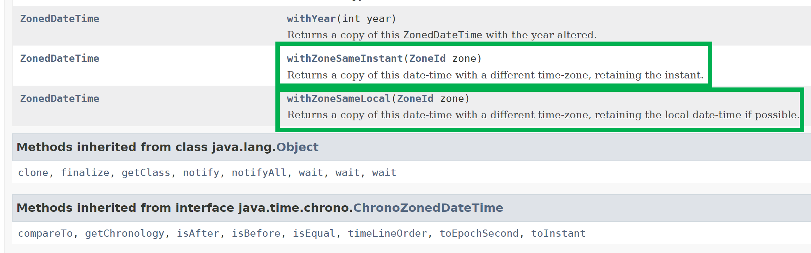

# 18. 지금 몇 시에요?

> - 오슬로(Oslo)에서 아테네(Athens)까지 운항하는 아시아나 항공 여객기는 월요일 몇시에 도착할까?
> - 여담이지만, 챕터 번호가 18이어서, 18 이라는 숫자와 `지금 몇시에요?` 를 함께 이어서 읽으면 뭔가 한국적이어서 제목을 적으면서도 놀란것 같다. 뭔가 박력넘치는 제목이다.

> - 시차변환 문제는 미국주식 실시간 데이터 애플리케이션 서버 개발시에 자주 겪었었다. 글로벌 서비스였기에 시간변환과 관련된 이슈가 존재했다. 전달된 데이터가 미국현지시각 기준으로 장중인지 판별하거나, 15분 지연, 10분 지연 서비스에 대한 장중여부 판정 등에 대한 여러가지 케이스가 다수 있었다.

<br>

# 참고자료

- [자바 개발자를 위한 97가지 제안 (73인의 전문가에게 듣는 자바 컬렉션) - 리디](https://ridibooks.com/books/852001043?_s=search&_q=97가지&_rdt_sid=search&_rdt_idx=0)<br>

- [Java8 Time API\] ZonedDateTime 사용법 | Engineering Blog by Dale Seo](https://www.daleseo.com/java8-zoned-date-time/)<br>
- [일광 절약 시간제 - 위키백과, 우리 모두의 백과사전](https://ko.wikipedia.org/wiki/일광_절약_시간제)
- [List of Time Zones](https://jp.cybozu.help/general/en/admin/list_systemadmin/list_localization/timezone.html)
- [Java - Display list of TimeZone with GMT - Mkyong.com](https://mkyong.com/java/java-display-list-of-timezone-with-gmt/)

<br>

# 예제 링크

직접 작성한 예제는 [modern-java-in-action/WhatTimeIsItTest.java](https://github.com/soon-good/modern-java-in-action/blob/develop/JAVA-%EC%A0%95%EC%A3%BC%ED%96%89/2022-JAVA-%EC%A0%95%EC%A3%BC%ED%96%89-try1/javastudy2022ty1/src/test/java/io/study/lang/javastudy2022ty1/proposal97/proposal18/WhatTimeIsItTest.java) 에 정리해두었다.<br>

<br>

# 오슬로에서 아테네까지 운항하는 아시아나 항공기는 월요일 몇시 몇분에 도착할까?

오슬로에서 아테네까지 운항하는 아시아느 항공기는 월요일 몇시 몇분에 도착할까?<br>

**System.currentTimeMillis()**<br>

라는 질문에 대해 System.currentTimeMillis() 를 통해 대답을 한다면, 맞는 값이긴 하지만 이 값에는 타임존이 없기에, 다른 나라기준으로 몇시인지 등을 확인하기 어렵다. 또한, 숫자로 나오는 이 데이터는 사람이 알아볼수 있는 값으로 변환해서 API의 결과값으로 리턴해야 하는 경우 역시 존재할 수 있다.<br>

또한, 만약 서머타임을 적용하는 나라라면, System.currentTimeMillis() 만으로는 시간을 구하기 더욱 어려워진다.<br>

**java.time 라이브러리**<br>

자바에서는 java 8 이후부터 `java.time` 라이브러리를 통해 LocalDateTime, ZonedDateTime, Instant 등 세가지 주요개념을 제공하고 있다.<br>

<br>

# LocalDateTime

`2022년 6월 8일 오후 5시 34분` 이라는 시간은 시차가 섞이지 않은 단위시간의 역할을 한다.<br>

각 나라마다 `2022년 6월 8일 오후 5시 34분` 이라는 시간은 존재하는데, 나라마다 시차가 따로 존재한다. 한국의 `2022년 6월 8일 오후 5시 34분` 은 다른 나라에서는 다른 시각이다.<br>

`LocalDateTime` 이 쓸모가 없는 것은 아니다. 타임존을 알고 있다면, 모든 데이터를 ZonedDateTime으로 가지고 있기보다는 특정 시작시간을 LocalDateTime 으로 저장해두고 있다가 이것을 필요한 나라에 맞춰서 ZoneId를 조합해 ZonedDateTime과 함께 현지시각으로 변환하면 되기 때문이다.<br>

<br>

# ZonedDateTime

예를 들면 6월 8일 상암월드컵 경기장에서 개최되는 한국 vs 태국 평가전을 베트남에서 인터넷으로 시청하려면 베트남 현지시각으로 몇시에 시청을 시작해야 할까? 와 같은 문제는 한국 시간 기준으로 ZonedDateTime 을 구해 베트남 호치민의 ZoneId 기반으로 변환한 시간을 구하면 된다.<br>

한 가지 유의해야 할 것이 있다. 서머타임을 채택하는 나라에 대한 처리가 필요하다. 결론부터 이야기하면, 서머타임이 적용되려면, ZoneId 객체를 사용해야 한다. ZoneOffset을 사용하면 서머타임이 적용되지 않는다<br>

서머타임을 처음 접했을때 정말 어려워서 상용서비스 대응을 위해서 각 잡고 대기했었던 슬픈사연이 있다. 이때 ZonedDateTime 과 ZoneId를 기반으로 UTC기준시를 미국현지시각으로 변환하는 로직에 자신이 없어서였다. 테스트 코드에서도 확인을 모두 했지만, 개발용도 서버에서도 동작을 확인하는게 필요했다.<br>

하지만, 팀 내에서 팀장 및 인프라팀에서 반대해서 상용인스턴스 1기로 라이브 개발 구조를 강요당하는 상황이었다. 다행히 변경해서 배포한 코드는 잘 동작했었다. 이유는 ZoneId 기반의 시차변환으로 짜여진 로직이었기 때문이다. 만약 내가 이때 ZoneOffset 기반으로 시차변환이 되도록 구현해두었다면, 서머타임 적용이 실패하지 않았을까 하고 생각해봤다.<br>

> 이때 사용하던 레거시의 구조는 중소기업에서 고객사가 별로 없을때 쓰는 흔한 레거시 구조였고 dev 페이스 없이 상용에 한번에 붙이는 구조였다. 이것 때문에 인프라 변경을 하겠다 했지만, 인프라 변경이 설득이 안되어서 굉장히 힘들었었다.<br>
>
> 나중에 운영 1년차가 거의 다 되어갈 무렵, 겨우 겨우 설득해서 허락을 받고 구조를 바꿨는데 고작 2.5일 밖에 안들었다. 2.5일이면 적용될 것을 1년 가까이 설득이 안된것이다. 정말 고집도 너무 세고, 아는 지식도 너무 없고, 무슨 말을 들어볼 생각을 안하는 사람들이랑 일하느라 몸속에 암세포가 하나 생긴 것 같은 기분이었다.<br>

<br>

**ZoneOffset**<br>

ZoneOffset은 특정 나라 A가 UTC 시간 기준으로 몇시간을 빼야하는지에 대한 offset(오프셋)을 의미한다. 그런데 이 ZoneOffset은 몇 시간을 뺄지에 대한 물리적인 시차만을 표현하지, 서머타임이 적용되었는지는 계산하지 않는다. 즉, 숫자상의 시간 차이만을 표현할 뿐이다. 그렇다고 쓸모가 없는 것은 아니다.<br>

<br>

**offset 이라는 단어는 무슨 뜻일까?**<br>

프로그래밍을 하다보면 offset이라는 단어가 자주 언급된다. 나도 한국인이라 offset이라는 영단어는 처음에 잘 와닿지 않았었다. 기술 공부, Database 공부, 자료구조 이런 것들을 가끔 해외자료를 보다가 쉽게 설명한 페이지를 보면서 감을 잡지 않았나 싶다.<br>

offset 이라는 단어는 배열의 인덱스를 배열의 몇번째 offset이라고 할수도 있고, A라는 위치에서 B라는 위치 사이의 차이를 offset이라고도 한다. 보통 DB에서 limit, offset 으로 페이징을 구현한다. 10개단위(limit) 페이징을 했을때 몇번째(offset) 페이지를 가져올지 등이 offset에 대한 개념이다.<br>

<br>

**ZoneId**

`Asia/Seoul` , `Asia/Ho_Chi_Minh` 등과 같은 TimeZone 이라는 개념이 있다.

실제로 사용되는 ZoneId를 확인할 수 있는 곳들은 아래와 같다.

- [List of Time Zones](https://jp.cybozu.help/general/en/admin/list_systemadmin/list_localization/timezone.html)
- [Java - Display list of TimeZone with GMT - Mkyong.com](https://mkyong.com/java/java-display-list-of-timezone-with-gmt/)

<br>

# 서머타임

> 참고 : [일광 절약 시간제 - 위키백과, 우리 모두의 백과사전](https://ko.wikipedia.org/wiki/일광_절약_시간제)

<br>

한국 사람들은 서머타임이 뭔지 개념을 잡기 힘들다. 서머타임을 적용하는 나라가 아니기 때문이다.<br>

그래서 서머타임이 뭔지 예를 들어보려고 정리해봤다.<br>

예를 들어 토요일 오후 10시에 출발해서 일요일 오전 6시에 도착하는 비행일정을 생각해보자.<br>

서머타임 때문에 1시간 뒤로 돌아가면?<br>

여객기는 6시가 아닌 5시에 도착하게 된다.(서머타임을 적용하지 않았을 때는 6시)<br>

오전 2시 30분에 시작하는 축구경기는?<br>

어떤 2시 30분인지 혼란스럽다. 2시 30분은 두번 존재할 수도 있고 아예 존재하지 않을수도 있다.<br>

DST가 시작하면 1시간 앞으로 이동해서 2시가 되는 순간 3시가 되어버린다.<br>

따라서 2시 30분은 존재하지 않게 된다.<br>

DST가 끝나면 1시간 뒤로 이동해서 3시가 다시 2시가 되어 버린다.<br>

따라서 2시 30분이 두번 존재하게 된다.<br>

<br>

# ZonedDateTime의 시간변환 메서드들

오늘 문서에서는 withZoneSameInstant(), withZoneSameLocal() 메서드를 정리하려고 한다.<br>

먼저 공식 도큐먼트의 설명을 보자. 아래는 도큐먼트의 링크다<br>

> [ZonedDateTime (Java Platform SE 8 )](https://docs.oracle.com/javase/8/docs/api/java/time/ZonedDateTime.html) <br>

<br>

도큐먼트의 내용 중 withZoneSameInstant, withZoneSameLocal 메서드에 대한 설명만 발췌해보면 아래와 같다.<br>



내용을 한국말로 요약해보면 이렇다.

- withZoneSameInstant
  - 타임존이 적용된 시각을 다른 타임존의 시간으로 변환한다.
  - 이때 Instant 는 유지되는데, 이 Instant는 타임존 기반으로 다른 시간에 적용된다.
- withZoneSameLocal
  - 타임존이 적용된 시각을 다른 타임존의 시간으로 변환하는데, 바꾸려고 했던 로컬 시간을 그대로 유지해서 변환한다.

<br>

짤막하게 예제와 설명을 준비해봤다.<br>

예제 링크는 [modern-java-in-action/WhatTimeIsItTest.java](https://github.com/soon-good/modern-java-in-action/blob/develop/JAVA-%EC%A0%95%EC%A3%BC%ED%96%89/2022-JAVA-%EC%A0%95%EC%A3%BC%ED%96%89-try1/javastudy2022ty1/src/test/java/io/study/lang/javastudy2022ty1/proposal97/proposal18/WhatTimeIsItTest.java) 이다.<br>

<br>

## withZoneSameInstant()

시간을 `from` -> `to` 로 변환한다고 할 때 `withZoneSameInstant()` 메서드는 타임존을 바꾼 후의 ZonedDateTime 을 얻어낸다.<br>

이때 얻어낸 `to` 의 `시/분/초`는 `from` 에 대한 현지 `시/분/초` 로 변환된다.<br>

ex)<br>

예를 들면 서울의 오늘날짜의 `Asia/Seoul` 타임존 기반의 `6:23` 분은 미국 날짜의 `America/New_York` 기반의 `17:23:00` 이다.(아래 예제에서는 zonedDateTime3)<br>

아래는 그 예제다. 설명 역시 주석으로 정리해뒀다.

```java
    /**
     * 시간을 from -> to 로 변환한다고 할때,
     * withZoneSameZoneInstant 메서드는
     * 타임존을 바꾼 후의 ZonedDateTime 을 얻어낸다.
     * 이때 얻어낸 to의 시간은 from 에 대한 현지 시/분/초로 변환된다.
     *
     * ex)
     * 서올의 오늘날짜의 Asia/Seoul 타임기반의 6:23 -> 미국의 오늘날짜의 America/New_York 기반의 17:23:00
     */
    @Test
    public void withZoneSameInstant(){
        // 현재 시각을 얻어온다.
        LocalDateTime localDateTime1 = ZonedDateTime.now()
                .withZoneSameInstant(ZoneId.of("America/New_York"))
                .toLocalDateTime();

        System.out.println(localDateTime1);

        LocalDateTime localDateTime2 = ZonedDateTime.now(ZoneId.of("Asia/Seoul"))
                .withZoneSameInstant(ZoneId.of("America/New_York"))
                .toLocalDateTime();

        System.out.println(localDateTime2);

        LocalDateTime korTime = LocalDateTime.of(LocalDate.now(), LocalTime.of(6,23,0));
        ZonedDateTime zonedDateTime3 = ZonedDateTime.of(korTime, ZoneId.of("Asia/Seoul"))
                .withZoneSameInstant(ZoneId.of("America/New_York"));
        System.out.println(zonedDateTime3);
    }
```

<br>

## withZoneSameLocal()

시간을 `from` -> `to` 로 변환한다고 할 때 `withZoneSameLocal()` 메서드는 타임존을 바꾼 후의 ZonedDateTime 을 얻어낸다.<br>

이때 얻어낸 `to` 의 `시/분/초`는 `from` 의 `시/분/초` 를 그대로 유지한채로 날짜와 타임존만 변경된다.<br>

> 공식 문서에서는 **"가능한 한도 내에서 시/분/초를 유지한다"** 라고 공식문서에서 이야기하는 걸로 봐서는, 불가능한 경우 역시도 존재하는 것으로 보인다.<br>

<br>

ex)<br>

예를 들면 서울의 오늘날짜의 `Asia/Seoul` 타임존 기반의 `6:05` 분은 미국 날짜의 `America/New_York` 기반의 `17:05:00` 이다.(아래 예제에서는 zonedDateTime3)<br>

아래는 그 예제다. 설명 역시 주석으로 정리해뒀다.

```java
/**
* 시간을 from -> to 로 변환한다고 할때,
* withZoneTimeLocal 메서드는
* 타임존을 바꾼 후의 ZonedDateTime 을 얻어낸다.
* 단, from 의 시/분/초는 유지한 채로 타임존만 변경한다.
* (가능한 한도 내에서 시/분/초를 유지한다고 공식문서에서 이야기하는 걸로 봐서는, 불가능한 경우 역시도 존재)
*
* ex)
* 서울의 오늘날짜의 Asia/Seoul 타임기반의 6:05:00 -> 미국의 오늘날짜의 America/New_York 기반의 6:05:00
*/
@Test
public void withZoneSameLocal(){
    LocalDateTime korTime = LocalDateTime.of(LocalDate.now(), LocalTime.of(6,5,0));

    ZonedDateTime zonedDateTime = ZonedDateTime.of(korTime, ZoneId.of("Asia/Seoul"))
        .withZoneSameLocal(ZoneId.of("America/New_York"));

    System.out.println(zonedDateTime);
}
```

<br>

# 실제로는 이런 경우도 봤다.

어떤 회사라고는 이야기는 못하지만, 시차변환을 못하겠어서 젠킨스에 특정 나라마다의 시각을 밀리초 주기로  update 하도록 해두는 잡을 등록해두는 것을 본적이 있다. 이때 젠킨스 업데이트를 실행하고 나니까, 상용 서비스가 에러가 났다. 에러 원인은 젠킨스 자동업데이트로 인해 젠킨스가 재부팅되었고, 시간판단 로직이 틀려져서 장애가 난 것이었다.<br>

이때 아침에 장애가 났었는데, 같은 회사, 같은 팀 직원이었던 나는 ZonedDateTime 과 TDD를 사용하는 독자노선을 타고 있었기에, 아침에 여유있게 아메리카노와 인절미를 먹으면서 사태를 지켜보고 있었다. 이 사람들과 책상이 멀리 있었기에 여유있게 지켜보고 있었다. 본인들이 멋있다고 느끼면서 장애를 내본 경험이라고 생각하는 듯 했다. 그때 속으로 `답답한 사람들이다` 하고 속으로 생각했었다.<br>

<br>

상용서비스에 Tiemzone 적용 등이 확신이 안간다면, 가급적 테스트 코드로 검증하는 코드를 작성하자. 그리고, 정말 가급적이면 제발 ZonedDateTime, ZoneId, LocalDateTime 등을 사용하자. 특정 나라의 시간을 얻어오는 것을 DB에 저장된 값으로 얻어오는 것은 좋지 않은 선택이다. 캐시를 썼다면 그래도 조금은 노력했구나 하고 생각했을 텐데, DB에 바로 쓰는 건 또 무슨 생각이었을까 싶었다.<br>

<br>


