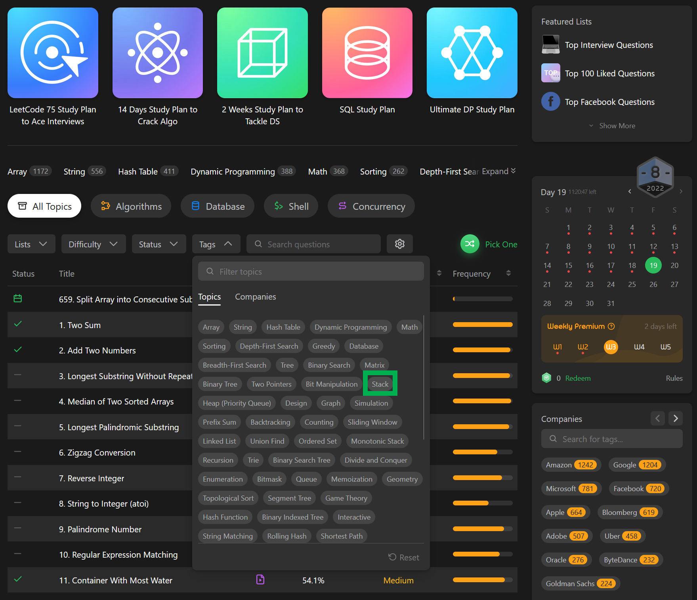

# 주제별 LeetCode 문제들 찾아보기

이미 아는 사람들도 많을 것 같다. 

흠... 난 나중에 다시 내가 다시... 취준/이준(이직준비)를 하게 될수도 있겠다는 생각이 들어서 기록으로 남겨놨다. 

그리고 어쩌면, 이전에 썼던 내 글을 보고 혼자서 고군분투하면서 푸는 사람들이 있을 까봐 잘못된 정보를 올린게 아닌가 하는 죄책감으로 뭔가 보완하는 글을 쓰기로 했다. 

오늘 쓸 내용은 이렇다.

- LeetCode Premium
- 주제별 빈출 문제 찾아보기

주제별 빈출문제 찾아보기를 해서 보는게 꽤 도움이 많이 된다는걸 오늘(?)에서야 알았다...ㅋㅋㅋ 

그래도 이전에 노력해놓은것들이 있어서 그나마 덜 부담이 된다. 

 

**LeetCode Premium** 

유튜브를 보다보면, MS 6년차, Facebook 시니어 등의 엔지니어들이 브이로그나 LeetCode 사용 꿀팁같은 것들을 영상으로 남겨놓는다. 

 

이 분들은 공통으로 다들 leetcode premium 은 그만한 가치가 있습니다. 지르세요. 하고 이야기한다.ㅋㅋ 

나도 결국 Monthly Plan 을 질렀다. 

 

코딩테스트 결과가 테스트 케이스를 감춰놓고 제출과 동시에 수정이 안되는 플랫폼도 있다고 들었다. 그래서 양질의 풀이가 필요한 것 같다. 

직접 MicroSoft, Amazon, Facebook  같은 대기업들의 문제들을 소팅해서 보고, 풀이방법들을 보는데, 생각지도 못한 창의적인 방법들도 있어서 꽤 놀랄때가 많다. 그리고 창의적인 문제들이 많다. 

세상 넓다. 혼자서 풀려고 하지말고, 좋은 풀이방식도 보고 사고방식을 크게 키워서 배워야 내가 발전한다.. 

나 뭐라고 하는건지... 

그런데,,, 아마도 이런 문제들은 대부분 영재교육을 마친 사람들은 모두 경시대회 문제로 머리빠질 정도로 스트레스받아가면서 어릴때 모두 공부 끝내신 분들이 많을 거다. 카이스트, 서울대, 포항공대 등등 다른 날라다니는 영재분들은 이미 질풍노도의 시기에 이런걸 미리 공부하고 창업을 하거나 외국에 유학가있거나, 외국에서 일하거나 진로를 바꿔서 천문학을 공부한다던가... 그런 괴물같은 분들도 많지 않나 싶다. 

 

**주제별 빈출 문제 찾아보기** 

예를 들면 Stack 주제에 대한 빈출 문제를 찾아보려면 아래와 같이 하면 된다. 

 

그러면 나타나는 창에서 아래 그림처럼 빈출 순으로 소팅하면, 빈출 순으로 문제들이 나타난다. 

나는 Stack 을 아직 6문제 밖에 안풀었다. Greedy 도 꽤 응용스러운 문제들이 많아서 내일 Greedy와 Stack을 5문제씩 더 풀어볼 예정이다. 

